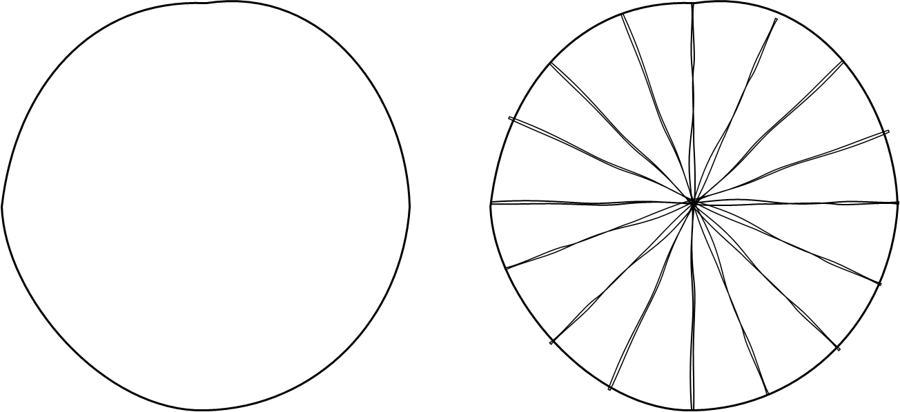
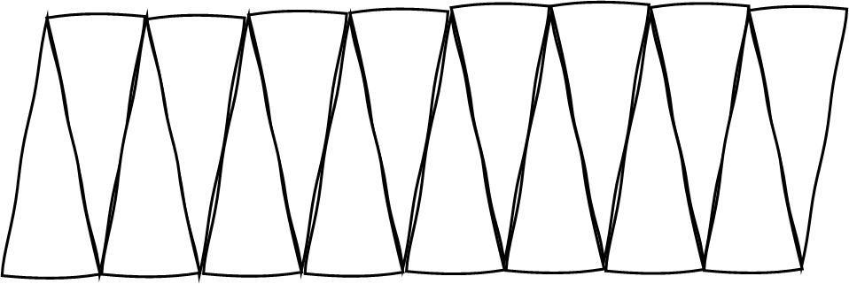
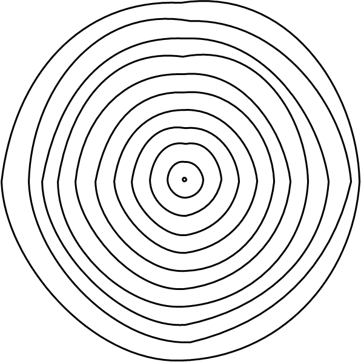
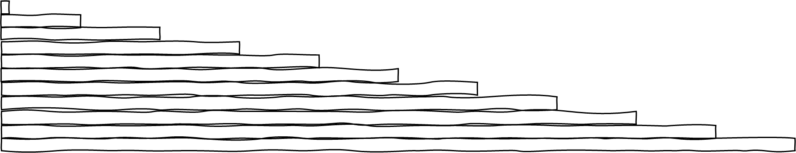

Gå tilbake til [[Geometri/1.6 Arealet av en sirkel|arealet av en sirkel]].

**Kakestykkeargumentet**

Vi tenker oss at vi deler en sirkel inn i «kakestykker» som i figuren
under.

Deretter plukker vi ut stykkene og stabler dem slik:

Vi ser at figuren *nesten* er et parallellogram med høyde lik sirkelens
radius og grunnlinje lik halve sirkelens omkrets. Jo finere inndeling,
dess mer vil figuren nærme seg et rektangel -- der høyden fortsatt er
radius og grunnlinja halve omkretsen. Arealet er dermed gitt ved
produktet av radien og halve omkretsen.

> [!warning]- Er du ikke overbevist?  
> Bruk glideren på figuren under til å få en følelse av hva som skjer når vi deler inn i finere og finere deler.
> %% Under er et htmldokument som embeddes %%
> <iframe src="Files\sirkelarealarkimedes.html"  frameborder="0" scrolling="no" style="aspect-ratio: 3/1.3; width: 90%"> </iframe>

Vi vet at forholdet mellom omkrets og diameter i sirkelen er
$\frac{O}{2r} = \pi$, som betyr at $O = 2\pi r$. Halve omkretsen er
dermed $\pi r$. En sirkel med radius $r$ har dermed arealet
$\pi r \cdot r = \pi r^{2}$.

**Skrelleargumentet**

En annen måte å vise hvorfor arealformelen er $\pi r^{2}$, er å tenke
oss at vi skreller sirkelen lag for lag. Hvert lag strekkes ut og legges
oppå det forrige. Resultatet er en figur som minner veldig om en
trekant. Igjen skjønner vi at dess smalere lag, dess mer lik en trekant
blir figuren. Med uendelig tynne striper, glattes trappetrinnene ut.

Sirkelens areal, $A$, er altså det samme som arealet av en trekant med
grunnlinje lik sirkelens omkrets og høyde lik radien:

$$A = \frac{1}{2}O \cdot r = \frac{1}{2}2\pi r \cdot r = \pi r^{2}.$$

Gå til [[Geometri/2.1 Volumbegrepet og Cavalieris prinsipp|volumbegrepet og Cavalieris prinsipp]].

Se oversikt [[Geometri/index|av geometriheftet]].