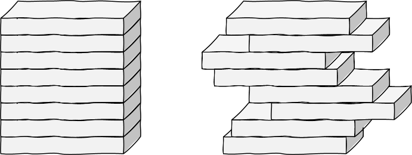

For å måle volumer bruker vi ikke overaskende en terning -- en kube --
der alle sider er $1$ som enhet. Volumet av en eller annen figur, er
altså antallet volumenheter den rommer.

{width="3.8516557305336834in"
height="1.5905511811023623in"}

Vi skal i det videre lene oss på det som kalles *Cavalieris prinsipp,*
etter den italienske matematikeren Bonaventura Cavalieri (1598--1647).
Figuren til venstre under er et rett prisme -- ei eske -- delt inn i
«del-esker». Prismets volum er summen av del-eskenes volum. Ettersom
hver del-eske prismet er delt inn i har samme volum som del-eksa ved
samme høyde i den vaklende stabelen til høyre, må prismet og figuren til
høyre ha samme volum. Tenk eventuelt på en stabel med mynter, eller en
kortstokk.

{width="3.138228346456693in"
height="1.1811023622047243in"}

Det ovenstående kan vi uttrykke litt mer generelt: La to, ikke
nødvendigvis like romfigurer ha lik høyde. Hvis det er slik at ved
enhver høyde, så er tverrsnittarealet av den ene figuren lik
tverrsnittarealet av den andre, så må også volumet av de to figurene
være likt. Det er denne observasjonen som kalles **Cavalieris
prinsipp**.
