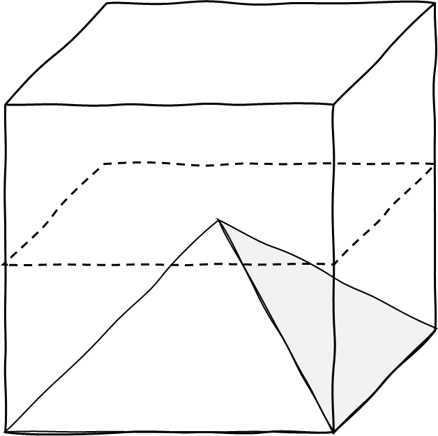
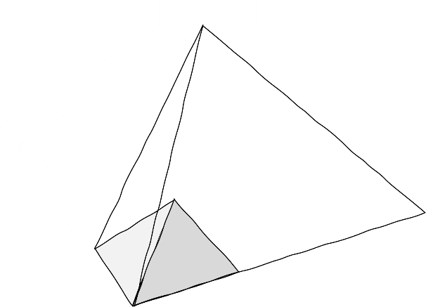

**Rett pyramide med kvadratisk grunnflate**

Figuren viser en pyramide med kvadratisk grunnflate og halve høyden av
terningen (kuben) den er plassert inni. Toppen av pyramiden er i sentrum
av terningen. Vi innser at samme pyramide kan trekkes fra hver av
terningens seks sider, uten overlapp. De vil ligge pent inntil
hverandre. (Du får tegne selv om du ikke ser det for deg; vår ble bare
noe rot.)

Dette betyr at volumet av én slik pyramide er en seksdel av terningens,
og nødvendigvis *en tredel* av ei eske med *samme* høyde som pyramiden.
Vi konkluderer: Volumet av en *rett pyramide* -- en pyramide der toppen
ligger rett over sentrum av grunnflaten -- med kvadratisk grunnflate $G$
og høyde $h$ er $\frac{1}{3}Gh$.

**Alle pyramider med kvadratisk grunnflate**

Hva om pyramiden ikke er rett, slik som i figuren under?

Da hjelper Cavalieri oss igjen. Pyramidene har like tverrsnittarealer
ved korresponderende høyder. Dermed har de også samme volum. Alle
pyramider med kvadratisk grunnflate er altså en tredel av eska med samme
grunnflate og høyde.

Dermed er volumet $V$ av enhver kvadratisk pyramide med grunnflate $G$
og høyde $h$ gitt ved $V = \frac{1}{3}Gh$.

**Alle pyramider med rektangulær grunnflate**

For å begrunne at *alle* pyramider med rektangulær grunnflate har volum
lik en tredel av grunnflaten ganger høyden, må vi introdusere en ny idé:
*strekking.* Se for deg at vi strekker alle punktene i en figur i én
retning. Tenk på det som skalering, om du vil. Vi skal merke oss to
egenskaper ved streking.

*Egenskap 1*: Ved å strekke pyramide med kvadratisk
grunnflate, kan vi oppnå en pyramide med en hvilken som helst
rektangulær grunnflate. Figuren over viser en kvadratisk pyramide som er
strukket langs den nærmeste sida i grunnflaten og langs høyden.

*Egenskap 2*: Hvis en figur strekkes i én retning med en
gitt faktor, for eksempel $1,5$, endres også volumet med samme faktor.
Eska under er strukket med faktoren $1,5$: Hele eska er én og en halv
ganger lengre enn den opprinnelige, heltrukne eska. Vi forstår intuitivt
at også volumet av eska er én og en halv ganger større.

Disse to egenskapene betyr at om vi strekker en kvadratisk pyramide, kan
vi få en hvilken som helst rektangulær pyramide. Volumet av den nye
pyramiden vil fortsatt være en tredel av eska den deler grunnflate og
høyde med (og som ble strukket sammen med pyramiden).

Dermed kan vi slå fast at *alle* pyramider med rektangulær grunnflate
har volum $\frac{1}{3}Gh$.

Se oversikt [[Geometri/index|av geometriheftet]].