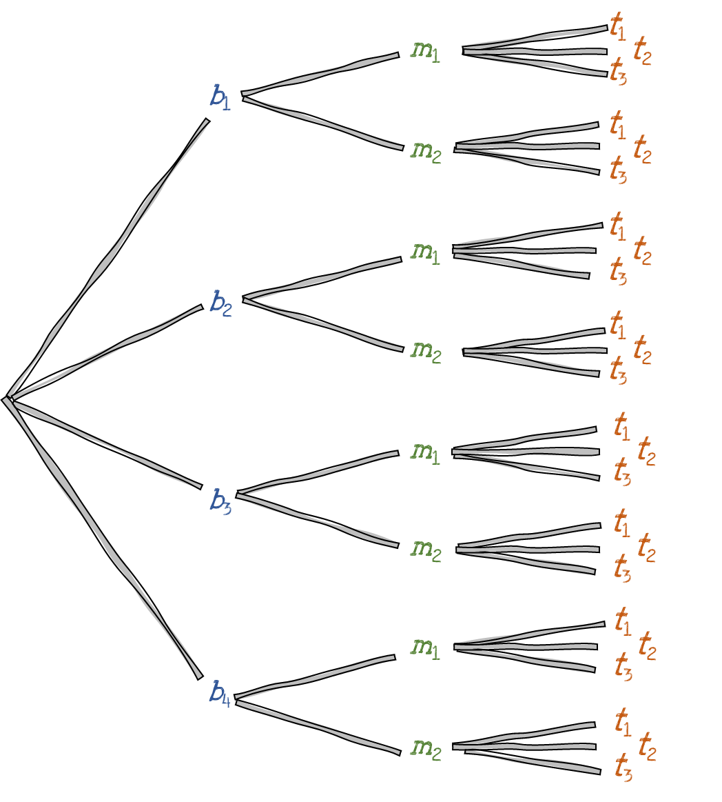

Under ser du illustrasjoner til fire situasjoner:

1.  Veivalg fra $A$ til $C$ via $B$.

2.  Ett av flere mulige tårn som kan bygges med ei eske i bunn, en
    sylinder i midten og en trekant på toppen.

3.  Blant syv personer trekkes en vinner, en andreplass og en
    tredjeplass.

4.  En kodelås med ti siffer på hver av de fire posisjonene.

{width="2.952755905511811in"
height="1.178568460192476in"}
{width="2.952755905511811in"
height="1.3763396762904636in"}

{width="2.1653543307086616in"
height="1.4434689413823272in"}

Situasjonene er matematisk sett *like.* I hvert tilfelle skal vi gjøre
det vi kan kalle et **sammensatt valg** eller *forsøk* som består av
flere **delvalg***, delforsøk* eller *trinn:*

1.  To delvalg med henholdsvis fem og tre muligheter.

2.  Tre delvalg med henholdsvis fire, to og tre muligheter.

3.  Tre delvalg med henholdsvis syv, seks og fem muligheter.

4.  Fire delvalg, alle med ti muligheter.

Det vi lurer på er selvsagt *hvor mange mulige utfall de sammensatte
valgene har --* hva det totale antallet muligheter, valg eller utfall
er. Siden situasjonene er matematisk like, holder det å finne ut av
hvordan vi kan telle i ett av eksemplene. Resten har samme løsning, bare
med andre tall. Vi velger tårnene som eksempel. *Hvor mange tårn kan vi
bygge når vi har fire esker å velge blant til bunnen, to sylindere til
midten, og tre trekanter til toppen?*

Vi døper bunnene $b_{1},\ b_{2},\ b_{3}$ og $b_{4}$, midtklossene
$m_{1}$ og $m_{2}$, og toppene $t_{1},\ t_{2}$ og $t_{3}$. Deretter
tegner vi oss frem til en måte å regne. Figuren under viser at *for
hver* av de fire bunnklossene, har vi to mulige midtklosser. Vi får
altså *fire grupper med to.* Fire grupper med to er $4 \cdot 2$. For
hver av disse $4 \cdot 2$ mulighetene, har vi tre mulige topper.
$4 \cdot 2$ grupper med tre er $4 \cdot 2 \cdot 3$. Det totale antallet
utfall er altså produktet av antall muligheter i hvert delvalg eller
trinn. Det er dette som kalles **multiplikasjonsprinsippet** (Alfa
kaller det *produktregelen*). Figuren kalles et **valgtre**,
**utfallstre** eller **trediagram**.

{width="3.543307086614173in"
height="3.932076771653543in"}

Nå innser vi kjapt at det er $5 \cdot 3$ veier fra $A$ til $C$ via $B$;
det er $7 \cdot 6 \cdot 5$ mulige trekninger til første-, andre- og
tredjeplass blant de syv personene; og man kan lage
$10 \cdot 10 \cdot 10 \cdot 10$ unike koder med låsen.

> Her kommer et noe dristig løfte: Hvis du *forstår*
> multiplikasjonsprinsippet, vil du være i stand til å løse (så godt
> som) alle kombinatoriske problemer du blir stilt overfor! Du må bare
> greie å oversette problemstillingen til et sammensatt valg og
> identifisere antallet muligheter i hvert delvalg.
