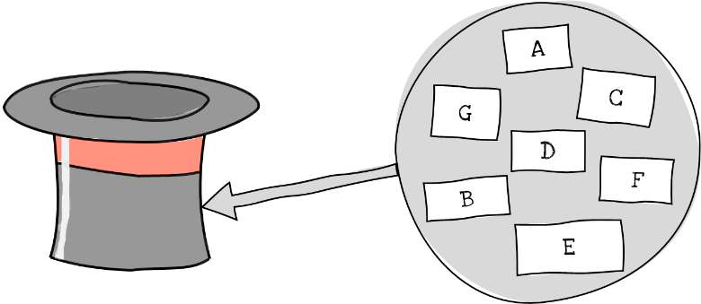

Å gjøre trekninger eller utvalg, er en annen typisk kombinatorisk
aktivitet. Se for deg en hatt med syv merka lapper oppi.

*På hvor mange måter kan vi trekke tre lapper fra en hatt som inneholder
syv?*

{width="3.543307086614173in"
height="1.539808617672791in"}

Svaret avhenger av hvilke kriterier som gjelder for trekningen. Teller
vi *rekkefølgen* lappene trekkes i, slik at for eksempel $BDF$ er et
annet utfall enn $FBD$, eller gjør vi ikke det? Legger vi lappene
tilbake for hver gang, slik at for eksempel $BFF$ er en mulig trekning,
eller gjenbruker vi dem ikke? Vi har altså *fire* mulige måter å gjøre
trekninger:

-   Vi teller rekkefølge

    -   og legger ikke lappene tilbake, (1)

    -   eller legger lappene tilbake. (2)

-   Vi teller ikke rekkefølge

    -   og legger ikke lappene tilbake, (3)

    -   eller legger lappene tilbake. (4)

Når vi teller rekkefølger, kaller vi det *ordna utvalg* uten (1) og med
(2) tilbakelegg. Når vi ikke gjør det, kaller vi det *uordna utvalg*
uten (3) og med (4) tilbakelegg.
