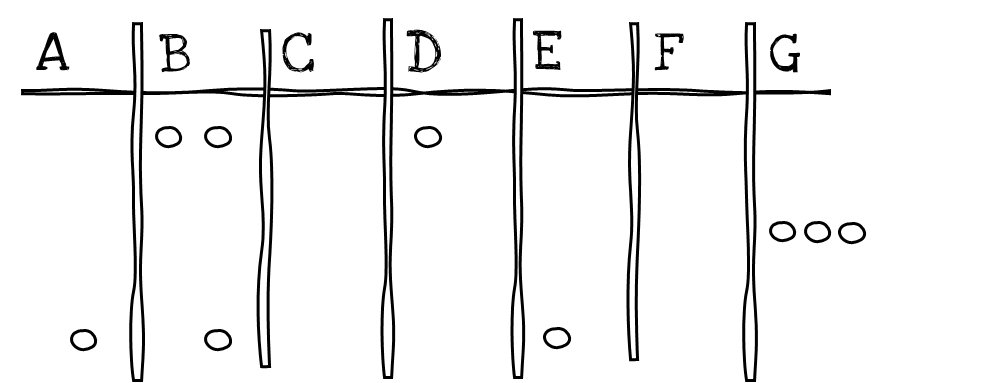

Vi justerer litt på spørsmålet: På hvor mange måter kan vi trekke tre
lapper fra en hatt som inneholder syv, *når vi [ikke]{.underline} teller
hvilken rekkefølge lappene blir trukket i?*

Dette betyr eksempelvis at de ordnede utfallene

$$ABC\  - \ ACB\  - \ BAC\  - \ BCA\  - \ CAB\  - \ CBA$$

skal telles som én og samme hendelse. Vi forstår nå intuitivt at dersom
vi teller rekkefølger uten å legge tilbake lappene, vil *hver eneste
lappe-trio* telles seks ganger. Antallet ordnede utfall uten
tilbakelegg, $7 \cdot 6 \cdot 5$, er altså seks ganger for stort når vi
ønsker å telle hver trio bare én gang.

**Vi trekker uten å legge lappene tilbake etter hver trekning (uten
tilbakelegg) (3)**

Trikset her er å gjøre en bevisst *overtelling --* akkurat som vi gjorde
da vi telte uordna sorteringer*.* Vi teller for mye med vilje, for
deretter å korrigere. Igjen trenger vi bare ett redskap:
multiplikasjonsprinsippet. Ved multiplikasjonsprinsippet er det
$7 \cdot 6 \cdot 5$ mulige trekninger i rekkefølge. Spørsmålet er hvor
mange ganger vi nå har telt hver trio, for eksempel $AGF$. Svaret på det
vet vi allerede -- det er antallet måter å sortere tre bokstaver: $3!$.
Antallet utfall når vi trekker tre lapper fra syv uten å telle
rekkefølger, og vi ikke legger lappene tilbake, er dermed

$$\frac{7 \cdot 6 \cdot 5}{3 \cdot 2 \cdot 1}.$$

[Merk]{.underline}: Denne trekninga er identisk med å telle uordna
sorteringer av objekter med to egenskaper. Tenk deg at vi har syv kuler
-- tre røde og fire blå -- som skal plasseres i rekkefølger etter farge.
Vi plasserer de tre røde først ved å trekke plassnummer ved hjelp av
lappene i hatten. Trekker vi for eksempel 3, 6 og 7, skal de røde
plasseres på plass nummer 3, 6 og 7.

{width="4.724409448818897in"
height="1.8449081364829396in"}

Ved første trekning, er det syv ledige plasser. For hver av disse er det
seks ledige, og deretter fem. Når de røde er plassert, må nødvendigvis
resten av plassene okkuperes av grønne. Det er altså nok å telle hvor
mange måter vi kan plassere de tre røde på syv ledige plasser. Svaret på
det er $7 \cdot 6 \cdot 5$ (ordna rekkefølger) delt på $3!$ (antallet
omstokkinger av de tre kulene hver plassering inneholder).

**Vi legger lappene tilbake etter hver trekning (med tilbakelegg) (4)**

Hva om vi fortsatt ikke ønsker å telle rekkefølger, men legger lappene
tilbake i hatten etter hver trekning? Det er fristende å tenke at svaret
er $\frac{7^{3}}{3!}$ etter tilsvarende logikk som over. Men slik er det
ikke. (Hvorfor blir det feil?)

Vi lager oss et skjema, noterer noen mulige utfall, og ser om vi
oppdager et mønster. Figuren viser tre utfall: $BBD$, $GGG$ og $ABE$.

{width="3.543307086614173in"
height="1.5482753718285214in"}

Vi innser nå at å finne antallet mulige utfall, svarer til spørsmålet om
*hvor mange måter vi kan plassere tre ringer innimellom de seks
tabellskilleveggene.*

{width="2.5196850393700787in"
height="0.3219838145231846in"}

Dette problemet har vi jo nettopp løst! Svaret er *på like mange måter
som vi kan sortere ni gjenstander der tre har én egenskap og resten en
annen.* Alternativt: *På like mange måter som vi kan gjøre en uordna
trekning [uten]{.underline} tilbakelegg av tre lapper fra en hatt med
[ni]{.underline}:*

$$\frac{9 \cdot 8 \cdot 7}{3!}.$$

Konklusjonen er altså denne: Å gjøre en uordnet trekning av tre fra
*syv* [med]{.underline} tilbakelegg, svarer nøyaktig til å gjøre en
uordnet trekning av tre fra *ni* [uten]{.underline} tilbakelegg.
Sammenhengen mellom tallene syv og ni er at de syv lappene gir opphav
til $7 - 1$ skillevegger i tabellen, som sammen med de tre ringene
(antallet lapper vi skal trekke) gir $(7 - 1) + 3 = 9$.
