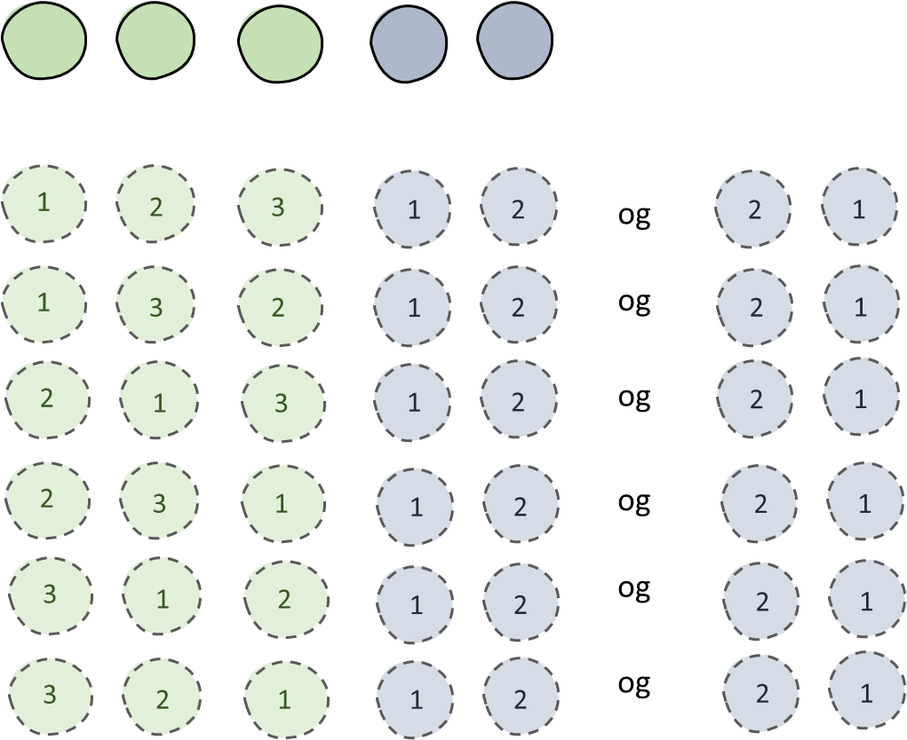
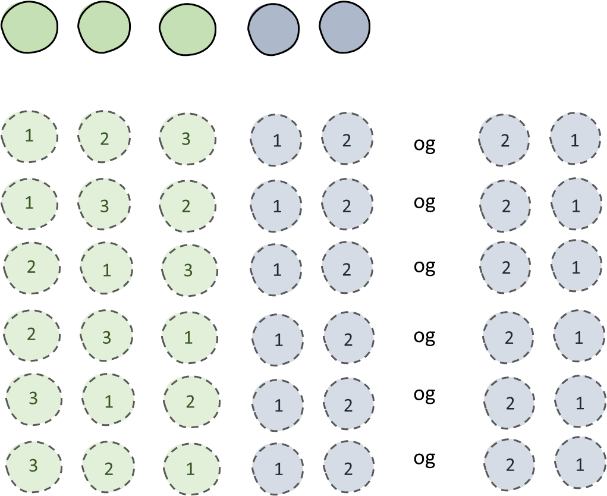
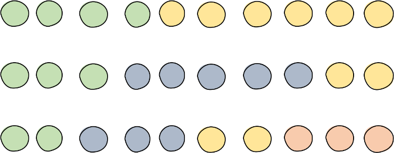

Gå tilbake til [[Sannsynlighet, kombinatorikk og statistikk/5.2.2 Ordna sorteringer|Ordna sorteringer]]

Vi skal telle antall måter å sortere kulene under. Dette er en uordna
sortering ettersom kulene ikke er merka; vi er bare interessert i de to
egenskapene grønn og blå. Situasjonen er identisk med den i innledninga
(18.2.1), der vi så på rekkefølger av fem personer der tre var jenter og
to var gutter. Trikset er nå, som da, å finne ut hvor mange ordna
sorteringer hver uordna sortering inneholder.

Vi tenker på kulene som merka: grønn $1,\ 2,\ 3$ og blå $1,\ 2$ (se
figuren under). Hver fargerekkefølge (det vil si hver uordna sortering)
inneholder da tolv ordna rekkefølger: Det er $3!$ måter å stokke om de
grønne. For hver av disse, er det $2!$ måter å stokke om på de blå.
Totalt altså $3! \cdot 2! = 12$.

De fem kulene kan stilles i totalt $5!$ ordna rekkefølger, som altså kan
grupperes i uordna fargesorteringer som hver inneholder $3! \cdot 2!$ av
dem. Det betyr at det må være

$$\frac{5!}{3! \cdot 2!}$$

måter å stille opp kulene etter farge (= antall uordna sorteringer av
kulene).

Har vi uordna sorteringer av objekter med *flere enn to* egenskaper --
kuler i flere farger -- kan vi tenke på samme måte. Under ser du ti
kuler, der tre er grønne, fem er blå og to er gule.

Ti kuler gir totalt $10!$ ordna sorteringer. Hver *uordna* sortering
inneholder $3!$ rekkefølger for de grønne. For hver av dem, er det $5!$
rekkefølger av de blå. For hver av de $3! \cdot 5!$ rekkefølgene av
grønne og blå, er det $2!$ rekkefølger av gule kuler. Hver uordna
sortering inneholder altså $3! \cdot 5! \cdot 2!$ ordna sorteringer.
Antallet uordna sorteringer er dermed

$$\frac{10!}{3! \cdot 5! \cdot 2!}.$$

Mønsteret er forhåpentlig såpass tydelig at vi drister oss til en
algebraisk generalisering (men det **ikke** meninga at dere skal pugge
dette som noen formel!). Vi har $n$ objekter med $k$ forskjellig
egenskaper. $e_{1}$ av dem har én egenskap, $e_{2}$ har en annen,
$e_{3}$ en tredje og så videre, opp til $e_{k}$ med egenskap nummer $k$.
Vi har altså at $e_{1} + e_{2} + \ldots + e_{k} = n$. Antallet uordna
sorteringer av de $n$ objektene er da

$$\frac{n!}{e_{1}! \cdot e_{2}! \cdot \ldots \cdot e_{k}!}.$$

Gå til [[Sannsynlighet, kombinatorikk og statistikk/5.3.0 Trekninger (utvalg)|Trekninger (utvalg)]]