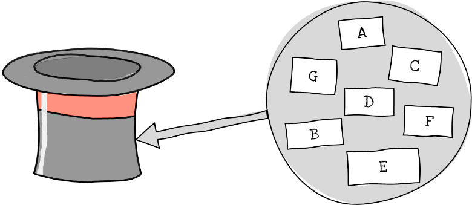

Gå tilbake til [[Sannsynlighet, kombinatorikk og statistikk/5.2.3 Uordna sorteringer|uordna sorteringer]].

Å gjøre trekninger eller utvalg, er en annen typisk kombinatorisk
aktivitet. Se for deg en hatt med syv merka lapper oppi.

*På hvor mange måter kan vi trekke tre lapper fra en hatt som inneholder
syv?*

Svaret avhenger av hvilke kriterier som gjelder for trekningen. Teller
vi *rekkefølgen* lappene trekkes i, slik at for eksempel $BDF$ er et
annet utfall enn $FBD$, eller gjør vi ikke det? Legger vi lappene
tilbake for hver gang, slik at for eksempel $BFF$ er en mulig trekning,
eller gjenbruker vi dem ikke? Vi har altså *fire* mulige måter å gjøre
trekninger:

-   Vi teller rekkefølge
    -   [[Sannsynlighet, kombinatorikk og statistikk/5.3.1 Vi teller rekkefølger - ordna utvalg#Vi trekker uten å legge lappene tilbake etter hver trekning (uten tilbakelegg) (1)|og legger ikke lappene tilbake, (1)]]
    -   [[Sannsynlighet, kombinatorikk og statistikk/5.3.1 Vi teller rekkefølger - ordna utvalg#Vi legger lappene tilbake etter hver trekning (med tilbakelegg) (2)|eller legger lappene tilbake. (2)]]
-   Vi teller ikke rekkefølge
    - [[Sannsynlighet, kombinatorikk og statistikk/5.3.2 Vi teller ikke rekkefølger - uordna utvalg#Vi trekker uten å legge lappene tilbake etter hver trekning (uten|og legger ikke lappene tilbake, (3)]]
    -   [[Sannsynlighet, kombinatorikk og statistikk/5.3.2 Vi teller ikke rekkefølger - uordna utvalg#Vi legger lappene tilbake etter hver trekning (med tilbakelegg) (4)|eller legger lappene tilbake. (4)]]

Når vi teller rekkefølger, kaller vi det *ordna utvalg* uten (1) og med
(2) tilbakelegg. Når vi ikke gjør det, kaller vi det *uordna utvalg*
uten (3) og med (4) tilbakelegg.

Gå til [[Sannsynlighet, kombinatorikk og statistikk/5.3.1 Vi teller rekkefølger - ordna utvalg|vi teller rekkefølger - ordna utvalg]].

Gå til [[Sannsynlighet, kombinatorikk og statistikk/index|oversikt over kombinatorikk og sannsynlighet]].