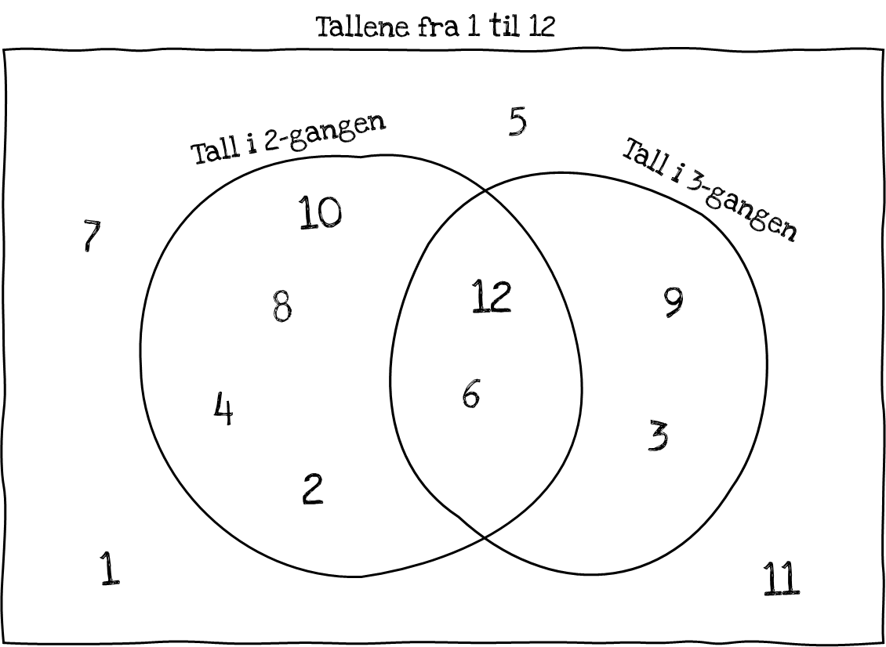

Gå tilbake til [[Sannsynlighet, kombinatorikk og statistikk/5.3.2 Vi teller ikke rekkefølger - uordna utvalg|Vi teller ikke rekkefølger - uordna utvalg]]

Se for deg de naturlige tallene fra $1$ til $12$. Samlingen av disse
utgjør en *mengde.* Tallene i 2-gangen og tallene i 3-gangen utgjør
*delmengder* av mengden*.* Vi ønsker å telle hvor mange av tallene som
er i to- *eller* tregangen. I figuren under ser vi at to tall hører
hjemme i *begge* disse delmengdene. Vi kan gå frem slik:

-   Teller alle tallene i 2-gangen: De er det $6$ av (inkluderer 12 og 6).
-   Teller alle tallene i 3-gangen: De er det $4$ av (inkluderer 12 og 6).
-   Summerer dem, og trekker fra antallet som er *både i tre- og to-gangen:* De er det $2$ av.
-   Dermed er det $6 + 4 - 2 = 8$ tall i 2- eller 3-gangen.

Eksemplet illustrerer *addisjonssetningen.* Når vi teller antallet
elementer i to mengder som har noen felles elementer, teller vi antallet
i hver av dem, og trekker fra antallet de har felles, ettersom disse
telles dobbelt.

Vi kaller «sammenslåingen» av to mengder for **union***,* og den
delmengden som er felles for dem, for **snitt***.* Antallet elementer i
*unionen* av to mengder er altså summen av antallet elementer i hver
mengde minus antallet i *snittet* av dem. Merk at dette også gjelder
dersom mengdene *ikke* har noen felles elementer, for da er jo antallet
elementer i snittet null (mengden er tom). To mengder som ikke deler
noen elementer, kaller vi **disjunkte**.

> [!warning] Merk 
> Det viktige er å forstå *innholdet* i addisjonssetningen. Her er også
> en formell, symbolsk formulering. La $A$ og $B$ være to mengder. Da
> betegner $A \cup B$ («A *eller* B») unionen og $A \cap B$ («A *og* B»)
> snittet av mengdene, mens $n(A)$ betyr *antall elementer i* $A$*.* Da
> har vi at
>
> $$n(A \cup B) = n(A) + n(B) - n(A \cap B).$$

Gå til [[Sannsynlighet, kombinatorikk og statistikk/5.4.2 Komplementsetningen| Komplementsetningen]]