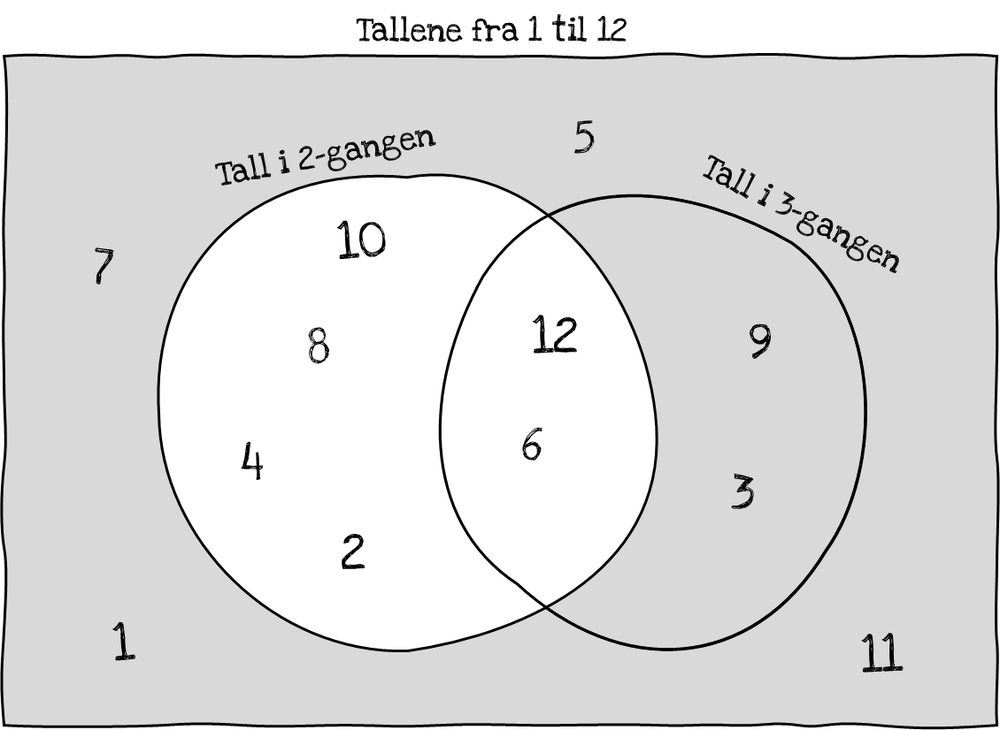

Vi ser også i figuren over at fire tall verken er i 2- eller 3-gangen:
$1,\ 7,\ 5$ og $11$. Det betyr at vi også kunne funnet antallet i 2-
eller 3- gangen ved å telle *alle,* som er $12$, og trukket fra de vi
ikke var interessert i. Det er altså $12 - 4 = 8$ tall som er i to-
eller tre-gangen.

Tilsvarende om vi var interessert i å telle for eksempel partallene:
Antallet svarer til *alle* minus de som *ikke* er partall -- se figuren
under.

Eksemplene illustrerer *komplementsetningen.* Antallet elementer i en
delmengde, $A$, finner vi ved å telle alle elementene i mengden $A$ er
en delmengde av og trekke fra antallet elementer som *ikke* er i $A$ --
**komplementet** til $A$. Alfa bruker notasjonen $A^{c}$. Det er også
vanlig å skrive $A'$.

> [!tip] Formelt
> La $A \subset U$, det vil si at $A$ er en delmengde av $U$.
> Da er $n(A) = n(U) - n\left( A^{'} \right).$ Vi har selvsagt også at
> $n\left( A^{'} \right) = n(U) - n(A).$

Gå til [[Sannsynlighet, kombinatorikk og statistikk/5.4.3 Eksempel på telling med addisjons- og komplementsetningen|Eksempel på telling med addisjons- og komplementsetningen]]