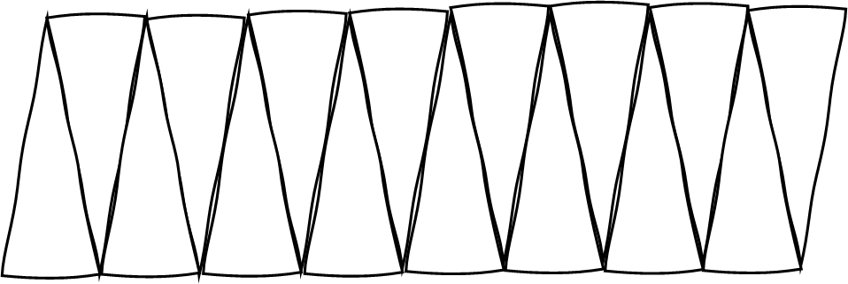

j

Heftet

for MA-173

{width="2.560416666666667in"
height="3.2in"}

2024

UNDER KONSTRUKSJON. ENDRINGER KAN FOREKOMME.

Gi beskjed om du finner noen feil, så får vi rettet dem fortløpende!

# Innhold {#innhold .TOC-Heading}

[1 Begreper i tallteori
[5](#begreper-i-tallteori)](#begreper-i-tallteori)

[2 Argumentasjonsformer
[6](#argumentasjonsformer)](#argumentasjonsformer)

[2.1 Uformelt argument: generisk eksempel
[6](#uformelt-argument-generisk-eksempel)](#uformelt-argument-generisk-eksempel)

[2.2 Formelt algebraisk argument
[7](#formelt-algebraisk-argument)](#formelt-algebraisk-argument)

[2.3 Implikasjon og ekvivalens
[7](#implikasjon-og-ekvivalens)](#implikasjon-og-ekvivalens)

[3 Delelighetskriterier
[8](#delelighetskriterier)](#delelighetskriterier)

[3.1 Oppvarming: posisjonssystem og tall på utvida form
[8](#oppvarming-posisjonssystem-og-tall-på-utvida-form)](#oppvarming-posisjonssystem-og-tall-på-utvida-form)

[3.2 Siste eller to siste sifre avgjør: 2, 5 og 4
[9](#siste-eller-to-siste-sifre-avgjør-2-5-og-4)](#siste-eller-to-siste-sifre-avgjør-2-5-og-4)

[3.2.1 Kriteriene [9](#kriteriene)](#kriteriene)

[3.2.2 Begrunnelse med generisk eksempel
[9](#begrunnelse-med-generisk-eksempel)](#begrunnelse-med-generisk-eksempel)

[3.2.3 Begrunnelse med generelt tall på utvida form
[10](#begrunnelse-med-generelt-tall-på-utvida-form)](#begrunnelse-med-generelt-tall-på-utvida-form)

[3.3 Tverrsummen avgjør: kriteriene for 3 og 9
[11](#tverrsummen-avgjør-kriteriene-for-3-og-9)](#tverrsummen-avgjør-kriteriene-for-3-og-9)

[3.3.1 Kriteriene [11](#kriteriene-1)](#kriteriene-1)

[3.3.2 Begrunnelse med generisk eksempel
[11](#begrunnelse-med-generisk-eksempel-1)](#begrunnelse-med-generisk-eksempel-1)

[3.3.3 Begrunnelse med generelt tall på utvida form
[11](#begrunnelse-med-generelt-tall-på-utvida-form-1)](#begrunnelse-med-generelt-tall-på-utvida-form-1)

[4 Figurtall [12](#figurtall)](#figurtall)

[4.1 Begreper
[12](#innledning-begreper-ordbruk-og-notasjon-og-sånn)](#innledning-begreper-ordbruk-og-notasjon-og-sånn)

[4.1.1 Figurnummer og figurtall
[12](#figurnummer-og-figurtall)](#figurnummer-og-figurtall)

[4.1.2 Rekursiv og eksplisitt beskrivelse, tillegg
[13](#rekursiv-og-eksplisitt-beskrivelse-tillegg)](#rekursiv-og-eksplisitt-beskrivelse-tillegg)

[4.1.3 Ulike typer figurtall
[15](#ulike-typer-figurtall)](#ulike-typer-figurtall)

[4.2 Strategier for å finne eksplisitt uttrykk
[16](#strategier-for-å-finne-eksplisitt-uttrykk)](#strategier-for-å-finne-eksplisitt-uttrykk)

[4.2.1 Gauss-trikset: doble summen, og halvere den igjen
[16](#gauss-trikset-doble-summen-og-halvere-den-igjen)](#gauss-trikset-doble-summen-og-halvere-den-igjen)

[4.2.2 Figurtall-som-en-sum-knepet: summere tilleggene ved hjelp av
trekanttall
[19](#figurtall-som-en-sum-knepet-summere-tilleggene-ved-hjelp-av-trekanttall)](#figurtall-som-en-sum-knepet-summere-tilleggene-ved-hjelp-av-trekanttall)

[4.2.3 Stirre-hardt-metoden: dekomponere figuren i kjente figurtall
[22](#stirre-hardt-metoden-dekomponere-figuren-i-kjente-figurtall)](#stirre-hardt-metoden-dekomponere-figuren-i-kjente-figurtall)

[4.3 Strategier for å finne rekursivt uttrykk
[25](#strategier-for-å-finne-rekursivt-uttrykk)](#strategier-for-å-finne-rekursivt-uttrykk)

[4.3.1 Ved å finne formen på tilleggene
[25](#ved-å-finne-formen-på-tilleggene)](#ved-å-finne-formen-på-tilleggene)

[4.3.2 Ved å beregne differansen mellom eksplisitte uttrykk for $Fn$ og
$Fn - 1$
[27](#ved-å-beregne-differansen-mellom-eksplisitte-uttrykk-for-f_n-og-f_n---1)](#ved-å-beregne-differansen-mellom-eksplisitte-uttrykk-for-f_n-og-f_n---1)

[5 Regnestrategier [28](#regnestrategier)](#regnestrategier)

[5.1 Oversikt over noen strategier
[28](#oversikt-over-noen-strategier)](#oversikt-over-noen-strategier)

[5.2 Begrunnelser og illustrasjoner av noen av strategiene
[28](#begrunnelser-og-illustrasjoner-av-noen-av-strategiene)](#begrunnelser-og-illustrasjoner-av-noen-av-strategiene)

[6 Brøkregning med illustrasjoner
[30](#brøkregning-med-illustrasjoner)](#brøkregning-med-illustrasjoner)

[6.1 Multiplikasjon [30](#multiplikasjon)](#multiplikasjon)

[6.1.1 Multiplikasjon med naturlige tall: tolkninger av multiplikasjon
[30](#multiplikasjon-med-naturlige-tall-tolkninger-av-multiplikasjon)](#multiplikasjon-med-naturlige-tall-tolkninger-av-multiplikasjon)

[6.1.2 Multiplikasjon med et naturlig tall og en brøk
[32](#multiplikasjon-med-et-naturlig-tall-og-en-brøk)](#multiplikasjon-med-et-naturlig-tall-og-en-brøk)

[6.1.3 Multiplikasjon med to brøker
[32](#multiplikasjon-med-to-brøker)](#multiplikasjon-med-to-brøker)

[6.2 Divisjon [34](#divisjon)](#divisjon)

[6.2.1 Delingsdivisjon: intuitiv tilnærming
[34](#delingsdivisjon-intuitiv-tilnærming)](#delingsdivisjon-intuitiv-tilnærming)

[6.2.2 Målingsdivisjon: intuitiv tilnærming
[38](#målingsdivisjon-intuitiv-tilnærming)](#målingsdivisjon-intuitiv-tilnærming)

[6.2.3 Målings- og delingsdivisjon: når tallene har enheter knyttet til
seg
[40](#målings--og-delingsdivisjon-når-tallene-har-enheter-knyttet-til-seg)](#målings--og-delingsdivisjon-når-tallene-har-enheter-knyttet-til-seg)

[6.2.4 Divisjon med brøk algebraisk: divisjon er det samme som brøk
[40](#divisjon-med-brøk-algebraisk-divisjon-er-det-samme-som-brøk)](#divisjon-med-brøk-algebraisk-divisjon-er-det-samme-som-brøk)

[7 Litt om multiplikasjon med negative tall
[42](#litt-om-multiplikasjon-med-negative-tall)](#litt-om-multiplikasjon-med-negative-tall)

[8 Potenser med heltallige eksponenter
[44](#potenser-med-heltallige-eksponenter)](#potenser-med-heltallige-eksponenter)

[8.1 Begrepsavklaring [44](#begrepsavklaring)](#begrepsavklaring)

[8.2 Produkter av potenser
[44](#produkter-av-potenser)](#produkter-av-potenser)

[8.3 Divisjon med potenser
[45](#divisjon-med-potenser)](#divisjon-med-potenser)

[8.4 Negative eksponenter
[46](#negative-eksponenter)](#negative-eksponenter)

[9 Lineære likninger [47](#lineære-likninger)](#lineære-likninger)

[9.1 Løsningen av en likning
[47](#løsningen-av-en-likning)](#løsningen-av-en-likning)

[9.2 Overordnet tilnærming
[48](#overordnet-tilnærming)](#overordnet-tilnærming)

[9.3 Arbeide baklengs [49](#arbeide-baklengs)](#arbeide-baklengs)

[9.4 Holde over [50](#holde-over)](#holde-over)

[9.5 Sammenlikne strukturelt
[51](#sammenlikne-strukturelt)](#sammenlikne-strukturelt)

[10 Ulikheter [52](#ulikheter)](#ulikheter)

[10.1 Den ene fallgruva [52](#den-ene-fallgruva)](#den-ene-fallgruva)

[10.2 En oppgave fra nasjonal deleksamen
[52](#en-oppgave-fra-nasjonal-deleksamen)](#en-oppgave-fra-nasjonal-deleksamen)

[11 Lineære likningssett med to ukjente
[54](#lineære-likningssett-med-to-ukjente)](#lineære-likningssett-med-to-ukjente)

[11.1 Løsningen av et likningssett
[54](#løsningen-av-et-likningssett)](#løsningen-av-et-likningssett)

[11.2 Innsettingsmetoden [54](#innsettingsmetoden)](#innsettingsmetoden)

[11.3 Addisjonsmetoden [55](#addisjonsmetoden)](#addisjonsmetoden)

[11.4 Grafisk løsning [56](#grafisk-løsning)](#grafisk-løsning)

[12 Lineære funksjoner [57](#lineære-funksjoner)](#lineære-funksjoner)

[12.1 Begrepsavklaring og utvalgte egenskaper
[57](#begrepsavklaring-og-utvalgte-egenskaper)](#begrepsavklaring-og-utvalgte-egenskaper)

[12.2 Finne funksjonsuttrykk gitt to punkter på grafen
[58](#finne-funksjonsuttrykk-gitt-to-punkter-på-grafen)](#finne-funksjonsuttrykk-gitt-to-punkter-på-grafen)

[13 Kvadratsetningene [59](#kvadratsetningene)](#kvadratsetningene)

[13.1 Første kvadratsetning
[59](#første-kvadratsetning)](#første-kvadratsetning)

[13.2 Andre kvadratsetning
[59](#andre-kvadratsetning)](#andre-kvadratsetning)

[13.3 Tredje kvadratsetning (konjugatsetninga)
[60](#tredje-kvadratsetning-konjugatsetninga)](#tredje-kvadratsetning-konjugatsetninga)

[14 Kvadratiske likninger
[61](#kvadratiske-likninger)](#kvadratiske-likninger)

[14.1 Geometrisk og algebraisk tolkning av problemstilling
[61](#geometrisk-og-algebraisk-tolkning-av-problemstilling)](#geometrisk-og-algebraisk-tolkning-av-problemstilling)

[14.2 Løsning ved hjelp av første kvadratsetning
[61](#løsning-ved-hjelp-av-første-kvadratsetning)](#løsning-ved-hjelp-av-første-kvadratsetning)

[14.3 Løsning ved hjelp av andre kvadratsetning
[62](#løsning-ved-hjelp-av-andre-kvadratsetning)](#løsning-ved-hjelp-av-andre-kvadratsetning)

[14.4 Ekstramateriale: Løsning ved hjelp av tredje kvadratsetning
[63](#ekstramateriale-løsning-ved-hjelp-av-tredje-kvadratsetning)](#ekstramateriale-løsning-ved-hjelp-av-tredje-kvadratsetning)

[14.5 Likninger der tallene ikke er «hyggelige»
[64](#likninger-der-tallene-ikke-er-hyggelige)](#likninger-der-tallene-ikke-er-hyggelige)

[15 Kvadratiske funksjoner
[65](#kvadratiske-funksjoner)](#kvadratiske-funksjoner)

[15.1 Begrepsavklaring og utvalgte egenskaper
[65](#begrepsavklaring-og-utvalgte-egenskaper-1)](#begrepsavklaring-og-utvalgte-egenskaper-1)

[15.2 Nullpunkter og symmetrilinje
[66](#nullpunkter-og-symmetrilinje)](#nullpunkter-og-symmetrilinje)

[16 Omvendt proporsjonale funksjoner
[68](#omvendt-proporsjonale-funksjoner)](#omvendt-proporsjonale-funksjoner)

[16.1 Begrepsavklaring og utvalgte egenskaper
[68](#begrepsavklaring-og-utvalgte-egenskaper-2)](#begrepsavklaring-og-utvalgte-egenskaper-2)

[16.2 Symmetrilinje [69](#symmetrilinje)](#symmetrilinje)

[17 Formler for areal og volum
[70](#formler-for-areal-og-volum)](#formler-for-areal-og-volum)

[17.1 Areal [70](#areal)](#areal)

[17.1.1 Arealbegrepet [70](#arealbegrepet)](#arealbegrepet)

[17.1.2 Arealet av et rektangel
[71](#arealet-av-et-rektangel)](#arealet-av-et-rektangel)

[17.1.3 Arealet av et parallellogram
[72](#arealet-av-et-parallellogram)](#arealet-av-et-parallellogram)

[17.1.4 Arealet av en trekant
[72](#arealet-av-en-trekant)](#arealet-av-en-trekant)

[17.1.5 Arealet av et trapes
[72](#arealet-av-et-trapes)](#arealet-av-et-trapes)

[17.1.6 Arealet av en sirkel
[73](#arealet-av-en-sirkel)](#arealet-av-en-sirkel)

[17.2 Volum [75](#volum)](#volum)

[17.2.1 Volumbegrepet og Cavalieris prinsipp
[75](#volumbegrepet-og-cavalieris-prinsipp)](#volumbegrepet-og-cavalieris-prinsipp)

[17.2.2 Volumet av et rett prisme
[75](#volumet-av-et-rett-prisme)](#volumet-av-et-rett-prisme)

[17.2.3 Volumet av et skjevt prisme og prismer med andre grunnflater
[76](#volumet-av-et-skjevt-prisme-og-prismer-med-andre-grunnflater)](#volumet-av-et-skjevt-prisme-og-prismer-med-andre-grunnflater)

[17.2.4 Volumet av en pyramide
[77](#volumet-av-en-pyramide)](#volumet-av-en-pyramide)

[18 Kombinatorikk [80](#kombinatorikk)](#kombinatorikk)

[18.1 Multiplikasjonsprinsippet (produktregelen)
[80](#multiplikasjonsprinsippet-produktregelen)](#multiplikasjonsprinsippet-produktregelen)

[18.2 Sorteringer [82](#sorteringer)](#sorteringer)

[18.2.1 Begrepsavklaringer og innledende betraktninger
[82](#begrepsavklaringer-og-innledende-betraktninger)](#begrepsavklaringer-og-innledende-betraktninger)

[18.2.2 Ordna sorteringer [82](#ordna-sorteringer)](#ordna-sorteringer)

[18.2.3 Uordna sorteringer
[83](#uordna-sorteringer)](#uordna-sorteringer)

[18.2 Trekninger (utvalg) [84](#trekninger-utvalg)](#trekninger-utvalg)

[18.2.1 Vi teller rekkefølger: ordna utvalg
[85](#vi-teller-rekkefølger-ordna-utvalg)](#vi-teller-rekkefølger-ordna-utvalg)

[18.2.2 Vi teller ikke rekkefølger: uordna utvalg
[86](#vi-teller-ikke-rekkefølger-uordna-utvalg)](#vi-teller-ikke-rekkefølger-uordna-utvalg)

[18.3 Addisjonssetningen og komplementsetningen
[88](#addisjonssetningen-og-komplementsetningen)](#addisjonssetningen-og-komplementsetningen)

[18.3.1 Addisjonssetningen
[88](#addisjonssetningen)](#addisjonssetningen)

[18.3.2 Komplementsetningen
[89](#komplementsetningen)](#komplementsetningen)

[18.3.1 Eksempel på telling med addisjons- og komplementsetningen
[89](#eksempel-på-telling-med-addisjons--og-komplementsetningen)](#eksempel-på-telling-med-addisjons--og-komplementsetningen)

[19 Sannsynlighet [91](#sannsynlighet)](#sannsynlighet)

[19.1 Introduksjon [91](#introduksjon)](#introduksjon)

[19.2 Grunnleggende begreper
[93](#grunnleggende-begreper)](#grunnleggende-begreper)

[19.2.1 Uniform sannsynlighet
[95](#uniform-sannsynlighet)](#uniform-sannsynlighet)

[19.3 Eksempler på typiske problemer
[96](#eksempler-på-typiske-problemer)](#eksempler-på-typiske-problemer)

[19.3.1 Eksempel 1 [96](#eksempel-1)](#eksempel-1)

[19.3.2 Eksempel 2 [98](#eksempel-2)](#eksempel-2)

#  1 Begreper i tallteori

Her følger noen kjappe forklaringer på og definisjoner av grunnleggende
begreper i tallteori.

**Naturlige tall:** Tallene $1,\ 2,\ 3,\ \ldots$. *Mengden* naturlige
tall (det vil si selve samlinga av dem) symboliseres $\mathbb{N}$. Vi
skriver $\mathbb{N} = \{ 1,\ 2,\ 3,\ \ldots\}$.

**Hele tall** eller **heltall:** Tallene
$\ldots,\  - 2,\  - 1,\ 0,\ 1,\ 2,\ \ldots$. Mengden heltall
symboliseres $\mathbb{Z}$. Vi skriver
$\mathbb{Z} = \{\ldots,\  - 2,\  - 1,\ 0,\ 1,\ 2,\ \ldots\}$.

Heltallene *inneholder* altså de naturlige tallene. Ethvert naturlig
tall er dermed et helt tall, men ikke nødvendigvis omvendt. Noen bruker
ordene *positive heltall.* Det betyr naturlige tall.

{width="6.299212598425197in"
height="1.9987882764654419in"}

At $a$ er en **faktor** i et tall, $b$, betyr at $b$ er delelig med $a$.
Alternativt: $b$ er i $a$-gangen. Alternativt: $b$ er $a$ ganger noe.
Eksempelvis er $5$ er faktor i $20$ fordi $5 \cdot 4 = 20$.

**Multiplum** beskriver akkurat det samme som faktor, bare med hensyn
til det andre tallet: For de samme tallene, $a$ og $b$, er $b$ et
multiplum av $a$. Altså: At $b$ er et multiplum av $a$, betyr at $b$ er
delelig med $a$. Alternativt at $b$ er $a$ ganger noe. Eksempelvis er
$20$ et multiplum av $5$ fordi $20$ er i fem-gangen.

Notasjonen $a \mid b$ brukes for å si at $a$ er en faktor i $b$ (og
dermed at $b$ er et multiplum av $a$).

Et **primtall** er et naturlig tall, $n$, med tall med nøyaktig to
faktorer ($1$ og $n$).

Et **sammensatt** **tall** er et naturlig tall med flere enn to
faktorer.

**Tallet** $\mathbf{1}$ er verken prim eller sammensatt. Det har bare én
faktor.

**Partall**: Heltall som er delelig med $2$. Alle tallene i to-gangen,
altså. Algebraisk: Alle heltall på formen $2n$.

**Oddetall**: Heltall som ikke er delelig med $2$. Alle heltallene som
ikke er i to-gangen. Algebraisk: Alle heltall på formen $2n - 1$ (eller
$2n + 1$, om du foretrekker).

Vi snakker ofte om par- og oddetall i sammenheng med *naturlige tall,*
men definisjonene gjelder alle *hele tall.* Om du lurte: $0$ er også et
partall.

# 2 Argumentasjonsformer

Vi tar for oss påstanden «produktet av to oddetall er et oddetall» og
gir to begrunnelser for den. Først et uformelt, grunnskoletilpasset
argument; deretter et mer formelt argument (som for all del også kan ha
sin plass i grunnskolen, avhengig av elevgruppa).

Uansett argumentasjonsform, må vi vise til *egenskaper* og *struktur.*
Enkelteksempler -- eller en hel haug med eksempler, for den saks skyld
-- begrunner sjelden noe som helst. Vi kan ikke *teste* alle produkter
av oddetall.

Uformelle argumenter som dem under, kan ofte passe fint der dere blir
bedt om å forklare et eller annet på en «grunnskoletilpasset måte».
Samme med spørsmål der nasjonal deleksamen ber om at du «forklarer slik
at en *n*-te klassing vil forstå».

## 2.1 Uformelt argument: generisk eksempel

At et tall er odde, betyr at det har én til overs om du deler det i to.
Syv er for eksempel $2 \cdot 3\mathbf{+ 1}$, femten er
$2 \cdot 7\mathbf{+ 1}$ og så videre. Vi skal vise at produktet av to
tall med denne egenskapen også har samme egenskap.

**En ren ordforklaring**

$5 \cdot 7$ betyr at $7$ skal gjentas fem ganger (gjentatt addisjon av
syv). Syv er partallet seks med én til overs. Hver gang jeg gjentar et
syv et *par* antall ganger, danner enerne som er til overs et nytt par;
det endelige resultatet er dermed et partall. Legger jeg til en syver
til, slik at vi har et odde antall syvere (for eksempel fem syvere), ja,
da har vi jo et odde antall enere (fem enere); det betyr én til overs og
at tallet er et oddetall.

**Med støtte i et talleksempel**

$5 \cdot 7 = 5 \cdot \left( 6\mathbf{+ 1} \right) = 5 \cdot 6 + 5 \cdot \mathbf{1}$.
Vi ser (som i forklaringa over) at om vi deler tallet i «par-delen» og
$1$, kan vi dele produktet tilsvarende i et partall (fem seksere) pluss
et odde antall enere. Totalt har vi altså én til overs, så produktet må
være et oddetall.

**Med støtte i en figur**

Vi kan bruke en figur til å illustrere at to og to oddetall danner et
par. Legger man så til et oddetall, slik at vi har summen av et odde
antall oddetall, må resultatet bli et oddetall.

To oddetall:

{width="3.09078302712161in"
height="0.5905511811023622in"}

Summen av to (og to) oddetall danner et partall:

{width="2.6215234033245842in"
height="0.5905511811023622in"}

Summen av et odde antall oddetall får da én til overs igjen:

{width="4.145952537182852in"
height="0.5905511811023622in"}

## 2.2 Formelt algebraisk argument

Oddetall er på formen $2n + 1$. Produktet av oddetall er da

$${(2n + 1)(2m + 1)
}{= 4nm + 2n + 2m + 1
}{= 2(2nm + n + m) + 1.}$$

Vi ser at også produktet har oddetallsform: to ganger noe (som helt
klart er et heltall siden $n$ og $m$ er det) pluss én.

## 2.3 Implikasjon og ekvivalens

Når vi viser at én egenskap fører til en annen, viser vi en
**implikasjon**; en hvis-så-sammenheng. *Hvis* to tall er odde, *så* er
produktet av tallene odde.

I de tilfellene vi kan lese sammenhengen begge veier, har vi en
**ekvivalens***.* Det er tilfellet med eksemplet over: Hvis produktet av
to tall er odde, så er de to tallene odde (for hvis minst ett av dem var
par, ville produktet også være par).

Parentesen over gir oss et eksempel på en implikasjon som ikke er en
ekvivalens: Hvis to tall er par, så er produktet av dem par. Men hvis
produktet av to tall er par, er ikke nødvendigvis begge tallene par
(minst ett er).

Symbolsk bruker vi doble piler for å indikere implikasjoner og
ekvivalenser. $a$ og $b$ er par $\Rightarrow$ $ab$ er par. $a$ og $b$ er
odde $\Leftrightarrow$ $ab$ er odde.

Hver gang du leser «hvis ... så», er det snakk om en implikasjon. Det
samme gjelder fraser som «... fører til ...», «... medfører (at) ...» og
«... impliserer ...». Frasen «hvis og bare hvis» brukes for å uttrykke
en ekvivalens: Produktet av to tall er odde *hvis og bare hvis* de to
tallene er odde.

# 3 Delelighetskriterier

## 3.1 Oppvarming: posisjonssystem og tall på utvida form

Vi bruker ti tallsymboler, sifrene $0$ til $9$, i et **posisjonssystem**
for å uttrykke tall. Verdien et gitt siffer står for, avhenger av
posisjonen det står på. Et alternativ kunne vært at for eksempel $532$
stod for summen av det enkelte symbols verdi. Et kjent eksempel på et
slikt *additivt* tallsystem, er romertallene, der for eksempel
$LXVII = 50 + 10 + 5 + 1 + 1$.

For å vise hva $532$ betyr, kan vi «pakke det ut» ved å skrive det på
**utvida form**:

$${532 = 500 + 30 + 2
}{= 5 \cdot 100 + 3 \cdot 10 + 2.}$$

Posisjonssystemet vi bruker har **grunntall** ti. Det betyr at verdien
av hver posisjon er en potens av ti:

$${1 = 10^{0}
}{10 = 10^{1}
}{100 = 10^{2}
}{1000 = 10^{3}
}\ldots$$

Dermed kan vi også skrive $532$ på utvida form som

$$5 \cdot 10^{2} + 3 \cdot 10 + 2.$$

Vi skal bruke utvida form til å *generalisere.* Ethvert tresifra tall
har ... vel ... tre sifre, plassert henholdsvis på hundrer-, tier og
enerplass. *Alle* tresifra tall i posisjonssystemet med grunntall ti ser
altså slik ut:

$$100a + 10b + c,$$

eller altså

$$10^{2}a + 10b + c,$$

der $a$, $b$ og $c$ er sifre mellom null og ni ($a \neq 0$, for da ville
det ikke være tresifra).

Merk at det er konvensjon (en enighet) som gjør at variablene kommer
*etter* tallene. Men siden multiplikasjon er kommutativt, spiller det
ingen rolle: hundre $a$-er har samme verdi som $a$ hundrere.

Ønsker vi å uttrykke et tall med et hvilket som helst antall sifre
generelt, går vi kjapt tom for bokstaver i alfabetet. Løsningen er å
bruke én bokstav som vi nummererer ut fra posisjonen det står på.

Et generelt tresifra tall kan uttrykkes slik:

$$10^{2}a_{2} + 10a_{1} + a_{0.}$$

Et generelt sekssifra tall slik:

$$10^{5}a_{5} + 10^{4}a_{4} + 10^{3}a_{3} + 10^{2}a_{2} + 10a_{1} + a_{0}$$

Et tall med et *vilkårlig* antall sifre (hvilket som helst antall) blir
da seende sånn ut:

$$10^{k}a_{k} + 10^{k - 1}a_{k - 1} + \ldots + 10^{2}a_{2} + 10a_{1} + a_{0}.$$

## 3.2 Siste eller to siste sifre avgjør: 2, 5 og 4

### 3.2.1 Kriteriene

Her er kriteriene for tall delelig med to, fem og fire:

-   Et tall er delelig med to hvis og bare hvis siste siffer er delelig
    med to.

-   Et tall er delelig med fem hvis og bare hvis siste siffer er delelig
    med fem.

-   Et tall er delelig med fire hvis og bare hvis tallet dannet av de to
    siste sifrene er delelig med fire.

### 3.2.2 Begrunnelse med generisk eksempel

**Tall delelig med to**

La $a$, $b$, $c$ og $d$ være sifrene i et firesifra tall $n$. Vi
uttrykker $n$ som summen av siste siffer og resten av tallet:

$${n = 1000a + 100b + 10c + d
}{= 10(100a + 10b + c) + d
}{= 2 \cdot 5(100a + 10b + c) + d.}$$

Alle posisjoner fra ti og opp, inneholder faktoren ti (andre linje).
Siden $10 = 2 \cdot 5$, inneholder de også faktoren to (tredje linje).
Ser vi bort fra tallet på enerposisjonen, $d$, er altså resten av tallet
*alltid* i to-gangen. Hele tallet er dermed en sum av eneren og et tall
i to-gangen. Den eneste måten denne summen, altså hele tallet, kan være
i to-gangen, er dersom også enerne er det. (Ellers får vi jo par + odd
som er odd, se [kapittel 2](#argumentasjonsformer)) Altså: Dersom tallet
er i to-gangen, *må* siste siffer være det. Og dersom siste siffer er i
to-gangen, vil hele tallet være det.

Siden *alle* posisjoner fra ti og opp er delelige med ti, innser vi at
argumentet over holder for tall med et hvilket som helst antall UUsifre
-- ikke bare for firesifra tall.

**Tall delelig med fem**

Hva med delelighetskriteriet for fem, sier du? Bytt ut «to» med «fem» i
forklaringa over. Konklusjonen blir at tallet er delelig med fem hvis og
bare hvis siste siffer er det. Dette gir to muligheter for siste siffer:
$0$ eller $5$.

**\
**

**Tall delelig med fire**

Etter samme mønster inneholder alle posisjoner fra og med *hundre*
faktoren $100$, som er et tall i fire-gangen. Et tall er dermed delelig
med fire hvis og bare hvis tallet dannet av de *to siste sifrene* er
det:

$${= 1000a + 100b + 10c + d
}{= 100(10a + b) + 10c + d
}{= 4 \cdot 25(10a + b) + 10c + d.}$$

**De samme argumentene med en elegant snarvei**

Siden alle posisjoner fra ti og opp er i ti-gangen, kan vi skrive et
tall som summen av eneren og ti ganger tallet dannet av resten av
sifrene. For eksempel: $3\ 258 = 3250 + 8 = 10 \cdot 325 + 8$. Da ser vi
på et blunk hvorfor kriteriene for delelighet med to og fem gjelder:

$${= 10a + b
}{= 2 \cdot 5a + b.}$$

Samme triks kan vi gjøre for tall delelig med fire:

$$= 100a + 10b + c$$

$$= 4 \cdot 25a + 10b + c.
$$

Tallet er delelig med fire hvis og bare hvis $4 \mid 10b + c$, altså om
fire er faktor i tallet dannet av de to siste sifrene.

### 3.2.3 Begrunnelse med generelt tall på utvida form

**Tall delelig med to og fem**

La $a_{k}$, $a_{k - 1}$, ..., $a_{1}$, og $a_{0}$ være sifrene i et
vilkårlig naturlig tall $n$. Vi uttrykker $n$ som summen av sifferet på
enerplass, $a_{0}$, og resten av tallet:

$${n = 10^{k}a_{k} + 10^{k - 1}a_{k - 1} + \ldots + 10a_{1} + a_{0}
}{= 10\left( 10^{k - 1}a_{k} + 10^{k - 2}a_{k - 1} + \ldots + a_{1} \right) + a_{0}.
}$$Vi ser at ti alltid er en faktor i resten av tallet. Siden
$10 = 2 \cdot 5$, er $2 \mid n \Leftrightarrow 2 \mid a_{0}$ og
$5 \mid n \Leftrightarrow 5 \mid a_{0}$.

**Tall delelig med fire**

Argumentet for delelighet med fire er tilsvarende. Vi skiller bare ut
tallet dannet av de *to siste sifrene:*

$${n = 10^{k}a_{k} + 10^{k - 1}a_{k - 1} + \ldots + 10^{2}a_{2} + 10a_{1} + a_{0}
}{= 100\left( 10^{k - 2}a_{k} + 10^{k - 3}a_{k - 1} + \ldots + a_{2} \right) + 10a_{1} + a_{0}.
}$$Siden $100 = 4 \cdot 25$ er faktor i resten av tallet, er
$4 \mid n \Leftrightarrow 4 \mid 10a_{1} + a_{0}$.

## 3.3 Tverrsummen avgjør: kriteriene for 3 og 9

### 3.3.1 Kriteriene

Her er kriteriene for tall delelig med tre og ni:

-   Et tall er delelig med tre hvis og bare hvis tverrsummen er delelig
    med tre.

-   Et tall er delelig med ni hvis og bare hvis tverrsummen er delelig
    med ni.

### 3.3.2 Begrunnelse med generisk eksempel

La $a$, $b$, $c$ og $d$ være sifrene i et firesifra tall, $n$, slik at
tallets tverrsum $T(n) = a + b + c + d$. Vi uttrykker $n$ som en sum av
tverrsummen og resten av tallet:

$${n = 1000a + 100b + 10c + d
}{= 999a + 99b + 9c + (a + b + c + d)
}{= 9(111a + 11b + c) + T(n).}$$

Siden ni alltid er en faktor i resten av tallet, ser vi at *dersom ni er
en faktor i tverrsummen, er også tallet selv delelig med ni,* og at
*dersom tallet er delelig med ni, må også tverrsummen være det.*

Siden $9 = 3 \cdot 3$, forstår vi også at $n$ er delelig med *tre* hvis
og bare hvis $T(n)$ er det.

Argumentet holder også for tall med flere sifre, ettersom posisjonene
oppover følger samme mønster: $10\ 000 - 1 = 9\ 999$,
$100\ 000 - 1 = 99\ 999$ og så videre.

### 3.3.3 Begrunnelse med generelt tall på utvida form

La $a_{k}$, $a_{k - 1}$, ..., $a_{1}$, og $a_{0}$ være sifrene i et
tall, $n$, slik at tallets tverrsum er

$$T(n) = a_{k} + a_{k - 1} + \ldots + a_{1} + a_{0}.$$

Vi uttrykker $n$ som summen av $T(n)$ og resten av tallet:

$${n = 10^{k}a_{k} + 10^{k - 1}a_{k - 1} + \ldots + 10a_{1} + a_{0}
}{= \left( 10^{k} - 1 \right)a_{k} + \left( 10^{k - 1} - 1 \right)a_{k - 1} + \ldots + (10 - 1)a_{1} + \left( a_{k} + a_{k - 1} + \ldots + a_{1} + a_{0} \right)
}{= 99\ldots 9a_{k} + 9\ldots 9a_{k - 1} + \ldots + 9a_{1} + T(n)
}{= 9\left( 11\ldots 1a_{k} + 1\ldots 1a_{k - 1} + \ldots + a_{1} \right) + T(n).
}$$

Siden ni alltid er faktor i resten av tallet, er
$9 \mid n \Leftrightarrow 9 \mid T(n).$ Og siden $3 \mid 9$, er
$3 \mid n \Leftrightarrow 3 \mid T(n).$

# 4 Figurtall

## 4.1 Innledning: begreper, ordbruk og notasjon og sånn

### 4.1.1 Figurnummer og figurtall

Figurene under illustrerer tallfølger som vokser etter bestemte mønstre.
Vi kaller slike tallfølger, naturlig nok, gjerne *figurtallmønster*
eller bare *figurtall.* Antallet ringer i figuren, altså tallet den
representerer, kalles **figurtallet**. Den enkelte figur er gitt et navn
bestående av en stor bokstav og et tall i senket skrift. Tallet er
**figurnummeret**. Figur[nummeret]{.underline} viser altså til hvilken
figur det er snakk om, mens figur[tallet]{.underline} viser til verdien
(antallet ringer i den aktuelle figuren).

Se på det øverste figurtallmønsteret. Det illustrerer tallfølgen
$4,\ 7,\ 10,\ 13,\ \ldots$, der $F_{1} = 4,\ F_{2} = 7$ og så videre.
Det vi som oftest er på jakt etter i arbeidet med figurtall, er å
beskrive mønsteret. Vi ser at antallet ringer i hver figur er fire (to
på hver side) pluss tre ganger én mindre enn figurnummeret (kolonnene i
midten). Antallet ringer i figur nummer $n$ er altså
$F_{n} = 3(n - 1) + 4$.

Vi kan også legge merke til at den første figuren har fire ringer.
Deretter øker antallet ringer med tre for hver figur. Med andre ord er
antallet ringer i en gitt figur, antallet i den forrige pluss tre.
Algebraisk: $F_{n} = F_{n - 1} + 3,\ F_{1} = 4$.

Den første beskrivelsen av mønsteret, som gir oss sammenhengen mellom
figurnummer og figurtall, kalles **eksplisitt sammenheng**. Den andre
beskrivelsen, som gir sammenhengen mellom nabofigurer, kalles **rekursiv
sammenheng**.

{width="1.968503937007874in"
height="0.5399092300962379in"}

{width="1.968503937007874in"
height="0.7270548993875765in"}

{width="1.968503937007874in"
height="0.7460345581802275in"}

{width="0.984251968503937in"
height="0.44114063867016623in"}{width="0.984251968503937in"
height="0.3153248031496063in"}

### 4.1.2 Rekursiv og eksplisitt beskrivelse, tillegg

Figurene vokser, som sagt, etter et mønster. Mønstrene er markert i
grønt under. For de øverste figurene ser vi at vi får et gitt figurtall
ved å gi det forrige et *tillegg* på tre. For de nederste gis et
figurtall et *tillegg* på to mer enn figurnummeret (vannrett stripe)
pluss én mindre enn det dobbelte av figurnummeret (L-en).

{width="3.543307086614173in"
height="2.1073982939632545in"}

{width="5.118110236220472in"
height="2.4363232720909886in"}

Slike beskrivelser av hvordan figurtall er bygd opp, kalles **rekursiv
sammenheng**. En rekursiv beskrivelse gir sammenhengen mellom
*nabofigurer.*

Ordet **tillegg** viser til det antallet (ringer) som legges til et
figurtall for å lage det neste.

  ----------------------------------------------------------------------------------------
                   $$F_{1} = 5$$           $$G_{1} = 6$$
  ---------------- ----------------------- -----------------------------------------------
                   $$F_{2} = F_{1} + 3$$   $G_{2} = G_{1} + (2 + 2) + (2 \cdot 2 - 1$)

                   $$F_{3} = F_{2} + 3$$   $$G_{3} = G_{2} + (3 + 2) + (2 \cdot 3 - 1)$$

                   $$F_{4} = F_{3} + 3$$   $$G_{4} = G_{3} + (4 + 2) + (2 \cdot 4 - 1)$$
  ----------------------------------------------------------------------------------------

For de øverste figurtallene er alle tilleggene $3$. Tilleggene er
*konstante.* Vi har at

$$F_{n} = F_{n - 1} + 3$$

for alle $n$, som er den algebraiske måten å si det vi allerede har
sagt: Hvert figurtall svarer til det forrige med et tillegg på tre.

Hvis vi også tar med verdien av det første figurtallet, kan hele
figurmønsteret beskrives slik:

$F_{n} = F_{n - 1} + 3$, der $F_{1} = 5$.

Den algebraiske versjonen av en rekursiv beskrivelse, kalles **rekursivt
uttrykk** eller **rekursiv formel**.

Tilleggene i den nederste figuren er ikke konstante. De øker (lineært)
for hvert figurtall. Ved omstokking av regneuttrykkene, eller ved å dele
inn figuren litt systematisk, ser vi at «stripa» og «L-en» består av et
antall ringer tilsvarende tre ganger figurnummeret pluss én. Vi har
altså at

$G_{2} = G_{1} + 3 \cdot 2 + 1$,

$G_{3} = G_{2} + 3 \cdot 3 + 1$

og så videre.

Rekursivt uttrykk er altså

$G_{n} = G_{n - 1} + 3n + 1$, der $G_{1} = 6$.

Merk at vi *må* spesifisere verdien av første figur. Det finnes
*uendelig mange* figurtall som følger mønstrene
$G_{n} = G_{n - 1} + 3n + 1$ og $F_{n} = F_{n - 1} + 3$. Uten en
startverdi, vet vi bare hvordan vi fra én figur lager den neste -- litt
som å velte dominobrikker. Nøyaktig hvilke verdier (figurtall) vi
produserer med en gitt dominooppskrift, avhenger helt av hvilken verdi
vi starter med. Dette gjelder selvsagt *alle* rekursive beskrivelser.

Beskrivelsen av hvordan tilleggene «ser ut», altså mønsteret de alle har
felles, har vi verbalt uttrykt som *to mer enn det tredobbelte av
figurnummeret* og algebraiske som $3n + 1$. Dette kaller vi **formen på
tilleggene**.

{width="5.118110236220472in"
height="2.4363232720909886in"}

En beskrivelse av hvordan figurtallet avhenger av figurnummeret, kalles
**eksplisitt sammenheng**.

For det øverste figurtallet, gjelder at antallet ringer er to mer enn
tre ganger figurnummeret:

$$F_{n} = 3n + 2.$$

En slik algebraisk beskrivelse av eksplisitt sammenheng, kalles
**eksplisitt uttrykk** eller **eksplisitt formel**.

{width="3.543307086614173in"
height="2.1073982939632545in"}

For det nederste figurtallet, er eksplisitt uttrykk

$$G_{n} = \frac{3n^{2} + 5n + 4}{2}.$$

Hvordan vi kan gå frem for finne eksplisitt og rekursiv sammenheng, ser
vi på i delkapittel [4.2](#strategier-for-å-finne-eksplisitt-uttrykk) og
[4.3](#strategier-for-å-finne-rekursivt-uttrykk).

### 4.1.3 Ulike typer figurtall

Noen figurtall er kjent for alle som driver med matematikk; de er en
naturlig del av tallteori. Dette gjelder spesielt trekant-, kvadrat- og
rektangeltallene. Disse har da også egne «symbolnavn», henholdsvis
$T_{n}$, $K_{n}$ og $R_{n}$. Vi kaller dem **kjente figurtall**.

Trekanttallene er summen av de naturlige tallene fra én og oppover.
Rektangeltallene er summen av partallene fra to og oppover.
Kvadrattallene er summen av oddetallene fra én og oppover. Se
illustrasjoner under.

{width="3.425196850393701in"
height="0.9659219160104987in"}

{width="3.425196850393701in"
height="0.9526848206474191in"}

{width="3.425196850393701in"
height="1.116200787401575in"}

Andre kjente figurtall er **polygontall** (som strengt tatt inneholder
trekant- og kvadrattallene). Dette er fem-, seks-, syvkanttallene og så
videre. Se Alfa.

Figurtall med konstante tillegg (som altså gir lineære eksplisitte
uttrykk), kan vi kalle **enkle figurtall**.

$G_{n}$ ser vi er satt sammen av et kvadrattall og deler av et
trekanttall. Figurtall som er satt sammen av kjente figurtall, kan vi
derfor kalle **sammensatte figurtall**.

Felles for de kjente og de sammensatte figurtallene, er at tilleggene er
lineære og eksplisitt uttrykk kvadratisk (inneholder $n^{2}$).

## 4.2 Strategier for å finne eksplisitt uttrykk 

### 4.2.1 Gauss-trikset: doble summen, og halvere den igjen

**Brukt på trekanttall -- algebraisk**

På en fest forteller noen deg noe guffent: Et ruletthjul er nummerert
fra $0$ til $36$. Hvis du summerer alle tallene, får du djevelens eget
tall, $666$. Du er ikke så interessert i djevler og slikt, men hvordan
vedkommende regnet seg frem til den lange summen -- det skulle du gjerne
visst. Her kommer et triks.

Vi ser på summen av de naturlige tallene opp til og med $36$, og kaller
den $T_{36}$:

$$T_{36} = 1 + 2 + 3 + \ldots + 34 + 35 + 36.$$

Vi innser at summen av laveste og høyeste, nest laveste og nest høyeste
og så videre er $37$. Om vi snur summen bak frem og legger den til seg
selv, ledd for ledd

$${T_{36} = 1 + 2 + 3 + \ldots + 34 + 35 + 36
}{+ {\ T}_{36} = 36 + 35 + 34 + \ldots + 3 + 2 + 1,}$$

får vi altså en haug med $37$-ere. $36$ stykker, nødvendigvis:

$${= 2 \cdot T_{36} = 37 + 37 + 37 + \ldots + 37 + 37 + 37
}{g = 36 \cdot 37.}$$

Dette er *dobbelt så mye* som summen vi er på jakt etter. Da gjenstår
bare å *halvere* det:

$$T_{36} = \frac{36 \cdot 37}{2} = 666.$$

> Vi har valgt å navngi trikset med å doble summen etter matematikeren
> [Carl Friedrich Gauss](https://snl.no/Carl_Friedrich_Gauss). Som barn
> skal han ha fått i oppdrag av læreren, som hadde sett seg lei på at
> lille Carl Friedrich alltid ble så raskt ferdig, å regne ut summen av
> de hundre første naturlige tallene. Carl Friedrich klarte å irritere
> læreren nok en gang ved å innse at summen svarer til halvparten av
> $100 \cdot 101$.

Vi generaliserer, og finner uttrykket for summen av de naturlige tallene
opp til og med et hvilket som helst tall $n$. Vi legger først summen,
$T_{n}$, til seg selv baklengs, og adderer ledd for ledd. $1$ med $n$,
$2$ med $(n - 1)$, $3$ med $(n - 2)$ og så videre:

$${{= 2 \cdot T}_{n} = 1 + 2 + \ldots + (n - 1) + n
}{2 \cdot \cdot + T_{n} = n + (n - 1) + \ldots + 2 + 1.}$$

Dette gir $n$ ledd, alle med verdien $n + 1$:

$${2 \cdot T_{n} = (n + 1) + (n + 1) + \ldots + (n + 1) + (n + 1)
}{= n \cdot (n + 1).}$$

Siden det dobbelte av summen er $n \cdot (n + 1)$, må summen selv være
halvparten:

$$T_{n} = \frac{n \cdot (n + 1)}{2}.$$

Dette uttrykket leser vi slik: Summen av de $n$ første naturlige tallene
svarer til *halvparten av det siste tallet i summen ganget med tallet
etter*. Alternativt: *produktet av siste tall i summen og det neste,
delt på to.* Eksempel: Summen av de naturlige tallene fra $1$ til $17$
svarer til $17$ ganger tallet etter ($18$, hvis du lurte), delt på to:

$$T_{17} = \frac{17 \cdot (17 + 1)}{2}.$$

**Brukt på trekanttall -- geometrisk**

Gauss-trikset kan også gjøres geometrisk. De hvite ringene viser summen
av de naturlige tallene opp til fem. Vi forstår nå hvorfor de kalles
*trekanttall.* De grønne ringene viser at vi alltid kan kopiere
trekanten, snu den opp ned og sette den oppå den opprinnelige.
Resultatet er et $5 \cdot 6$-rektangel, der de hvite ringene utgjør
halvparten, altså $\frac{5 \cdot 6}{2}\ $.

Trikset funker åpenbart for alle $T_{n}$: Vi får et rektangel med $n$
kolonner som hver inneholder $n + 1$ ringer. Halvparten av ringene er da
gitt ved $\frac{n(n + 1)}{2}$.

{width="1.5354330708661417in"
height="1.9758770778652668in"} {width="1.5354330708661417in"
height="2.292636701662292in"}

**Brukt på rektangeltall -- algebraisk**

Rektangeltallene er summen av partallene $2 + 4 + 6$ og så videre.
Partallene er bare tallene i to-gangen oppover, så

$$R_{n} = 2 \cdot 1 + 2 \cdot 2 + 2 \cdot 3 + \ldots + 2(n - 2) + 2(n - 1) + 2n.$$

Vi kan tenke på hvert ledd oppover én toer, to toere, tre toere og så
videre. Da ser vi kjapt, at om vi legger siste til første, nest siste
til andre og så videre, får vi $n + 1$ toere hver gang:

$${R_{n} = 2 \cdot 1 + 2 \cdot 2 + 2 \cdot 3 + \ldots + 2(n - 2) + 2(n - 1) + 2n
}{+ R_{n} = 2n + 2(n - 1) + 2(n - 2) + \ldots + 2 \cdot 3 + 2 \cdot 2 + 2 \cdot 1
}{= 2R_{n} = 2(n + 1) + 2(n + 1) + \ldots + 2(n + 1).}$$

Det dobbelte av summen er altså $n$ ledd, hver med verdien $2(n + 1)$.
Dermed:

$${2R_{n} = n \cdot 2(n + 1)
}{R_{n} = n(n + 1).}$$

**Brukt på kvadrattall -- algebraisk**

Kvadrattallene er summen av oddetallene $1 + 3 + 5$ og så videre.
Oddetallene er én mindre enn tallene i to-gangen oppover, så

$$K_{n} = (2 \cdot 1 - 1) + (2 \cdot 2 - 1) + \ldots + (2(n - 1) - 1) + (2n - 1).$$

Vi dobler og halverer igjen:

$${K_{n} = (2 \cdot 1 - 1) + (2 \cdot 2 - 1) + \ldots + \left( 2(n - 1) - 1 \right) + (2n - 1)
}{+ K_{n} = (2n - 1) + \left( 2(n - 1) - 1 \right) + \ldots + (2 \cdot 2 - 1) + (2 \cdot 1 - 1)
}{= 2K_{n} = \left( 2(n + 1) - 2 \right) + \left( 2(n + 1) - 2 \right) + \ldots + \left( 2(n + 1) - 2 \right)
}{= 2n + 2n + \ldots + 2n
}{= n \cdot 2n
}{\Rightarrow K_{n} = n^{2}.}$$

Her er det betydelig mer symbolsk fingerferdighet involvert. Det betyr
bare at du må ta deg god tid. Man *leser* ikke matematikk; man må
*gjøre* matematikk!

### 4.2.2 Figurtall-som-en-sum-knepet: summere tilleggene ved hjelp av trekanttall

Strategien kan oppsummeres i tre (fire) steg:

1)  Finn *formen på tilleggene.*

2)  Skriv opp figur nummer $n$ som en *sum av tilleggene*.

3)  Omform summen ved hjelp av *eksplisitt uttrykk for trekanttall*.

4)  Ta-da!

**Brukt på rektangeltall**

Siden vi allerede vet at rektangeltallene er summen av partallene, er
[steg 1 og 2]{.underline} unnagjort på et blunk:

$$R_{n} = 2 \cdot 1 + 2 \cdot 2 + 2 \cdot 3 + \ldots + 2n.$$

[Steg 3:]{.underline} Det dobbelte av én pluss det dobbelte av to pluss
det dobbelte av tre og så videre, kan vi enklere tenke på som en dobling
av summen én pluss to pluss tre og så videre:

$$R_{n} = 2(1 + 2 + 3 + \ldots + n).$$

Vi ser og forstår det vi allerede har sett og forstått:
$R_{n} = 2T_{n}$:

$$R_{n} = 2 \cdot \frac{n(n + 1)}{2} = n(n + 1).\ $$

**Brukt på kvadrattall**

Vi vet at

$$K_{n} = (2 \cdot 1 - 1) + (2 \cdot 2 - 1) + \ldots + (2n - 1).$$

Siden hvert oddetall er én mindre enn tilsvarende partall, er summen den
samme som summen av partallene, bare at vi tar bort én for hvert ledd:

$${K_{n} = 2 \cdot 1 + 2 \cdot 2 + \ldots + 2n - (1 + 1 + \ldots + 1)
}{= 2(1 + 2 + \ldots + n) - n
}{= n(n + 1) - n
}{= n^{2} + n - n
}{= n^{2}.}$$

**\
**

**Brukt på et sammensatt figurtall**

Her er et eksempel der vi ikke allerede kjenner formen på tilleggene --
et *sammensatt figurtall.*

{width="4.133858267716535in"
height="1.6406758530183727in"}

[Steg 1:]{.underline} Ved å stirre hardt på figurene, ser vi at
tillegget fra første til **andre** figur er $4 \cdot \mathbf{1} + 1$,
tillegget fra andre til **tredje** er $4 \cdot \mathbf{2} + 1$, og fra
tredje til **fjerde** $4 \cdot \mathbf{3} + 1$. *Formen på tillegget*
som gis for å lage figur nummer $n$, er altså

$${4(n - 1) + 1
}{= 4n - 4 + 1
}{= 4n - 3.}$$

> Merk at den symbolske omforminga over er intuitivt opplagt, om vi bare
> leser uttrykkene på en fornuftig måte: $4(n - 1) + 1$ kan vi lese som
> $n - 1$ firerhopp på tallinja, og ett skritt *frem* ($+ \ 1$). Vi
> lander åpenbart på samme sted om vi gjør $n$ firerhopp -- altså ett
> ekstra firerhopp -- for deretter å ta tre skritt *tilbake* ($- 3$).
> Med et talleksempel:
>
> $$5 \cdot 4 + 1 = 6 \cdot 4 - 3.$$
>
> {width="3.937007874015748in"
> height="0.9829811898512686in"}

Vi ser at også det første figurtallet har samme form:
$F_{1} = 1 = 4 \cdot 1 - 3$.

{width="4.133858267716535in"
height="1.6406758530183727in"}

[Steg 2:]{.underline} Dermed er den $n$-te figuren, figur nummer $n$,
gitt ved

$$F_{n} = (4 \cdot 1 - 3) + (4 \cdot 2 - 3) + (4 \cdot 3 - 3) + \ldots + (4n - 3).$$

[Steg 3:]{.underline} Vi omformer summen ved å skille alle leddene i
fire-gangen fra $- 3$-leddene, og bruker formelen for trekanttall:

$${F_{n} = (4 \cdot 1 - 3) + (4 \cdot 2 - 3) + (4 \cdot 3 - 3) + \ldots + (4n - 3)
}{= (4 \cdot 1 + 4 \cdot 1 + 4 \cdot 1 + \ldots + 4 \cdot 1) - (3 + 3 + 3 + \ldots + 3)
}{= 4(1 + 2 + 3 + \ldots + n) - 3n
}{= 4 \cdot \frac{n(n + 1)}{2} - 3n
}{= 2n(n + 1) - 3n
}{= 2n^{2} + 2n - 3n
}{= 2n^{2} - n
}{= n(2n - 1).}$$

Merk at *alle* uttrykkene nedover er *ekvivalente* -- de har *lik
verdi,* men ulik *form.* Det det som er «greia» med omforming av
algebraiske uttrykk: å skrive om til annen form uten å tukle med
verdien. De seks første uttrykkene vil, av de fleste, anses som uferdige
når spørsmålet er «hva er eksplisitt uttrykk for $F_{n}$?». De to siste
vil, av de fleste, anses som fornuftige svar på spørsmålet. Om man går
for formen av en sum (nest siste) eller et produkt (siste), er langt på
vei en smakssak.

Hvis det ikke er åpenbart fra figuren hva som er formen på tilleggene,
eller om man bare liker tall bedre enn figurer, kan vi også gå frem slik
i [steg 1:]{.underline}

  ------------------------------------------------------------------------------------------------
        $$F_{1} = 1$$            Ser at tilleggene øker med    $$F_{1} = 1 = 4 \cdot 0 + 1$$
                                 $4$.                          
  ----- ------------------------ ----------------------------- -----------------------------------
        $$F_{2} = F_{1} + 5$$    De svarer altså til firerhopp $$F_{2} = F_{1} + 4 \cdot 1 + 1$$
                                 på tallinja,                  

        $$F_{3} = F_{2} + 9$$    med $1$ som startverdi.       $$F_{3} = F_{2} + 4 \cdot 2 + 1$$
                                 *Formen* på                   

        $$F_{4} = F_{3} + 13$$   tilleggene må da være         $$F_{4} = F_{3} + 4 \cdot 3 + 1$$
                                 $1 + 4 \cdot noe$.            
  ------------------------------------------------------------------------------------------------

Herfra er alt som før. Men siden noen sikkert lurer, skal vi se at vi
ikke trenger å skrive om tilleggene til $4n - 3$. Vi må bare huske på at
første ledd har $4 \cdot \mathbf{0}$, andre ledd $4 \cdot \mathbf{1}$,
tredje ledd $4 \cdot \mathbf{2}$ og så videre, slik at det $n$-te leddet
er $4(n - 1) + 1$, ikke $4n + 1$:

$${F_{n} = 1 + (4 \cdot 1 + 1) + (4 \cdot 2 + 1) + (4 \cdot 3 + 1) + \ldots + \left( 4(n - 1) + 1 \right)
}{= 4\left( 1 + 2 + 3 + \ldots + (n - 1) \right) + (1 + 1 + 1 + \ldots + 1)
}{= 4T_{n - 1} + n
}{= 4 \cdot \frac{(n - 1)n}{2} + n
}{= 2n(n - 1) + n
}{= 2n^{2} - n.}$$

### 4.2.3 Stirre-hardt-metoden: dekomponere figuren i kjente figurtall

Strategien er særlig aktuell når man har et figurtallmønster illustrert,
og der målet er å finne det eksplisitte uttrykket for den $n$-te
figuren.

**Brukt på et polygontall**

Under ser du femkanttallene opp til $P_{4}$.

{width="4.724409448818897in"
height="1.7904822834645668in"}

Vi ønsker å finne eksplisitt uttrykk for $P_{n}$ ved å **dekomponere**
-- det vil si bryte ned, eller dele inn -- figuren i kjente figurtall.
Her er to muligheter:

  -----------------------------------------------------------------------------------------------------------------------------------------
  {width="3.0311417322834644in"   generated](./media/media/image25.png){width="3.0161570428696414in"
  height="1.1930555555555555in"}                                       height="1.1930555555555555in"}
  -------------------------------------------------------------------- --------------------------------------------------------------------

  -----------------------------------------------------------------------------------------------------------------------------------------

Til venstre ser vi at figuren er satt sammen av et kvadrattall og et
trekanttall. Kvadratet (blå) har samme nummer som figuren, mens
trekanten (grønn) har ett nummer lavere. For eksempel er
$P_{4} = K_{4} + T_{3}$.

Til høyre ser vi at figuren er satt sammen av tre trekanttall. Det ene
med samme nummer som figuren (oransje); de to andre ett nummer lavere
(grå og hvit). For eksempel er $P_{3} = T_{3} + 2T_{2}$.

Siden vi allerede har formlene for trekant- og kvadrattall, blir det nå
en smal sak å finne $P_{n}$.

Med venstre dekomponering:

$${P_{n} = K_{n} + T_{n - 1}
}{= n^{2} + \frac{(n - 1)n}{2}
}{= \frac{2n^{2} + n^{2} - n}{2}
}{= \frac{\mathbf{3}\mathbf{n}^{\mathbf{2}}\mathbf{- n}}{\mathbf{2}}
}{= \frac{\mathbf{n}\left( \mathbf{3}\mathbf{n - 1} \right)}{\mathbf{2}}
}{= \frac{\mathbf{1}}{\mathbf{2}}\mathbf{n}\left( \mathbf{3}\mathbf{n - 1} \right).}$$

De tre uttrykkene i fet skrift er like «ferdige» og like vakre. Hvilket
du liker best, er opp til deg. Men det er svært nyttig å forstå både
*at* og *hvorfor* de (og de tre øverste) er likeverdige.

Med høyre dekomponering:

$${P_{n} = T_{n} + 2T_{n - 1}
}{= \frac{n(n + 1) + 2n(n - 1)}{2}
}{= \frac{n^{2} + n + 2n^{2} - 2n}{2}
}{= \frac{3n^{2} - n}{2}.}$$

**Brukt på et sammensatt figurtall**

La oss vende tilbake til figurene under.

{width="4.724409448818897in"
height="1.875057961504812in"}

Vi ønsker å avdekke strukturen i figurene slik at vi kan finne uttrykket
som gir oss antallet ringer i figur $n$. Stirrer vi hardt nok, ser vi
kanskje noe sånt:

{width="4.724409448818897in"
height="1.875057961504812in"}

Det skjuler seg et kvadrattall og to trekanttall i hver figur. Kvadratet
har samme nummer som figurene; trekantenes nummer er ett lavere.

$F_{1} = K_{1}$, $F_{2} = K_{2} + 2 \cdot T_{1}$,
$F_{3} = K_{3} + 2 \cdot T_{2}$, $F_{4} = K_{4} + 2 \cdot T_{3}$.

Hvis vi lar $T_{0} = 0$, og det er vel ingenting som er mer fornuftig
enn det, ser vi at også første figur kan beskrives etter samme mønster
som resten: $F_{1} = K_{1} + 2 \cdot T_{0}$.

Figur nummer $n$ er altså satt sammen av kvadrattall nummer $n$ og to
trekanttall med nummer $n - 1$:

$${F_{n} = K_{n} + 2 \cdot T_{n - 1}
}{F_{n} = n^{2} + 2 \cdot \frac{(n - 1) \cdot n}{2}
}{F_{n} = n^{2} + n^{2} - n
}{F_{n} = 2n^{2} - n.}$$

Som en bonus, ser vi at det algebraiske uttrykket gir oss en mulig
omstrukturering av figurene: Den $n$-te figuren er to kvadrater av
størrelse $n^{2}$, der en rad med $n$ ringer mangler i én av dem. Det
algebraiske

uttrykket gir altså opphav til en ny geometrisk tolkning.

{width="4.724409448818897in"
height="1.6695056867891513in"}

Alternativt kan vi faktorisere uttrykket:
$F_{n} = 2n^{2} - n = n \cdot (2n - 1)$. Nå får vi atter en måte å lese
figurene: Den $n$-te figuren er produktet av $n$ og oddetall nummer $n$.
Her trengs ingen omstrukturering, bare at vi stirrer litt annerledes:

{width="1.6291371391076115in"
height="1.968503937007874in"}

## 4.3 Strategier for å finne rekursivt uttrykk

### 4.3.1 Ved å finne formen på tilleggene

Kunsten å finne rekursivt uttrykk, kan vi egentlig allerede: Den består
i å finne *formen på tilleggene* -- for det er jo de som forteller oss
hvordan figurene vokser. Rekursiv beskrivelse er en slags
dominobeskrivelse: Når du ser på én figur, legg til ..., så får du den
neste. Snur vi på det, forteller rekursiv beskrivelse også hvordan hvert
figurtall inneholder den forrige.

**Kjente figurtall: trekant-, rektangel- og kvadrattallene**

Vi har sett hvordan hver figur inneholder den forrige for trekant-,
rektangel- og kvadrattallene. Her ser vi det igjen.

{width="3.937007874015748in"
height="2.1748917322834647in"}

For å lage neste trekanttall, legger vi til det neste naturlige tallet;
for å lage neste rektangeltall, legger vi til neste partall; og for å
lage neste kvadrattall, legger vi til neste oddetall. Vi ser av figurene
at

  --------------------------------------------------------------------------------------
                      $T_{n} = T_{n - 1} + n$,        der $T_{1} = 1$,
  ------------------- ------------------------------- ----------------------------------
                      $R_{n} = R_{n - 1} + 2n$,       der $R_{1} = 2,$

                      $K_{n} = K_{n - 1} + 2n - 1$,   der $K_{1} = 1$.
  --------------------------------------------------------------------------------------

**Kjente figurtall: polygontall**

La oss studere femkanttallene igjen. For hver figur legger vi til et lag
ytterst, langs tre av sidene. Vi ser at antallet tilleggsringer på hver
side, tilsvarer figurnummeret. Men ettersom to og to sider deler et
hjørne (mørkeblått), må vi trekke fra to for ikke å overtelle. Vi har
altså at

$${P_{1} = 1
}{P_{2} = P_{1} + 3 \cdot 2 - 2
}{P_{3} = P_{2} + 3 \cdot 3 - 2
}{P_{4} = P_{3} + 3 \cdot 4 - 2.}$$

{width="4.724409448818897in"
height="1.7904822834645668in"}

Vi generaliserer mønsteret: Et femkanttall svarer til det forrige pluss
ett tillegg tilsvarende tre ganger figurnummeret minus to. Første
femkanttall er én. Algebraisk er dermed rekursivt uttrykk for det $n$-te
femkanttallet gitt ved

$$P_{n} = P_{n - 1} + 3n - 2,\ \ P_{1} = 1.$$

**Sammensatte figurtall**

Vi har tidligere
([4.2.2](#figurtall-som-en-sum-knepet-summere-tilleggene-ved-hjelp-av-trekanttall))
sett figurtallene under, og funnet at hver figur øker med
$4(n - 1) + 1 =$

$4n - 3$ fra $F_{n - 1}$ til $F_{n}$. Dermed er

$$F_{n} = F_{n - 1} + 4n - 3,\ \ F_{1} = 1.$$

{width="4.724409448818897in"
height="1.875057961504812in"}

Det er altså ikke noe særlig nytt i det å *finne* rekursivt uttrykk. Vi
gjør akkurat som når vi finner eksplisitt uttrykk ved hjelp av
Gauss-trikset eller figurtall-som-en-sum-knepet: avslører mønsteret som
beskriver hvordan figuren vokser. Når vi leter etter eksplisitt uttrykk,
bruker vi formen på tilleggene som et hjelpemiddel. Når vi leter etter
rekursivt uttrykk, er formen på tilleggene selve målet.

### 4.3.2 Ved å beregne differansen mellom eksplisitte uttrykk for $F_{n}$ og $F_{n - 1}$

Hvis vi kjenner eksplisitt uttrykk for et figurtall, kan vi bruke det
til å finne rekursivt uttrykk. Vi kan ta kvadrattallene som eksempel,
for de kjenner vi godt nå. Vi vet at

$$K_{n} = K_{n - 1} + 2n - 1.$$

Det betyr jo også at

$$K_{n} - K_{n - 1} = 2n - 1.$$

Altså: Tillegget $2n - 1$ er bare *differansen mellom nabo-kvadrattall.*
Dermed, om vi kjente eksplisitt uttrykk, $K_{n}$, og lurte på hva
tillegget var, trengte vi bare å regne ut venstre side av likningen
over.

Anta nå at vi vet at $K_{n} = n^{2}$, og vi ønsker å finne formen på
tilleggene, slik at vi kan lage rekursivt uttrykk. Da beregner vi
$K_{n} - K_{n - 1}$:

$${K_{n} - K_{n - 1}
}{= n^{2} - (n - 1)^{2}
}{= n^{2} - \left( n^{2} - 2n + 1 \right)
}{= 2n - 1.}$$

Dermed må altså $K_{n} = K_{n - 1} + 2n - 1$, og $K_{1} = 1$.

Vi tar trekanttallene også:

$${T_{n} - T_{n - 1} = \frac{n(n + 1)}{2} - \frac{n(n - 1)}{2}
}{T_{n + 1} - T_{n} = \frac{n\left( (n + 1) - (n - 1) \right)}{2}
}{T_{n + 1} - T_{n} = \frac{n \cdot 2}{2}
}{T_{n + 1} - T_{n} = n.}$$

Dette stemmer godt med hva vi forventet: Trekanttallene er summen av de
naturlige tallene oppover. Tar vi med startverdien $T_{1} = 1$, får vi
at

$$T_{n} = T_{n - 1} + n,\ \ T_{1} = 1.$$

#  5 Regnestrategier 

## 5.1 Oversikt over noen strategier

  ------------------------------------------------------------------------------
  **Strategi**                        **Eksempel**
  ----------------------------------- ------------------------------------------
  Justere opp og ned                  $12 + 16 = 10 + 18$

  Fast differanse                     $16 - 12 = 14 - 10$

  Dobling og halvering                $12 \cdot 8 = 24 \cdot 4 = 48 \cdot 2$

  Utvide eller forkorte               $213\ :5 = 426\ :10$

                                      $81\ :18 = 9\ :2$

  Utnytte kommutativitet              $36 \cdot 4 = 4 \cdot 36$

  Utnytte assosiativitet              $6 \cdot 13 = 2 \cdot (3 \cdot 13)$

  Utnytte distributivitet             $6 \cdot 13 = 6 \cdot 10 + 6 \cdot 3$

                                      $18 \cdot 23 = 20 \cdot 23 - 2 \cdot 23$

  Multiplikasjon med $5$              $13 \cdot 5 = (13 \cdot 10)\ :2$

  Divisjon med $20$                   $260\ :20 = (260\ :10)\ :2$
  ------------------------------------------------------------------------------

## 5.2 Begrunnelser og illustrasjoner av noen av strategiene

*Fast differanse*. $16 - 12$ er *avstanden* mellom $12$ og $16$. Om vi
endrer begge tall opp eller ned like mye, endrer vi åpenbart ikke
avstanden. Vi kan enten se for oss at vi flytter differansen til
endepunktene treffer passende tall som er enkle å regne med, eller at vi
lar differansen stå i ro mens vi flytter tallinja.

{width="4.724409448818897in"
height="1.0851968503937008in"}

*\
*

*Dobling og halvering*. Vi kan alltid tenke på et produkt som *arealet
av et rektangel.* Å doble den ene sida og halvere den andre, endrer
rektanglet, men ikke arealet:

{width="3.1496062992125986in"
height="2.3247134733158354in"}

*Utnytte distributivitet*. Dette er bare å telle i omganger. Å telle fem
tre ganger, er det samme som å telle to fem ganger, og deretter tre fem
ganger.

{width="4.724409448818897in"
height="1.255744750656168in"}

Eller vi kan støtte oss til multiplikasjon som areal igjen. Arealet av
hele rektanglet er summen av arealene av de to rektanglene det er delt
inn i:

$${3 \cdot 7
}{= 3 \cdot (5 + 2)
}{= 3 \cdot 5 + 3 \cdot 2.}$$

{width="3.1496062992125986in"
height="1.6649846894138234in"}

# 6 Brøkregning med illustrasjoner 

## 6.1 Multiplikasjon

### 6.1.1 Multiplikasjon med naturlige tall: tolkninger av multiplikasjon 

For å oppleve at en *forstår* multiplikasjon med brøk, er det nyttig å
ha noen bilder av hva multiplikasjon kan *bety;* hvordan vi kan *tolke*
multiplikasjon, eller se for oss hva multiplikasjon *er.* En tolkning
eller forståelse av multiplikasjon som kan være nyttig, er å se for seg
multiplikasjon som *gjentatte like grupper;* tett knyttet til den
multiplikative strukturen *like grupper* og multiplikasjon som *gjentatt
addisjon,* altså.

Bildet av multiplikasjon som gjentatt addisjon byr dog på noen
utfordringer når vi skal tolke en multiplikasjon som for eksempel
$\frac{4}{3} \cdot 6$. Mens $4 \cdot 6$ kan forstås som en slags
kortform av $6 + 6 + 6 + 6$, er det ikke så enkelt å se hvilken gjentatt
addisjon $\frac{4}{3} \cdot 6$ kan svare til. For «svaret» er $8$, som
jo ligger *mellom* $6$ og $6 + 6$.

Men å gjenta behøver ikke bety gjentatt *addisjon.* Det gir god mening å
si at man skal gjenta $6$ for eksempel *en halv* gang. Da får vi $3$; en
halv sekser. Tilsvarende med å gjenta $6$ fire tredels ganger. Da skal
vi ha fire tredeler av $6$, altså $8$.

Multiplikasjon, med både naturlige tall og brøk, kan altså fornuftig
forstås som å finne et antall eller andel *av* et tall. $4 \cdot 6$ er å
finne fire seksere. $\frac{4}{3} \cdot 6$ er å finne fire tredeler av
seks.

Under ser du multiplikasjonen $4 \cdot 6$. Fire grupper med seks. Fire
seksere. Seks gjentatt fire ganger. Fire eksemplarer av seks. Eller --
min favoritt -- fire *kopier av* seks.

{width="4.724409448818897in"
height="1.2539293525809274in"}

Jeg liker kopimetaforen fordi den i mitt hode er akkurat like
meningsfull når tallene i multiplikasjonen er brøker.
$\frac{1}{2} \cdot 6$ er en *halv kopi av* seks. $\frac{4}{3} \cdot 6$
er seks kopiert fire tredels ganger (eller én og én tredels gang, om du
vil).

Du leste nylig at det ikke er så enkelt å se hvilken gjentatt addisjon
$\frac{4}{3} \cdot 6$ kan svare til. Det er egentlig ikke sant. Med
forståelsen fire tredeler *av* seks, detter nærmest en gjentatt addisjon
ut av seg selv. Vi skal gjenta ikke $6$, men *en tredel av* $6$*,* fire
ganger.
$\frac{4}{3} \cdot 6 = \frac{6}{3} + \frac{6}{3} + \frac{6}{3} + \frac{6}{3}$.
Ikke én, ikke to, ikke tre, men *fire* tredeler-av-seks. Sånn:

{width="4.724409448818897in"
height="1.24125in"}

Med andre ord kan også brøkmultiplikasjon forstås som gjentatt addisjon.
Men gjentatt addisjon av *deler av* et tall. (Og nå innser du at for
eksempel $\frac{4}{3} \cdot \frac{2}{5}$ på tilsvarende vis ikke er mer
hokus pokus enn fire kopier av en tredel av $\frac{2}{5}$. Og vips, så
er multiplikasjon like enkelt og selvsagt som å pusse tennene!)

Tallinja er også til god hjelp med å forstå -- det vil si, danne et
bilde av -- hva multiplikasjon er eller betyr. I multiplikasjonen
$3 \cdot 2$ forteller $2$ hvor lange hopp vi skal gjøre, mens $3$ angir
antallet slike hopp.

{width="4.724409448818897in"
height="0.6748687664041995in"}

I multiplikasjonen $\frac{4}{3} \cdot 6$ kan vi tenke tilsvarende, men
på to måter (som jo er dobbelt så bra!). Alternativ 1 er akkurat som
over: Vi skal gjøre hopp av lengde $6$, og vi skal gjøre $\frac{4}{3}$
slike hopp. Ett helt og et tredels $6$-erhopp, om du vil.

{width="4.724409448818897in"
height="0.746411854768154in"}

Alternativ 2 er at også hvert av tallene i brøken har ulik jobb. Mens
$4 \cdot 6$ betyr «gjør fire hopp som er $6$ *hele* enheter lange»,
betyr $\frac{4}{3} \cdot 6$ «gjør fire hopp som er *en tredel* av $6$
enheter lange». Altså at telleren angir antallet hopp, mens nevneren
forteller hva slags deler av $6$ som skal hoppes. (Dette svarer til
tolkninga et par avsnitt over:
$\frac{4}{3} \cdot 6 = \frac{6}{3} + \frac{6}{3} + \frac{6}{3} + \frac{6}{3}$.)

{width="4.724409448818897in"
height="0.7182020997375328in"}

### 6.1.2 Multiplikasjon med et naturlig tall og en brøk

Her er det to tilfeller: naturlig tall ganger brøk, og brøk ganger
naturlig tall. Det første tilfellet, for eksempel $5 \cdot \frac{2}{3}$,
har vi egentlig allerede full kontroll på. $5 \cdot \frac{2}{3}$ er fem
kopier av $\frac{2}{3}$; fem to-tredelsgrupper; $\frac{2}{3}$ gjentatt
fem ganger. $5 \cdot \frac{2}{3}$ er altså
$\frac{2}{3} + \frac{2}{3} + \frac{2}{3} + \frac{2}{3} + \frac{2}{3}$,
eller litt kjappere: $\frac{5 \cdot 2}{3} = \frac{10}{3}$.

{width="4.724409448818897in"
height="0.7521194225721785in"}

Men: Vi kan lese figuren «andre veien» også, som et bilde av
multiplikasjonen $\frac{2}{3} \cdot 5$, altså to tredeler av fem. De fem
boksene er ... vel ... fem. De hvite delene er nettopp to tredeler av de
fem boksene.

Vi har også blitt enige om at $\frac{2}{3} \cdot 5$ kan tolkes som en
tredel av fem gjentatt to ganger. Det kan vi også se i figuren: Nederste
stripe med hvite felter er én tredel av fem. Denne stripa er kopiert i
to etasjer. Vi skjønner dermed at å *regne* $\frac{2}{3} \cdot 5$ må
foregå på samme måte som for $5 \cdot \frac{2}{3}$. Altså,
$\frac{2}{3} \cdot 5 = \frac{2 \cdot 5}{3}$.

Faktisk innser vi nå at

  -------------------------------------------------------------------------------------------------------------------------------------------------------------
  $5 \cdot \frac{2}{3}$,   $\frac{2}{3} \cdot 5$,   $2 \cdot \frac{5}{3}$,   $\frac{5}{3} \cdot 2$,   $$\frac{5 \cdot 2}{3}$$   og    $$\frac{2 \cdot 5}{3}$$
  ------------------------ ------------------------ ------------------------ ------------------------ ------------------------- ----- -------------------------

  -------------------------------------------------------------------------------------------------------------------------------------------------------------

alle er uttrykk for *akkurat det samme!*

### 6.1.3 Multiplikasjon med to brøker

Som eksempel tar vi for oss multiplikasjonen
$\frac{2}{3} \cdot \frac{4}{5}$. Igjen tolker vi multiplikasjonstegnet
som «av». Vi skal altså finne to tredeler *av* fire femdeler. Det tolker
vi som to kopier av en tredel av $\frac{4}{5}$.

Hva er en tredel av en femdel? Vel, da må vi dele hver femdel i tre. Det
gir $15$, altså $3 \cdot 5$, små deler.

{width="5.511811023622047in"
height="1.2545800524934383in"}

La oss nå finne $\frac{2}{3} \cdot \frac{4}{5}$, altså to tredeler av
fire femdeler.

{width="5.511811023622047in"
height="1.9944564741907262in"}

Som en slags konklusjon, ser vi at om vi bare tenker litt fornuftig på
hva multiplikasjon er, så detter nesten regne-«reglene» for brøk ut av
seg selv. Skal multiplikasjon bety det samme i $2 \cdot 4$ og
$\frac{2}{3} \cdot \frac{4}{5}$, må sistnevnte bety *to tredeler av fire
femdeler,* slik førstnevnte betyr *to firere.* Skal vi *regne* dette,
finner vi én tredel av $\frac{4}{5}$ og lager to kopier:
$2 \cdot \frac{4}{3 \cdot 5} = \frac{2 \cdot 4}{3 \cdot 5}$ -- akkurat
som for $2 \cdot 4$: Teller opp fire enere, og lager to kopier.

La oss visualisere $\frac{2}{3} \cdot \frac{4}{5}$ på tallinja også. Vi
kan tenke at vi først finner to tredeler av hver av de fire femdelene,
for så å slå dem sammen. I siste linje ser vi da at
$\frac{2}{3} \cdot \frac{4}{5} = 4 \cdot \frac{2}{3 \cdot 5}$.

{width="4.724409448818897in"
height="3.0877055993000875in"}

Eller vi kan tenke at vi først finner én tredel av $\frac{4}{5}$, for så
å doble, altså at
$\frac{2}{3} \cdot \frac{4}{5} = 2 \cdot \frac{4}{3 \cdot 5}$.

{width="4.724409448818897in"
height="3.0877066929133856in"}

## 6.2 Divisjon

### 6.2.1 Delingsdivisjon: intuitiv tilnærming

Divisjonen $a\ :b$ tolket som delingsdivisjon, er spørsmålet om hvilket
tall som går $b$ ganger opp i $a$. Vi ser typisk for oss en situasjon
der $a$ skal fordeles i $b$ grupper eller deler; spørsmålet er hvor stor
hver gruppe eller del er. La oss se på tre problemstillinger med lik
struktur, der bare ett tall skiller en fra en annen. Hensikten er å vise
hvordan delingsdivisjon «ser ut» når vi utvider fra å dele på naturlige
tall til å dele på brøker.

1)  En strøbil fordeler $120$ kg grus jevnt på $3$ km vei. Hvor mye grus
    trengs per kilometer?

(= *hvilket tall (antallet kg per km) går* $3$ *ganger opp i* $120$*?*)

2)  En strøbil fordeler $120$ kg grus jevnt på $1,5$ km vei. Hvor mye
    grus trengs per kilometer?

(= *hvilket tall går* $1,5$ *eller* $3/2$ *ganger opp i* $120$*?*)

3)  En strøbil fordeler $120$ kg grus jevnt på $0,75$ km vei. Hvor mye
    grus trengs per kilometer?

(= *hvilket tall går* $0,75$ *eller* $3/4$ *ganger opp i* $120$*?*)

Det er nok få som er uenige i at 1) er en delingssituasjon. $120$ kg
grus på $3$ km, gir $120\ :3$ kg grus på $1$ km. De to andre kan kanskje
være litt vanskeligere å oppfatte som delingssituasjoner. I så fall,
hold fast på denne tanken: *Strukturen* i de tre situasjonene er
*identisk.* Dermed *må* alle svare til samme type regnestykke. Hvis
hjernen stritter imot, må vi bare bearbeide den litt.

Den første situasjonen kan vi illustrere som under. Vi ser og forstår at
$120\ :3 = 40$ er det antallet kg per km som går tre ganger opp i $120$
km.

{width="4.724409448818897in"
height="1.1691972878390202in"}

{width="4.724409448818897in"
height="1.5030971128608923in"}

Situasjon 2) er strukturelt lik. $1,5$ km er tre halve kilometere,
$\frac{3}{2}$ km, altså. Problemstillingen svarer dermed til å fordele
$120$ kg grus jevnt på $\frac{3}{2}$ kg vei, det vil si divisjonen
$120\ :\frac{3}{2}$. La oss illustrere igjen, slik at vi samtidig innser
-- uten å ty til noen huskeregler! -- hvordan vi kan regne. Vi har $120$
kg grus på $\frac{3}{2}$ km vei.

{width="4.724409448818897in"
height="1.1691972878390202in"}

De $120$ kiloene er fordelt likt på tre *halve* kilometere. Det er altså
$\frac{120}{3}$ kg grus per halve km.

{width="4.724409448818897in"
height="1.5039370078740157in"}

Da må det ligge det dobbelte, altså $2 \cdot \frac{120}{3}$ kilo grus på
én km. Med andre ord, er $120\ :\frac{3}{2} = 2 \cdot \frac{120}{3}$,
eller på mer vant form: $120\ :\frac{2}{3}$. Og vi ser og forstår at
$120\ :\frac{3}{2} = 2 \cdot \frac{120}{3} = 80$ er det antallet kg per
km som går tre halve (eller én og en halv) ganger opp i $120$ km.

{width="4.724409448818897in"
height="1.5748031496062993in"}

Nå bør den tredje situasjonen være en smal sak å forstå seg på. $120$ kg
er jevnt fordelt på tre firedeler av en kilometer. Mengden grus per km
er gitt ved divisjonen $120\ :\frac{3}{4}$. Tenkningen er helt lik som
over.

{width="4.724409448818897in"
height="1.3339807524059493in"}

Hver av de tre firedelene inneholder $120\ :3$ kg grus.

{width="4.724409448818897in"
height="1.3142049431321086in"}

Fire av disse delene er en hel km, så det trengs $4 \cdot \frac{120}{3}$
kg med grus på én km. Vi har altså at
$120\ :\frac{3}{4} = 4 \cdot \frac{120}{3}$. Eller igjen, på mer vant
form: $120\ :\frac{3}{4} = 120 \cdot \frac{4}{3}$. Og vi ser og forstår
at $120\ :\frac{3}{4} = 4 \cdot \frac{120}{3} = 160$ er det antallet kg
per km som går tre firedels (eller tre kvarte, om du vil) ganger opp i
$120$ km.

{width="4.724409448818897in"
height="1.3142049431321086in"}

Her er det mulig å få (enda en?) en aha-opplevelse. Ikke bare *kan vi
regne* divisjon som multiplikasjon, studerer vi siste illustrasjon over,
ser vi at problemstillingen $120\ :\frac{3}{4}$ *er* å finne
$\frac{4}{3}$ av $120$.

La oss utdype dette ved å undersøke hvordan vi tenker når vi deler *noe*
på $\frac{5}{3}$, og deretter hvordan vi tenker når vi finner
$\frac{3}{5}$ av dette *noe.*

*Divisjon med* $5/3$*:*

Ønsker å finne ut hvilket tall som går $\frac{5}{3}$ ganger opp i et
bestemt tall, $a$. Alternativt: Hvis vi fordeler et tall $a$ likt på
$\frac{5}{3}$, hvor mye utgjør da en hel (altså tre tredeler)?

> Tenkning: Deler tallet $a$ i fem like deler (deler $a$ på fem), ganger
> opp med tre for å finne tre tredeler, altså en hel.

*Multiplikasjon med* $3/5$*:*

Ønsker å finne $\frac{3}{5}$ av et tall, $a$.

Tenkning: Deler $a$ i fem like deler (deler $a$ på fem), ganger opp med
tre femdeler.

{width="4.724409448818897in"
height="2.3897637795275593in"}

Tenkningen (og illustrasjonen) er i begge tilfeller identisk!

### 6.2.2 Målingsdivisjon: intuitiv tilnærming 

Divisjonen $a\ :b$ tolket som målingsdivisjon, er spørsmålet om hvor
mange ganger $b$ går opp i $a$; hvor mange $b$-er det er «plass til» i
$a$. Vi kan typisk se for oss en situasjon der $a$ skal fordeles i
grupper eller mengder av størrelse $b$; spørsmålet er hvor mange slike
grupper eller mengder $a$ rekker til. La oss se på tre problemstillinger
med lik struktur, der bare ett tall skiller en fra en annen. Hensikten
er å vise hvordan målingsdivisjon «ser ut» når vi utvider fra å dele på
naturlige tall til å dele på brøker.

1)  En $12$ meter lang stropp deles i lengder på $3$ meter. Hvor mange
    deler får vi?

(= *hvor mange ganger går* $3$ *opp i* $12$*?*)

2)  En $12$ meter lang stropp deles i lengder på $1,5$ meter. Hvor mange
    deler får vi?

(= *hvor mange ganger går* $3/2\ $ *opp i* $12$*?*)

3)  En $12$ meter lang stropp deles i lengder på $0,75$ meter. Hvor
    mange deler får vi?

(= *hvor mange ganger går* $3/4$ *opp i* $12$*?*)

Vi er alle enige om at situasjon 1) svarer til divisjonen $12\ :3$. Vi
er like enige i at tre går fire ganger opp i tolv, så $12\ :3 = 4$. Vi
kan illustrere det slik:

{width="4.724409448818897in"
height="2.0in"}

I situasjon 2 skal vi dele stroppen i $\frac{3}{2}$-lengder. Siden vi
allerede vet at det går fire $3$-meterslengder, skjønner vi kjapt at det
må dobbelt så mange $\frac{3}{2}$-meterslengder, ettersom $\frac{3}{2}$
meter er halvparten så langt som $3$ meter.

Vi kan også tenke slik: Finner først hvor mange halvmetere som går på
$12$ meter, altså hvor mange ganger $\frac{1}{2}$ går opp i $12$. Det må
være $12 \cdot 2$ siden hver ener blir delt i to. Men vi lurer på hvor
mange ganger *tre* todeler går opp i tolv. Vel, da grupperer vi tre og
tre halvdeler, det vil si deler de $12 \cdot 2$ halvdelene på tre:
$\frac{12 \cdot 2}{3}$, som jo er det samme som $12 \cdot \frac{2}{3}$.

Atter et alternativ: Finner ut hvor mange halvmetere $12$ *er:*
$12 = \frac{24}{2}$. Da er hele stroppen og delene oppgitt i samme
enhet: halvdeler. Fordeler så de $24$ halvdelene likt på tre: $24\ :3$.

{width="5.511811023622047in"
height="2.911117672790901in"}

Tredje situasjon er lik. Skal dele stroppen i lengder på $\frac{3}{4}$
meter. Deler den først i firedeler, før vi grupperer tre og tre; det vil
si deler $12 \cdot 4$ (antall firedeler i tolv) på tre. Med andre ord,
$12\ :\frac{3}{4} = \frac{(12 \cdot 4)}{3}$.

{width="6.190164041994751in"
height="3.2402777777777776in"}

Igjen ser vi at «å gange med den omvendte brøken» langt fra er noe
matemagisk lureri som en eller annen matematiker har trukket opp av
hatten. Det er slik det *må være,* og det er gode, forståelige grunner
til det. Men de er forståelige først når vi har dannet oss gode bilder
av hva regneoperasjonene *er,* og av hva det vil si å multiplisere og
dividere med en brøk. Hvis regning bare står for oss som ren
symbolmanipulasjon, er saken langt verre.

### 6.2.3 Målings- og delingsdivisjon: når tallene har enheter knyttet til seg

Når én enhet, for eksempel meter, er involvert, kan vi notere oss
følgende muligheter:

1.  Meter delt på meter gir *målingsdivisjon*. $12\ m\ :3\ m = 4$.
    «Svaret» $4$ er et enhetsløst tall som forteller hvor mange
    $3$-metere det går på $12$ meter.

2.  Meter delt på tall gir *delingsdivisjon.* $12\ m\ :3 = 4\ m$.
    «Svaret» $4$ får enheten meter, og forteller hvilket antall metere
    som går tre ganger opp i $12$ meter.

3.  Tall delt på meter gir ikke mening. I 1. og 2. kan vi snu på det og
    tenke multiplikasjon: 1. svarer til at $4 \cdot 3\ m = 12\ m$. 2.
    svarer til at $3 \cdot 4\ m = 12\ m$. Tall delt på meter ville gitt
    multiplikasjonen $3\ m \cdot 4\ m = 12$, men $3\ m \cdot 4\ m$ er jo
    $12\ m^{2}$.

Når to enheter er involvert, får vi disse mulighetene:

1.  Enhet $A$ delt på enhet $B$ gir *delingsdivisjon.* Tolv kroner per
    tre kilo av en vare gir $12\ kr\ :3\ kg = 4\ kr/kg$. Her må $3\ kg$
    forstås som antallet grupper*,* mens det vi finner, $4\ kr/kg$, er
    antallet i eller størrelsen på hver gruppe.

2.  Enhet $A$ delt på den sammensatte enheten $A/B$ gir
    *målingsdivisjon.* $12\ kr\ :3\ kr/kg = 4\ kg$ må forstås som hvor
    mange kilo vi kan kjøpe når hvert kilo koster tre kroner. Vi kjenner
    altså antallet i eller størrelsen på hver gruppe, og finner antallet
    slike grupper.

3.  Å dele $A$ på $B/A$ får du prøve på selv. Ring meg hvis du kan gi
    mening til det!

### 6.2.4 Divisjon med brøk algebraisk: divisjon er det samme som brøk

La oss først slå fast at divisjon og brøk er to sider av samme sak.
Situasjonen *fem personer skal dele tre kvadrater likt mellom seg*
svarer til divisjonen $5\ :3$. Vi gir hver person hver sin tredel av de
fem kvadratene. Hver person får da $\frac{5}{3}$. Med andre ord er
$5\ :3 = \frac{5}{3}$.

{width="2.3618055555555557in"
height="1.5198020559930008in"}

Poenget er at brøken $\frac{a}{b}$ er «svaret» på divisjonen $a\ :b$.
Altså, for alle tall $a$ og $b$, er $a\ :b = \frac{a}{b}$. Divisjonen og
brøken er to måter å si det samme.

La oss så se på en divisjon med brøker. Eller, vi ser like godt på
*alle* brøkdivisjoner på en gang. De ser slik ut -- en eller annen brøk
delt på en eller annen (annen) brøk:

$$\frac{a}{b}\ :\frac{c}{d}.$$

Vi utnytter at enhver divisjon er en brøk, og ser heller divisjonen som
en stor brøk med $a/b$ i teller og $c/d$ i nevner:

$$\frac{\frac{a}{b}}{\frac{c}{d}}.$$

Grunnen til at det er en god idé, er at slike vanvittige brøker gir oss
en like vanvittig trang til å *utvide* eller *forkorte* på en
*[lur]{.underline}* måte. Den stabelen med bokstaver er altfor høy! Og å
utvide og forkorte brøker er enkelt.

Her er et lurt tall å utvide med: $\frac{d}{c}$. Det er et lurt tall
fordi nevner blir $1$.

$$\frac{\frac{a}{b} \cdot \frac{d}{c}}{\frac{c}{d} \cdot \frac{d}{c}} = \frac{a}{b} \cdot \frac{d}{c}.$$

Ta-da! Å dele på $\frac{c}{d}$ er det samme som å gange med
$\frac{d}{c}$ fordi *utviding av brøk.*

# 7 Litt om multiplikasjon med negative tall

Målet med undervisningen av regning med negative tall, må være at
elevene oppleve regnereglene som *meningsfulle*. Å lære *å regne* er en
smal sak.

La oss minne oss om hva som skjer når vi multipliserer et positivt tall
med et annet, for eksempel $3 \cdot 5$. En nyttig måte å tenke, er at
tallet til venstre for gangetegnet gjentar, kopierer eller strekker
tallet til høyre. $3 \cdot 5$ er altså fem *gjentatt* tre ganger, tre
*kopier* av fem, eller fem *strukket* til tre ganger opprinnelig lengde
(opprinnelig lengde er fem enheter til høyre på tallinja; se figuren
under).

Med denne tolkninga som utgangspunkt, hvordan er det da naturlig å
forstå $3 \cdot ( - 5)$? Er det behov for å tenke noe annerledes? Nei.
Tolkningene negativ fem gjentatt tre ganger, tre kopier av negativ fem,
eller negativ fem strukket til tredobbel lengde funker som ei kule!

Hva så med $( - 3) \cdot 5$? Skal vi lage *negative kopier* nå, liksom?!
Ja, hvorfor ikke. Hvis $3 \cdot 5$ er tre *positive* kopier av fem --
tre femmerhopp mot høyre på tallinja -- *må* vel nesten $( - 3) \cdot 5$
være tre *negative* kopier av fem; altså tre femmerhopp mot *venstre* på
tallinja. Når tallet som kopierer er negativt, snur det altså retningen
til tallet som kopieres. Sånn:

{width="4.724409448818897in"
height="2.8062718722659667in"}

Da lurer vi bare på én ting: Hvordan oppfører negative kopier av
negative tall seg? Vel, med siste setning over friskt i minne, gir
svaret seg selv: $( - 3) \cdot ( - 5)$ er tre negative kopier av negativ
fem. Når tallet som kopierer er negativt, snur det retninga til tallet
som kopieres. $- 5$ peker mot venstre, så $( - 3) \cdot ( - 5)$ må være
tre femmer-lengder mot høyre.

Alternativt, negative kopier gir «baklengshopp». Baklengs for $5$ er
$- 5$. Baklengs for $- 5$ er $5$.

{width="4.724409448818897in"
height="1.1232863079615047in"}

Med denne måten å tenke, betyr multiplikasjon fortsatt akkurat det samme
som for naturlige tall, og tegnet «$-$» betyr bare *motsatt (vei)* med
null som referanse*.* Vi får altså en enhetlig og sammenhengende
tolkning av multiplikasjon som gjelder både positive og negative tall.

En annen innfallsvinkel, som også «bygger» utvida multiplikasjonsbegrep
fra det som allerede er kjent, og fra egenskaper som allerede er
etablerte, er denne: Vi tar for oss noe kjent, og som involverer
multiplikasjon med negative tall: $5 \cdot (3 - 3)$. Kjent 1: noe ganger
null er null. Kjent 2: distributiv egenskap. Med andre ord:

-   Kjent 1: Produktet $5 \cdot (3 - 3)$ har verdien $0$.

-   Kjent 2: Det skal kunne regnes på denne måten:
    $5 \cdot 3 + 5 \cdot ( - 3)$.

Da *må* $5 \cdot ( - 3)$ være det motsatte tallet av $5 \cdot 3$, nemlig
$- (5 \cdot 3)$. Altså, produktet av et positivt og et negativt tall må
være negativt.

Tilsvarende er også $- 5 \cdot (3 - 3) = 0$. Produktet skal også kunne
regnes som $- 5 \cdot 3 + ( - 5) \cdot ( - 3)$. Vi har nettopp blitt
enige om at $- 5 \cdot 3$ er $- (5 \cdot 3)$. For at
$- 5 \cdot 3 + ( - 5) \cdot ( - 3)$ skal være null, blir
$( - 5) \cdot ( - 3)$ pent nødt til å være $5 \cdot 3$. Altså, produktet
av to negative tall må være positivt, ellers er ikke lenger noe ganger
null lik null.

Systemet for divisjon følger med på kjøpet. Divisjon er jo motsatt
operasjon av multiplikasjon. Siden produktet av to negative er positivt,
må et positivt delt på et negativt være negativt, og så videre. Eller,
enhver divisjon med et tall $a$ er bare en kamuflert multiplikasjon med
$\frac{1}{a}$. Med andre ord, har vi kontroll på multiplikasjon, trenger
vi ikke bry oss nevneverdig med divisjon.

# 8 Potenser med heltallige eksponenter 

## 8.1 Begrepsavklaring

På samme måte som $3 + 3 + 3 + 3 + 3$ kan «forkortes» $5 \cdot 3$, kan
$3 \cdot 3 \cdot 3 \cdot 3 \cdot 3$ «forkortes» $3^{5}$. Uttrykket
$3^{5}$ betyr altså *produktet av fem treere.*

Et slikt uttrykk -- av typen «noe opphøyd i et eller annet» -- kalles et
*potensuttrykk.* I eksempelet er $3$ *grunntallet,* mens $5$ er
*eksponenten.* Potenser er mindre fjerne enn du kanskje tenker over:
Posisjonssystemet vårt -- noe av det aller mest grunnleggende for
regning og matematikk for øvrig -- er bygget opp av nettopp
tierpotenser. For hvert steg mot venstre øker eksponenten med én, og for
hvert steg mot høyre, avtar eksponenten med én.

## 8.2 Produkter av potenser

Vi skal her se kort på hvordan regning med potenser oppfører seg med
denne «noe opphøyd i ett eller annet»-notasjonen (notasjon er det fancy
ordet for *skrivemåte*).

La oss undersøke to ting: 1) Hva skjer om vi ganger produktet av en
gjeng treere med produktet av en annen gjeng med treere? 2) Hva skjer om
vi ganger produktet av en gjeng treere med produktet av en gjeng, las
oss si, femmere?

Altså, hvordan ser det nedenstående ut med potensnotasjon -- produktet
av *fire* treere multiplisert med produktet av *fem* treere:

$$(3 \cdot 3 \cdot 3 \cdot 3) \cdot (3 \cdot 3 \cdot 3 \cdot 3 \cdot 3)$$

Vel, det er jo til sammen bare produktet av *ni* treere:
$3^{4} \cdot 3^{5} = 3^{4 + 5} = 3^{9}$.

Vi kan uttrykke potenssammenhengen generelt slik:
$a^{n} \cdot a^{m} = a^{n + m}$.

Hva så med produkter av potenser med *ulike* grunntall? For eksempel:

$$(3 \cdot 3 \cdot 3 \cdot 3) \cdot (7 \cdot 7 \cdot 7 \cdot 7 \cdot 7)$$

Vi kan åpenbart si det samme slik: $3^{4} \cdot 7^{5}$. Det ramler jo
rett ut av definisjonen over. Men om vi stokker litt på rekkefølgen,
oppdager vi noe mer:

$$(3 \cdot 3 \cdot 3 \cdot 3) \cdot (7 \cdot 7 \cdot 7 \cdot 7) \cdot 7$$

Vi har produktet av *fire* treere og *fire* syvere -- ganget med syv:
$3^{4} \cdot 7^{4} \cdot 7$. Stokker vi om igjen, og parer treerne og
syverne så langt som mulig, ser vi at uttrykket

$$(3 \cdot 7) \cdot (3 \cdot 7) \cdot (3 \cdot 7) \cdot (3 \cdot 7) \cdot 7$$

svarer til *produktet av tre og syv fire ganger --* ganget med syv.
Produktet av fire «$3 \cdot 7$»-ere er jo $(3 \cdot 7)^{4}$. Så med
potensnotasjon kan vi uttrykke hele multiplikasjonen slik:
$(3 \cdot 7)^{4} \cdot 7$.

For å riste ut det generelle av situasjonen:
$a^{n} \cdot b^{n} = (ab)^{n}$.

Vi kunne jo også finne på å multiplisere produktet av en gjeng treere
(eller et annet tall, selvsagt) *med seg selv* noen ganger -- lage en
slags metapotens. Vi undersøker hvordan en slik sak oppfører seg:

$$(3 \cdot 3 \cdot 3 \cdot 3) \cdot (3 \cdot 3 \cdot 3 \cdot 3) \cdot (3 \cdot 3 \cdot 3 \cdot 3) \cdot (3 \cdot 3 \cdot 3 \cdot 3) \cdot (3 \cdot 3 \cdot 3 \cdot 3)$$

Her har vi produktet av $5 \cdot 4$ treere, så vi kan i alle fall så
fast at dette er $3^{5 \cdot 4}$. På den annen side er det jo også
produktet av fem «$3^{4}$»-ere, det vil si $\left( 3^{4} \right)^{5}$.
Med andre ord, «metapotenser» oppfører seg slik:
$a^{n \cdot m} = \left( a^{n} \right)^{m}$.

## 8.3 Divisjon med potenser

Med så mye ny innsikt i bagasjen, blir en fort hungrig etter mer.
Hvordan oppfører potenser seg under divisjon, for eksempel? Som over kan
vi 1) dele en potens på en annen der grunntallene er *ulike,* eller 2)
dele en potens på en annen med *samme* grunntall.

Ulike grunntall (samme eksponent): $\frac{3^{5}}{7^{5}}$. Dette
uttrykket kan vi også forstå som
$\frac{3 \cdot 3 \cdot 3 \cdot 3 \cdot 3}{7 \cdot 7 \cdot 7 \cdot 7 \cdot 7}$,
som jo (ved alminnelig brøkregning) er produktet av fem
$\frac{3}{7}$-ere. Altså:
$\frac{3}{7} \cdot \frac{3}{7} \cdot \frac{3}{7} \cdot \frac{3}{7} \cdot \frac{3}{7}$.
Dette er, per definisjon, $\left( \frac{3}{7} \right)^{5}$.

Konklusjon: $\frac{a^{n}}{b^{n}} = \left( \frac{a}{b} \right)^{n}$.

Samme grunntall (ulik eksponent): $\frac{3^{7}}{3^{5}}$. Dette er
produktet av syv treere delt på produktet av fem treere. Siden vi
allerede har avslørt at $3^{7} = 3^{2} \cdot 3^{5}$, kan vi gjennomskue
divisjonen slik:
$\frac{3^{7}}{3^{5}} = 3^{2} \cdot \frac{3^{5}}{3^{5}}$. Et tall delt på
seg selv er $1$, så uttrykket svarer til $3^{2}$. Eksponenten $2$ er
ganske opplagt differansen mellom $7$ og $5$.

På lik linje med at $a^{n} \cdot a^{m} = a^{n + m}$, er altså
$\frac{a^{n}}{a^{m}} = a^{n - m}$.

I resonnementet over utnyttet vi en detalj: Et tall delt på seg selv er
$1$. Sammen med divisjonssammenhengen, der $n = m$, får vi at
$a^{0} = 1$.

Nå lurer du sikkert på hva som skjer om man deler en potens på en annen
med samme grunntall, men der eksponenten i tallet man deler på er
*større* enn den i potensen i teller. Flaks for deg, da, at vi skal
undersøke nettopp det i neste delkapittel.

## 8.4 Negative eksponenter

Tallene selv vil egentlig bare én ting, så det virker best å lytte til
dem:

  ------------------------------------------------------------------------------------------------------------------------------------------------------------------------------------------------------------------------------------------------------------------------------------------
  $$\rightarrow$$           $$:3$$                                  $$:3$$                                  $$:3$$                                  $$:3$$                                  $$:3$$                                  $$:3$$                                  
  ------------------------- ------------- ------------------------- ------------- ------------------------- ------------- ------------------------- ------------- ------------------------- ------------- ------------------------- ------------- ------------------------- ----------------
  $$\frac{3^{4}}{3^{1}}$$                 $$\frac{3^{4}}{3^{2}}$$                 $$\frac{3^{4}}{3^{3}}$$                 $$\frac{3^{4}}{3^{4}}$$                 $$\frac{3^{4}}{3^{5}}$$                 $$\frac{3^{4}}{3^{6}}$$                 $$\frac{3^{4}}{3^{7}}$$   

  $$3^{3}$$                               $$3^{2}$$                               $$3^{1}$$                               $$3^{0}$$                               $$3^{- 1}$$                             $$3^{- 2}$$                             $$3^{- 3}$$               

  $$27$$                                  $$9$$                                   $$3$$                                   $$1$$                                   $$\frac{1}{3}$$                         $$\frac{1}{9}$$                         $$\frac{1}{27}$$          

  $$\frac{1}{3^{- 3}}$$                   $$\frac{1}{3^{- 2}}$$                   $$\frac{1}{3^{- 1}}$$                   $$\frac{1}{3^{0}}$$                     $$\frac{1}{3^{1}}$$                     $$\frac{1}{3^{2}}$$                     $$\frac{1}{3^{3}}$$       

                            $$\cdot 3$$                             $$\cdot 3$$                             $$\cdot 3$$                             $$\cdot 3$$                             $$\cdot 3$$                             $$\cdot 3$$                             $$\leftarrow$$
  ------------------------------------------------------------------------------------------------------------------------------------------------------------------------------------------------------------------------------------------------------------------------------------------

Vi ser at å dele med $3$ svarer til å redusere eksponenten med $1$.
Andre veien: Å multiplisere med $3$ svarer til å øke eksponenten med
$1$. Følger vi dette mønsteret forbi eksponent $= 0$, ser vi at den
naturlige måten å forstå negative eksponenter, er som stambrøker ($1$ i
teller) med potenser av tre i nevner. Potensene i grå skrift er en liten
bonus for å vise symmetrien i sammenhengen; at mønsteret går begge
veier. Det er det i svart skrift som er knyttet til læringsmålene.

Her passer det å trekke frem titallssystemet igjen, med tallet
$3\ 257,298$ som eksempel:

  -----------------------------------------------------------------------------------------------------------------------------------------------------------------------------------------------------------------------------------------------------------------------------------------------------------------------------------
  $$10^{3}$$                                                                                                                                                                                                                       $$10^{2}$$   $$10^{1}$$   $$10^{0}$$   $$10^{- 1}$$       $$10^{- 2}$$        $$10^{- 3}$$
  -------------------------------------------------------------------------------------------------------------------------------------------------------------------------------------------------------------------------------- ------------ ------------ ------------ ------------------ ------------------- --------------------
  $$1000$$                                                                                                                                                                                                                         $$100$$      $$10$$       $$1$$        $$\frac{1}{10}$$   $$\frac{1}{100}$$   $$\frac{1}{1000}$$

  $$3$$                                                                                                                                                                                                                            $$2$$        $$5$$        $$7$$        $$2$$              $$9$$               $$8$$

  $$3 \cdot 10^{3}\ \ \ \  + \ \ \ \ 2 \cdot 10^{2}\ \ \ \  + \ \ \ \ 5 \cdot 10^{1}\ \ \ \  + \ \ \ \ 7 \cdot 10^{0}\ \ \ \  + \ \ \ \ 2 \cdot 10^{- 1}\ \ \ \  + \ \ \ \ 9 \cdot 10^{- 2}\ \ \ \  + \ \ \ \ 8 \cdot 10^{- 3}$$                                                                                 
  -----------------------------------------------------------------------------------------------------------------------------------------------------------------------------------------------------------------------------------------------------------------------------------------------------------------------------------

Konklusjonen, i algebraisk språkdrakt, er at
$a^{- n} = \frac{1}{a^{n}}$.

#  9 Lineære likninger

## 9.1 Løsningen av en likning

Vi tar følgende likning som eksempel. Den er trolig innfløkt nok til at
de færreste umiddelbart *ser* hva løsningen må være.

$$\frac{3}{4}(2x - 1) = x + \frac{3}{4}$$

I en likning kan vi tenke på variabelen som et *ukjent tall. Løsningen*
av likningen er *verdien det ukjente tallet må ha for at verdien av
uttrykkene på hver side av likhetstegnet skal være lik.*

$${\frac{3}{4}\left( 2 \cdot \mathbf{3} - 1 \right) = \mathbf{3} + \frac{3}{4}
}{\frac{15}{4} = 3\frac{3}{4}}$$

Vi kan også tenke slik om løsningen av likningen: $x$ er en *variabel.*
Det betyr at verdien av uttrykkene på hver side av likhetstegnet
*varierer;* de er *avhengige av* verdien til variabelen $x$. Vi tenker
altså på uttrykkene som *funksjonsuttrykk.* Det likningen da spør om er
for hvilken verdi av variabelen $x$ vi får *lik* *funksjonsverdi* på
begge sider. Hvert uttrykk «løper gjennom» en gjeng med verdier, og på
et tidspunkt «kolliderer» de og gir samme tall, så å si. I figuren under
ser vi at når $x = 3$ gir *begge* uttrykkene samme funksjonsverdi:
$\frac{15}{4}$.

{width="4.046797900262467in"
height="3.317390638670166in"}

> **Grafisk tolkning av likningen** Når $x$ «farer igjennom» alle
> verdiene langs førsteaksen, gjør verdiene av uttrykkene --
> funksjonsverdiene -- det samme langs andreaksen. Løsningen av
> likningen er den $x$-verdien som gir samme funksjonsverdi i begge
> uttrykk -- der grafene skjærer hverandre.

## 9.2 Overordnet tilnærming 

Erfaringsmessig er det mange som opplever at rullegardina går ned når en
likning inneholder mange tall og operasjoner, slik som den i eksemplet;
de ser bare en haug med symboler og vet ikke helt hva de skal gjøre. Som
et botemiddel mot nedrullede gardiner lanseres derfor følgende
overordnende tilnærming til likningsløsing.

Les likningen med egne ord, pust dypt og tenk fornuftig. Bruk velvalgte,
(eventuelt like) operasjoner på begge sider. Altså, se etter
sammenhenger, strukturelle likheter, mulige forenklinger (som å
utvide/forkorte brøkuttrykk) og like eller liknende tall i likningen
*før* du går i gang med å løse den. Og la det du finner avgjøre hvordan
du griper an likningen. Med andre ord: La likningen avgjøre strategi,
heller enn mer eller mindre tankeløst å følge en oppskrift du vet
fungerer.

Vi gyver løs på likninga på to måter. I begge måtene *resonnerer* jeg
fremfor å følge en bestemt oppskrift. Jeg bruker altså aktivt min egen
forståelse og tolkning av hva uttrykkene betyr til å løse problemet.

*Første løsning:* Begge sider har «noe med tre firedeler» i seg. Venstre
side kan jeg tenke på som

$3(2x - 1)$ firedeler. Ved å uttrykke $x$ på høyre side som
$\frac{4x}{4}$, blir også høyre side *noen* firedeler:
$\frac{4x + 3}{4}$.

Nå har vi altså

$$\frac{3(2x - 1)}{4} = \frac{4x + 3}{4}.$$

At en firedel av $3(2x - 1)$ har samme verdi som en firedel av $4x + 3$,
betyr at de to tellerne må ha lik verdi; altså at

$$3(2x - 1) = 4x + 3.$$

Nå er det bare å regne rett frem:

Trekker fra $4x$ og legger til $3$ på begge sider. Det dobbelt av $x$ er
$6$; da er $x = 3$.

$${6x - 3 = 4x + 3
}{2x = 6
}{x = 3}$$

*Andre løsning:* Ser at om jeg «regner ut» på venstre side, får jeg
egentlig ikke så uhyggelige tall -- og de er nokså like dem på høyre
side. Det lover godt for videre regning. Venstre side:

$$\frac{3}{4}(2x - 1) = \frac{3}{2}x - \frac{3}{4}.$$

Vi har altså

$$\frac{3}{2}x - \frac{3}{4} = x + \frac{3}{4}.$$

Jeg leser dette slik: Tre *halve* $x$ minus tre firedeler har samme
verdi som én *hel* $x$ pluss tre firedeler. Jeg tenker videre som i
boksen til høyre.

Trekker fra $x$ på begge sider. Én og en halv $x$ minus én $x$ er en
halv $x$.

Likningen slik den ser ut nå, sier at en halv $x$ må være det *dobbelte*
av tre firedeler, altså $\frac{3}{2}$.

En hel $x$ må dermed være tre.

> $${\frac{3}{2}x - \frac{3}{4} = x + \frac{3}{4}
> }{\frac{1}{2}x - \frac{3}{4} = \frac{3}{4}
> }{x = 3}$$

Det ovenstående var ment som eksempler på en overordnet *tilnærming* til
det å løse likninger. La oss bruke følgende likning som eksempel når vi
nå skal se på to spesifikke *strategier* for likningsløsing:

$$\frac{3x + 7}{2} = 11.$$

## 9.3 Arbeide baklengs

Når vi «arbeider baklengs» tenker vi på likninga som et ukjent tall $x$
som har blitt utført en rekke regneoperasjoner på. Strategien går så ut
på å nøste seg tilbake igjen til utgangspunktet.

> {width="3.0679505686789152in"
> height="0.4597014435695538in"}

Vi skjønner da at denne strategien er egnet i likninger der «alt med
$x$» opptrer på én side av likhetstegnet, mens den andre siden kan
oppfattes som «svaret». Vi arbeider baklengs ved å starte med
resultatet, $11$, og utføre de *motsatte regneoperasjonene* i tur og
orden. Tallet vi da ender på er $x$. Les fra høyre:

> {width="2.816434820647419in"
> height="0.362749343832021in"}

##  9.4 Holde over

Ideen her er å holde over deler av likninga og tenke på det man holder
over som et tall. Dermed kan vi konsentrere seg om én regneoperasjon av
ganga. Boksene illustrerer hvilke deler jeg holder over. Dette kan man
ellers gjøre enten ved fysisk å holde fingeren over, eller ved ren
tankekraft.

{width="2.3in"
height="2.3305555555555557in"}

$11$ er halvparten av et tall; da må tallet være $22$. Med andre ord er
altså $3x + 7 = 22$. Vi fortsetter på samme vis:

*Noe* pluss syv er $22$; da må dette *noe*, altså $3x$, være $15$.

$15$ er det tredobbelte av et tall; da er tallet $5$. $x = 5$.

Begge strategiene, «arbeide baklengs» og «holde over», er ment som
mental hjelp. De er ikke oppskrifter som skal følges slavisk, verken i
hodet eller skriftlig. Som for «arbeide baklengs» er «holde over» egnet
til løsning av likninger der «alt med $x$ i seg» er på den ene sida, og
den andre sida bare har et tall -- og der den ukjente bare inngår i ett
ledd.

Likevel, om den ukjente opptrer på begge sider av likhetstegnet, er det
gode sjanser for at vi kan rydde litt, for deretter å tenke i tråd med
en av strategiene over:

$${3x + 5 = - 7 - x
}{4x + 5 = - 7}$$

> Merk: $- x$ er ***[ikke]{.underline}*** «flyttet til andre siden av
> likhetstegnet og gitt motsatt fortegn»! Den ukjente verdien $x$ er
> *lagt til begge uttrykk.* Uansett verdi, er $- x + x$ null; og uansett
> verdi er $3x + x = 4x$. Etter som *samme verdi* er lagt til begge
> sider, er stadig verdien av uttrykket på høyre side lik verdien av det
> på venstre side (og omvendt, selvsagt).

*Noe* pluss fem er negativ syv, så *noe* må være negativ tolv. Fire
ganger ukjent tall er negativ tolv; ukjent tall er negativ tre.

## 9.5 Sammenlikne strukturelt 

La oss se på denne: $3x + 5 = x + 9$. Vi ser at de to uttrykkene likner
*litt* på hverandre: «noe med $x$ pluss et tall». Vi forsøker å gi den
ene sida *samme form -- samme struktur --* som den andre, for på den
måten å avsløre hvilket tall $x$ skjuler.

$${3x + 5 = x + 9
}{3x + \mathbf{5} = (x + 4) + \mathbf{5}
}{3x + \mathbf{5} = (x + 2 + 2) + \mathbf{5}
}{x = 2}$$

Nest siste linje kunne vi også notert som under for å fremheve likheten,
men jeg valgte å tenke på $3x$ som «tre eksemplarer av $x$» og derfor
dele $x + 4$ i tre like deler.

$$(x + x + x) + \mathbf{5} = (x + 2 + 2) + \mathbf{5}$$

Denne strategien bruker aktivt at uttrykkene på begge sider har *lik
verdi.* Så forsøker vi også å gi dem *lik form* for å avsløre den
ukjente verdien. Siden vi kan skille ut en femmer på begge sider, må de
resterende leddene på hver side ha lik verdi. Strategien danner slik et
godt grunnlag for å forstå det grunnleggende prinsippet om å utføre de
samme operasjoner på hver side av likhetstegnet: At begge sider har en
femmer, betyr at vi kan *se bort fra* femmerne og forenkle likninga til

$$3x = x + 4.$$

Etter samme prinsipp: Begge sider inneholder tallet $x$, som følgelig
kan ses bort fra:

$$2x = 4.$$

Nå er problemet nærmest gjennomsiktig.

Denne strategien er kanskje noe fremmed, i alle fall i skriftlig form.
Likevel, det er den mest nærliggende måten å angripe likninger gitt som
«kopper og perler». Og den spiller på de to avgjørende «reglene» for
likninger: 1) verdien av uttrykkene på hver side er lik, og 2) verdien
av hver $x$ er den samme.

#  10 Ulikheter

## 10.1 Den ene fallgruva

Å løse en (lineær) ulikhet er akkurat som å løse en likning. Det er bare
én fallgruve for den uoppmerksomme ulikhetsløser. Siden $3 < 5$ er
$- 3 > - 5$. Med andre ord, ved multiplikasjon (og divisjon) av begge
sider med et negativt tall, endrer ulikheten retning. At $x$ er *større*
enn minus ti (til høyre for minus ti på tallinja), betyr at $- x$ er
*mindre* enn ti (til venstre for ti på tallinja): $x > - 10$ betyr at
$- x < 10$.

{width="4.724409448818897in"
height="1.993934820647419in"}

Vi kan også se det slik: Enhver $x$ indikert i øverste linje er større
enn $- 10$. Ethvert punkt derfra, speilet om null (for det er det «$-$»
gjør med tall), vil havne til venstre for $10$. Motsatt om vi kikker
nedenfra og opp.

## 10.2 En oppgave fra nasjonal deleksamen

Her er en oppgave fra nasjonal deleksamen:

{width="5.511811023622047in"
height="2.8318503937007873in"}

Vi blir bedt om å påpeke elevens feil, og å foreslå hjelpetiltak. Feilen
er, som du allerede enten har sett eller gjettet: Eleven har gått i den
ene fella som finnes. Divisjonen i nest siste linje gir egentlig

$$x > \frac{1}{4}.$$

i siste linje.

La oss illustrere det igjen. Vi skal ha alle $x$ som er slik at om vi
dobler og gjør den negativ, så er resultatet lavere enn $- \frac{1}{2}$.
Figuren illustrer alle tall lavere enn $- \frac{1}{2}$.

{width="5.118110236220472in"
height="1.029717847769029in"}

Vi er på jakt etter alle tall $x$ slik at $- 2x$ «havner» til venstre
for $- \frac{1}{2}$. Figuren viser et eksempel på et slikt tall $x$ som
har blitt doblet og speilet om $0$, altså gjort negativ. Vi ser også av
figuren at for å treffe til venstre for $- \frac{1}{2}$, må tallet som
speiles, altså $2x$, nødvendigvis være større enn $\frac{1}{2}$.

{width="5.118110236220472in"
height="2.052123797025372in"}

# 11 Lineære likningssett med to ukjente

## 11.1 Løsningen av et likningssett

Vi tar følgende likningssett som eksempel:

$${(A)\ \ \ 2x - 5y = 16
}{(B)\ \ \ 5x + 4y = 7}$$

På samme måte som ved likninger med én ukjent, er en løsning av en
likning med to variabler verdiene av disse som gir lik verdi på hver
side av likhetstegnet. Når vi så har *to* likninger med de samme to
ukjente, er løsningen verdiene av variablene som gjør *begge* likninger
sanne *samtidig.* Det helt sentrale er altså at $x$ og $y$ i likning (A)
skal ha *samme verdi* som $x$ og $y$ i (B). Noe som betyr at vi jakter
et tallpar $(x,y)$ som tilfredsstiller *begge* likningene på samme tid.

Eksempelvis vil $(x,y) = (13,\ 2)$ løse (A), men ikke (B). Tilsvarende,
$(x,y) = (1,\ \frac{1}{2})$ løser (B), men ikke (A). De to første
løsningsmetodene hviler spesifikt på forutsetningen at tallparet vi
jakter på er det tallparet som løser begge likningene.

## 11.2 Innsettingsmetoden

Trikset i innsettingsmetoden er å bruke den ene likninga til å uttrykke
én av variablene ved hjelp av den andre -- å finne vekslingskursen
mellom $x$ og $y$, om du vil; hvor mye én $y$ er verd i $x$-er eller
omvendt -- for så å *sette inn* dette uttrykket i den andre likninga.
Det vi da oppnår er å forenkle den ene likningen til en likning med én
ukjent. Vi velger det som (jeg synes) ser enklest ut: å finne $x$
uttrykt ved $y$ i (A).

Legger $5y$ til begge sider.

Deler begge sider på to.

$${2x - 5y = 16
}{2x = 5y + 16
}{x = \frac{5}{2}y + 8.}$$

Dette betyr altså at én $x$ er verd $\frac{5}{2}y + 8$, åtte mer enn fem
halve $y$. Nå som vi har vekslingskursen, kan vi bruke den til å
erstatte $x$-leddet i (B):

$$5\left( \frac{5}{2}y + 8 \right) + 4y = 7.$$

På den måten har vi fått ei likning med én ukjent. Den løser vi slik vi
ønsker, for eksempel slik:

Utvider $4y$ til $\frac{8}{2}y$ og adderer brøkene. Trekker $40$ fra
begge sider.

Ser at å gange $\frac{33}{2}$ med $- 2$ gir $33$, så $y = - 2$.

$${\frac{25}{2}y + 40 + 4y = 7
}{\frac{25 + 8}{2}y = - 33
}{\frac{33}{2}y = - 33
}{y = - 2.}$$

Når vi nå har $y$-verdien, er det en smal sak å avsløre $x$-en. Vi
velger den likninga vi liker best og regner ut med $- 2$ satt inn for
$y$.

Fordi $6 + 10$ er $16$.

$${2x - 5 \cdot ( - 2) = 16
}{x = 3.}$$

Tallpararet som løser likningssettet -- det vil si *begge likningene* --
er altså $(x,y) = (3, - 2)$.

## 11.3 Addisjonsmetoden

Her er likningssettet igjen:

$${(A)\ \ \ 2x - 5y = 16
}{(B)\ \ \ 5x + 4y = 7}$$

Innsettingsmetoden har en tendens til å utfordre oss med litt
brøkregning, selv om koeffisientene (tallene foran $x$ og $y$) er
heltall. (Ser du hvorfor?) Med addisjonsmetoden slipper vi gjerne det.
Til gjengjeld må vi ofte forholde oss til høyere tall. Hva man
foretrekker, er en smakssak.

Grunnideen her er som over: å redusere problemet til én likning med én
ukjent. Det gjør vi ved å skalere, det vil si multiplisere, én eller
begge likningene med passelige tall, slik at enten $x$- eller
$y$-leddene får samme koeffisient med motsatte fortegn i de to
likningene. Adderer vi så de to venstresidene, vil disse leddene bli
null. Siden venstresiden hver likning har samme verdi som høyresiden, må
også summen av venstresidene være lik summen av høyresidene.

Vi velger igjen det som (jeg synes) ser greiest ut: å multiplisere (A)
med $- 5$ og (B) med $2$. Det gir

$${(A)\ \  - 10x + 25y = - 80
}{(B)\ \ \ \ \ \ \ \ \ \ 10x + 8y = 14}$$

Vi summerer likningene og får

$${25y + 8y = - 80 + 14
}{33y = - 66
}{y = - 2.}$$

Verdien for $x$ finner vi som tidligere.

Jeg valgte her å multiplisere den ene likninga med et negativt tall
siden koeffisientene til $x$-leddet var positivt i begge likningene. Det
er selvsagt ingenting i veien for heller å multiplisere med $5$, for så
å *subtrahere* (A) fra (B). Effekten er akkurat den samme.

##  11.4 Grafisk løsning

Siste metode er å tolke de to likningene grafisk, som linjer i et
koordinatsystem (slik vi også gjorde for den første likningen på side
1). Grafen til (A) vil vise alle tallparene som løser (A). Grafen til
(B) vil tilsvarende bestå av alle punktene, det vil si tallparene, som
tilfredsstiller (B). Å finne løsningen til likningssettet -- tallparet
som tilfredsstiller begge likningene -- svarer da til å finne punktet
$(x,y)$ som ligger på *begge* linjene. Med andre ord: grafenes
*skjæringspunkt.*

For å tegne grafene, kan det være greit først å skrive om likningene på
formen $y =$ ...

$$(A)\ \ \ y = \frac{2}{5}x - \frac{16}{5}$$

$$
{\ (B)\ \ \ y = - \frac{5}{4}x + \frac{7}{4}}$$

\(A\) er altså linja som stiger med $\frac{2}{5}$ per $x$, og som
skjærer andreaksen i $- 3\frac{1}{5}$.

\(B\) er linja som avtar med $1\frac{1}{4}$ per $x$, og som skjærer
andreaksen i $1\frac{3}{4}$.

At den ene stiger mens den andre avtar, sikrer at settet har løsning. Én
løsning. (Hvorfor nøyaktig én løsning? Går det an at et sett ikke har
løsning? Kan det finnes flere løsninger? Hvor mange da, i så fall?)

Vi tegner grafene:

{width="5.431287182852143in"
height="3.6777329396325458in"}

Punktet som ligger på begge grafene -- grafenes skjæringspunkt -- er,
som forventet $(3, - 2)$.

# 12 Lineære funksjoner

## 12.1 Begrepsavklaring og utvalgte egenskaper

En **lineær** **funksjon** er en funksjon med funksjonsuttrykk på formen
$f(x) = ax + b$, der parameterne $a$ og $b$ er bestemte tall. Merk at vi
må ha $a \neq 0$. Ellers får vi en *konstant funksjon --* en funksjon
der alle funksjonsverdier er konstant lik $b$.

Parameteren $a$ kalles *stigningstallet,* og $b$ *konstantleddet*.
Stigningstallet forteller oss hvor bratt grafen er, altså hva slags
stigning den har. $b$ forteller oss hvor grafen skjærer andreaksen
($y$-aksen).

Dette forstår vi intuitivt: Uttrykket $ax + b$ kan vi lese som at hver
innverdi $x$ først multipliseres med et fast tall $a$; deretter får
produktet et tillegg $b\ $(positivt eller negativt). Eksempelvis betyr
$3x - 7$ at hver innverdi multipliseres med tre før syv trekkes fra
(eller negativ syv legges til). For hver $x$ i positiv retning, øker
altså $f(x)$ med tre. Stigningstallet er altså *forholdet mellom endring
i funksjonsverdi og tilhørende endring i innverdi.* Dermed, om $a$ blir
større, får vi en raskere økning -- en brattere graf. Om $a < 0$, får vi
tilsvarende effekt, men med en graf som avtar stadig mer for «mer
negativ» $a$.

{width="2.951596675415573in"
height="2.082279090113736in"}
{width="2.952755905511811in"
height="2.1393700787401575in"}

Konstantleddet angir funksjonsverdien i $x = 0$. Det er fordi at for
alle $a$ er $a \cdot 0 + b = b$. Det er grunnen til at $b$ finnes igjen
på grafen som skjæringspunktet med andreaksen.

{width="2.952755905511811in"
height="2.105097331583552in"}

## 12.2 Finne funksjonsuttrykk gitt to punkter på grafen

Siden ei linje er *entydig bestemt* av to punkter (gitt to punkter
finnes det bare ei linje som passerer gjennom dem), kan vi finne
funksjonsuttrykket til en lineær funksjon dersom vi kjenner to punkter
på grafen.

De to punktene $( - 1,\ 2)$ og $(3,\  - 4)$ ligger på grafen til en
lineær funksjon. Vi skal finne funksjonsuttrykket. Vi vet at uttrykket
er på formen $ax + b$. Vår jobb er å finne riktig $a$ og $b$.

Før vi går i gang, skisserer vi situasjonen, så vi er trygge på at vi
ikke dummer oss helt ut når vi forsøker å finne funksjonsuttrykket. Det
er ikke *nødvendig* å skissere grafen, men vi ser nå to viktige
holdepunkter: Stigningstallet er *negativt,* og konstantleddet ser ut
til å være litt under $1$.

{width="3.543307086614173in"
height="2.528771872265967in"}

Vi finner først stigningstallet. Når $x$ øker med fire fra $- 1$ til
$3$, avtar $f(x)$ med seks fra $2$ til $- 4$. Stigningstallet er altså
$\frac{- 6}{4} = - \frac{3}{2}$. Nå vet vi at
$f(x) = - \frac{3}{2}x + b$. Vi finner så konstantleddet.

[Alternativ 1:]{.underline} Vi vet at for hver $x$ mot høyre, avtar
funksjonsverdien med $\frac{3}{2}$. For $x = - 1$ er $f(x) = 2$, så
$f(0) = 2 - \frac{3}{2} = \frac{1}{2}$. Konstantleddet er altså
$\frac{1}{2}$.

[Alternativ 2:]{.underline} Vi bruker et av punktene (samme hvilket). At
$( - 1,\ 2)$ ligger på grafen, betyr at $f( - 1) = 2$. Siden vi kjenner
stigningstallet, gir dette oss en enkel liten likning:

$${- \frac{3}{2} \cdot ( - 1) + b = 2
}{b = 2 - \frac{3}{2}
}{b = \frac{1}{2}.}$$

Dermed er vi i mål: $f(x) = - \frac{3}{2}x + \frac{1}{2}$.

# 13 Kvadratsetningene

Rent algebraisk er ikke disse setningene særlig overraskende. De kan
«begrunnes» ved rett frem regning. Vi skal se på dem 1) som en måte å
knytte algebraisk symbolmanipulasjon til geometri, og 2) som identiteter
som i mange tilfeller letter symbolmanipulasjon. Det første innebærer å
oversette begge veier mellom algebra og geometri, og har også et
didaktisk aspekt ved seg: Det er nyttig å ha noe (relativt) konkret å
knytte algebraiske symboler til; å ha et *bilde* av hva symbolene kan
bety. Det andre innebærer *å bli vant til* å «trikse» med symboler: Når
vi kjenner igjen en del identiteter (to eller flere uttrykk som ser
ulike ut, men som har lik verdi), få vi noen snarveier som kan lette
regnearbeidet vårt. Jeg *ser* for eksempel umiddelbart at $3x + 6$ er
$3(x + 2)$, uten å måtte regne, på grunn av kjennskap til distributiv
egenskap. Denne egenskapen kan betraktes som en identitet:
$ab + ac = a(b + c)$.

## 13.1 Første kvadratsetning

Arealet av kvadratet under, der sidelengden er en *sum*, kan betraktes
på to måter: «Direkte», som kvadratet av sidelengdene, eller som summen
av rektanglene det består av. Algebraisk gir dette identiteten
$(a + b)^{2} = a^{2} + 2ab + b^{2}$.

{width="3.432638888888889in"
height="1.5898228346456693in"}

## 13.2 Andre kvadratsetning

Arealet av kvadratet under, der sidelengdene er en *differanse*, gir en
tilsvarende sammenheng. Arealet kan betraktes «direkte», som kvadratet
av sidelengden $(a - b)$, eller slik: Hele det store kvadratet minus de
to $a \times b$-rektanglene; legg så til ett eksemplar av kvadratet i
høyre hjørne, ettersom det ble trukket fra to ganger. Algebraisk svarer
dette til identiteten $(a - b)^{2} = a^{2} - 2ab + b^{2}$.

{width="3.936415135608049in"
height="1.7874529746281715in"}

## 13.3 Tredje kvadratsetning (konjugatsetninga)

I figuren til høyre ser vi at det grå arealet svarer til
$a^{2} - b^{2}$. Vi flytter det lille rektanglet nederst til høyre, og
legger det på toppen av figuren. Resultatet ser vi i figuren til
venstre, der det samme grå arealet nå svarer til $(a + b)(a - b)$.

Algebraisk får vi identiteten $(a + b) \cdot (a - b) = a^{2} - b^{2}$.

{width="3.897858705161855in"
height="2.1417115048118984in"}

# 14 Kvadratiske likninger

## 14.1 Geometrisk og algebraisk tolkning av problemstilling

Geometrisk kan vi se for oss følgende problemstilling. Det samlede
arealet av figuren under er $24$. Hvor lang er da sidene i kvadratet?

{width="3.2604166666666665in"
height="1.0633048993875767in"}

Algebraisk svarer problemstillinga til denne likninga:
$x^{2} + 10x = 24$. En *andregradslikning.*

## 14.2 Løsning ved hjelp av første kvadratsetning

Vi skal løse problemet med støtte i geometri for å se hvordan vi kan
gripe det an algebraisk. Første steg er en lur observasjon:
$10 \times x$-rektanglet kan deles i to $5 \times x$-rektangler. En
liten omstrukturering gir oss denne figuren:

{width="2.047244094488189in"
height="2.110851924759405in"}

Hvorfor var det så lurt, tenker du kanskje. Vel, denne «L»-en mangler
bare et $5 \times 5$-kvadrat, så er den selv et kvadrat -- et
$(x + 5)^{2}$-kvadrat. Siden L-ens areal er $24$, er det store
kvadratets areal $24 + 25 = 49$. Det betyr at sidelengden $x + 5$ må
være $7$. Da må $x = 2$.

{width="2.047244094488189in"
height="2.1108541119860016in"}

Vi ser altså av figuren at $x^{2} + 2 \cdot 5x + 5^{2} = (x + 5)^{2}$,
som vi kjenner igjen som første kvadratsetning. Her kommer grunn 2 til å
bruke tid på kvadratsetningene inn: Å gå fra det som her er høyre side
til venstre side, er en smal sak. Det er bare å regne. Å gå andre veien,
derimot, krever trening i å gjenkjenne summer på formen
$a^{2} + 2ab + b^{2}$, som altså svarer til kvadrater på formen
$(a + b)^{2}$.

Vi trener på en til, denne gang uten støtte i en figur, annet enn en vi
ser for oss: $x^{2} + 14x = 72$. Første ledd er arealet av et kvadrat,
andre ledd arealet av et rektangel, og høyre side er det samlede
arealet. Vi deler rektanglet i to:

$$x^{2} + 2 \cdot 7x = 72.$$

Deretter snekrer vi på et $7 \times 7$-kvadrat slik at vi får et stort
kvadrat med sider $x + 7$. Vi justerer også det samlede arealet:

$$x^{2} + 2 \cdot 7x + 7^{2} = 72 + 49.$$

Venstre side kan vi nå skrive om som arealet av ett stort kvadrat i
stedet for summen av to kvadrater og to rektangler. Det samlede arealet
er regnet sammen på høyre side:

$$(x + 7)^{2} = 121.$$

Nå er likningen temmelig gjennomsiktig. Hvis arealet er $121$, er siden
$11$. Da må $x = 4$.

Merk: Hvis vi ser bort fra den geometriske konteksten finnes det én
løsning til. Både $11^{2}$ og $( - 11)^{2}$ er $121$. Vi har altså at

$$x + 7 = \pm 11.$$

Da vil $x = 4$ og $x = - 18$ løse likninga.

## 14.3 Løsning ved hjelp av andre kvadratsetning

Sett nå at vi støtte på en likning der koeffisienten i førstegradsleddet
var negativt, som her: $x^{2} - 6x = 7$. Forhåpentlig ser vi at dette
ikke egentlig er noen utfordring -- vi kan til og med illustrere
problemstillingen om vi vil:

{width="3.5506944444444444in"
height="1.8591218285214348in"}

Arealet av det hvite området er 7. Vi deler $6x$-rektanglet i to, og
legger det ene i toppen. Den biten som overlapper,
$3 \times 3$-kvadratet, er flyttet inn i figuren slik at det hvite
området er like stort i begge figurer.

Algebraisk har vi gjort dette:

$${x^{2} - 6x = 7
}{x^{2} - 2 \cdot 3x = 7}$$

Nå roper andre kvadratsetning til oss: Det hvite området mangler bare et
$3 \times 3$-kvadrat for å være et fullstendig kvadrat. Skøyter vi på
dette, øker arealet med 9, og vi får

$${x^{2} - 2 \cdot 3x + 3^{2} = 7 + 9
}{(x - 3)^{2} = 16
}{x - 3 = \pm 4,}$$

som betyr at $x = 7$ og $x = - 1$ løser likninga.

Moralen er denne: Vi gjør akkurat det samme som tidligere, det er bare
*andre* kvadratsetning som kommer oss til unnsetning.

## 14.4 Ekstramateriale: Løsning ved hjelp av tredje kvadratsetning

La oss se på $x^{2} + 14x = 72$ igjen. Vi vet at venstre side blir et
kvadrat om vi legger til $7^{2}$, nemlig $(x + 7)^{2}$. Høyre side blir
da $72 + 49 = 121 = 11^{2}$. Trekker vi dette fra begge sider, får vi

$$(x + 7)^{2} - 11^{2} = 0,$$

som er *differansen mellom to kvadrater.* Tredje kvadratsetning gir oss
da at

$${(x + 7)^{2} - 11^{2} = 0
}{\left( (x + 7) + 11 \right) \cdot \left( (x + 7) - 11 \right) = 0
}{(x + 18) \cdot (x - 4) = 0}$$

For at venstre side skal gi null, må enten $x = - 18$ eller $x = 4$.
Ta-da!

Metoden er altså helt lik de over, vi bare faktoriserer ved hjelp av
tredje kvadratsetning til slutt, i stedet for å beregne kvadratrot. Merk
at dette gjør metoden mindre anvendelig dersom ikke høyre side er et
kvadrattall.

## 14.5 Likninger der tallene ikke er «hyggelige»

Hittil har koeffisienten til andregradsleddet vært 1, og tallet på høyre
side etter å ha snekret på det manglende kvadratet, har vært et
kvadrattall. Dette gir et svært begrenset utvalg likninger. La oss
utvide repertoaret. Vi løser $3x^{2} + 7x = - 4$.

Metoden vi har til rådighet, krever andregradskoeffisient = 1. Det løser
vi enkelt ved å dele begge sider med 3:

$$x^{2} + \frac{7}{3}x = - \frac{4}{3}.$$

Vi gjør som før og deler rektanglet i to:

$$x^{2} + 2 \cdot \frac{7}{6}x = - \frac{4}{3}.$$

Nå mangler vi et $\left( \frac{7}{6} \right)^{2}$-kvadrat for å få et
fullstendig kvadrat:

$${x^{2} + 2 \cdot \frac{7}{6}x + \left( \frac{7}{6} \right)^{2} = - \frac{4}{3} + \left( \frac{7}{6} \right)^{2}
}{\left( x + \frac{7}{6} \right)^{2} = - \frac{4}{3} + \frac{49}{36}
}{\left( x + \frac{7}{6} \right)^{2} = - \frac{48}{36} + \frac{49}{36} = \frac{1}{36}
}{x + \frac{7}{6} = \pm \sqrt{\frac{1}{36}} = \pm \frac{1}{6}}$$

Løsningene er dermed $x = \frac{1}{6} - \frac{7}{6} = - 1$ og
$x = - \frac{1}{6} - \frac{7}{6} = - \frac{8}{6} = - \frac{4}{3}.$

Øvelsen her er altså å holde tunga rett i munnen, og ikke tape av syne
hvordan *selve metoden* fungerer. Det er ingenting nytt, annet enn mer
kinkige tall å operere med.

# 15 Kvadratiske funksjoner 

## 15.1 Begrepsavklaring og utvalgte egenskaper

En **kvadratisk funksjon** $f$ er en funksjon der funksjonsuttrykket er
på formen $f(x) = ax^{2} + bx + c$. Vi kan, for å trekke sammenhenger
til lineære funksjoner, tenke på den som en lineær funksjon (med uttrykk
$bx + c$) som har fått et kvadratisk tillegg $ax^{2}$. På denne måten
skjønner vi at tredjegradsfunksjoner er funksjoner på formen
$ax^{3} + bx^{2} + cx + d$, fjerdegradsfunksjoner får et fjerdegradsledd
som tillegg og så videre. Alle disse kalles *polynomfunksjoner.*
Tredjegradsfunksjoner er polynomfunksjoner av tredje grad, kvadratiske
er polynomfunksjoner av grad to, og lineære er førstegrads
polynomfunksjoner.

Den grønne grafen under viser den lineære funksjonen $f$ gitt ved
$f(x) = 2x + 1$. Den røde viser andregradsfunksjonen $g$ gitt ved
$g(x) = x^{2} + 2x + 1$, altså $f(x)$ med et kvadratisk tillegg.

{width="5.905511811023622in"
height="3.9988517060367452in"}

Grafene sammenfaller i $x = 0$, for der bidrar ikke $x^{2}$ med noe. Går
vi mot høyre, ser vi at i $x = 1$ er den røde grafen $1^{2} = 1$ enhet
høyere enn den grønne. I $x = 2$ er den røde $2^{2} = 4$ enheter høyere,
og så videre. Det samme skjer om vi spaserer mot venstre. Siden $x^{2}$
er positiv uavhengig av $x$, gir den alltid et *positivt* *tillegg.* I
$x = - 1$ ligger den røde grafen $( - 1)^{2} = 1$ enhet høyere enn den
grønne. I $x = - 2$ er den røde $( - 2)^{2} = 4$ enheter over, og så
videre.

Denne måten å tenke om kvadratiske funksjoner -- som en *utvidelse* fra
lineære -- gir oss også en intuitiv forståelse av andregradsgrafers
utseende: For hvert «skritt» til siden *øker* tillegget -- 1, 4, 9, 16
og så videre (for heltallige skritt). Det må bety at grafen blir *stadig
brattere* begge veier. Dette i motsetning til lineære grafer, som er
like bratte overalt. Grafen må altså være *krum,* ikke rett. Og siden
det kvadratiske tillegget alltid er positivt, krummer grafen oppover;
den «vokser i begge retninger».

Videre forstår vi da at dersom tillegget var $- x^{2}$, (som betyr
$- (x^{2})$, ikke $( - x)^{2}$), ville grafen bli tilsvarende, bare
snudd på hodet. Den ville krummet nedover. Hva om det kvadratiske leddet
var for eksempel $3x^{2}$ eller $- 5x^{2}$?

I funksjonsuttrykket $ax^{2} + bx + c$ forstår vi nå (etter å ha tenkt
litt på spørsmålet over), at parameteren $a$ har to jobber: 1) den
avgjør om grafen krummer opp eller ned, og 2) den bestemmer hvor bratt
grafen er: høyere $a$, i både positiv og negativ retning, gir brattere
graf (eller smalere, om du vil). Jobben til $c$, konstantleddet, er som
alltid det samme: Det hever og senker grafen; det er jo bare et konstant
tillegg -- positivt eller negativt -- til alt som kommer før det i
funksjonsuttrykket.

## 15.2 Nullpunkter og symmetrilinje

La oss studere $h(x) = 3x^{2} + 6x - 1$. Grafen vises under. Vi skal
interessere oss i to ting: 1) punktene der grafen skjærer førsteaksen,
og 2) linja grafen er symmetrisk om.

{width="3.975984251968504in"
height="4.534653324584427in"}

Punktene der grafen skjærer førsteaksen, er der funksjonsverdien er
null. Skal vi *finne* disse punktene, må vi lete etter de verdiene av
$x$ som er slik at $f(x) = 0$. Og det er vi jo allerede eksperter på! Å
bestemme $x$ slik at funksjonsverdien, altså $f(x)$, er null, er det
samme som å løse likningen

$$3x^{2} + 6x - 1 = 0.$$

Vi løser på vanlig måte, og finner at

$${3x^{2} + 6x = 1
}{x^{2} + 2x = \frac{1}{3}
}{x^{2} + 2x + 1 = 1\frac{1}{3}
}{(x + 1)^{2} = \frac{4}{3}
}{x + 1 = \pm \sqrt{\frac{4}{3}}}$$

Uttrykket på høyre side kan skrives om litt penere:
$\sqrt{\frac{4}{3}} = \frac{\sqrt{4}}{\sqrt{3}} = \frac{2}{\sqrt{3}} = \frac{2 \cdot \sqrt{3}}{\sqrt{3} \cdot \sqrt{3}} = \frac{2\sqrt{3}}{3}$,
eller $\frac{2}{3}\sqrt{3}$, om du vil. (Ikke bruk mye tid på dette om
kjente du fikk noen grå hår. Regneregler for røtter er ikke poenget
her.)

Vi har dermed at løsningene er

$$x = - 1 \pm \frac{2}{3}\sqrt{3}.$$

Det vi *skal* bruke tid på er dette: Uttrykket på høyre side forteller
oss nemlig at de to løsningene ligger på hver side av $- 1$. Ikke bare
det, men begge ligger *like langt* fra $- 1$, nøyaktig
$\frac{2}{3}\sqrt{3}$ «meter» fra $- 1$. (Rota av tre må være mellom én
og to et sted -- nærmere to -- siden rota av én er én, og rota av fire
er to. To tredeler av *nesten to* er *litt mer enn én*. Løsningene
ligger da rett forbi null og litt nedenfor minus to, som stemmer godt
med grafen over.) Tallet $- 1$ ser vi av grafen spiller en sentral (pun
intended) rolle: Linja $x = 1$ er nemlig grafens symmetrilinje.
Symmetrilinja for grafen til en kvadratisk funksjon detter altså ut av
løsningene for funksjonens nullpunkter!

# 16 Omvendt proporsjonale funksjoner

## 16.1 Begrepsavklaring og utvalgte egenskaper

En lineær funksjon der konstantleddet er null, kalles også en
*proporsjonal funksjon.* Funksjonsuttrykket ser da generelt slik ut:
$f(x) = ax$. Funksjonsverdien er proporsjonal med input-verdien
(x-verdien), noe som innebærer at *forholdet* mellom funksjonsverdi og
inputverdi er *konstant:* $\frac{f(x)}{x} = a$. Kikker du på en
saftflaske finner du fort noe som ligner på dette 1 + 9, som betyr at du
skal blande inn ni ganger så mye vann som du har saft, eller
$f(x) = 9x$, der $x$ er antall liter saft. Vi ser nå enkelt at hvis vi
dobler mengde saft, så må vi doble mengde vann. Halverer vi mengde saft,
må vi halvere mengde vann. Firedobler vi mengde saft må vi firedoble
mengde vann, osv. Vi sier at mengdene vokser i proporsjon med hver
andre.

En funksjon på formen $g(x) = \frac{a}{x}$ kalles en **omvendt
proporsjonal funksjon***.* Her er ikke forholdet mellom funksjonsverdi
og input konstant, men *produktet* av funksjonsverdi og input konstant:
$g(x) \cdot x = a$.

Skal du for eksempel fordele utbytte på $100\ 000$ kr fra et bankran på
$x$ ranere, vil sammenhengen kunne beskrives som
$f(x) = \frac{100\ 000}{x}$. For to ranere blir utbyttet $50\ 000$ per
raner. Dobler du antall ranere må du halvere utbyttet per raner.
Firedobler du antall ranere blir utbyttet per raner fire ganger så lite.
Halverer du antall ranere blir utbyttet dobbelt så stort, og så videre.
Vi ser at mengdene vokser motsatt av hvordan proporsjonale mengder
vokser, de vokser **omvendt proporsjonalt.** Dess større $x$ blir, dess
mindre blir funksjonsverdien. Ser vi den omvendt proporsjonale
funksjonen $g(x) = \frac{100}{x}$ og beveger oss mot høyre langs
$x$-aksen, vil 100 deles -- eller fordeles, om du vil -- på stadig mer;
resultatet blir da stadig mindre. Beveger vi oss andre veien langs
$x$-aksen, skjer det samme, men med motsatt fortegn. Funksjonsverdien
kryper stadig nærmere null. Grafen til en omvendt proporsjonal funksjon
ser slik ut (eksemplet viser $g(x) = \frac{100}{x}$):

{width="6.029166666666667in"
height="4.082580927384077in"}

## 16.2 Symmetrilinje

Også denne grafen ser ut til å være symmetrisk. Og det er den. Om linja
$y = x$. Det er ikke vanskelig å innse: At $y = \frac{a}{x}$ betyr, som
sagt, at $yx = a$. Grafen består altså av alle tallpar $(x,y)$ med
egenskapen at produktet av dem er et fast tall $a$. Symmetrien ramler
dermed rett ut av den kommutative egenskapen. Symmetrilinja skjærer
punktene der $x = y$. Når $x = y$ er $xy = x^{2}$. I skjæringspunktene
er dermed $x^{2} = a$, som betyr at $x = y = \pm \sqrt{a}$. I eksemplet
over, er $x = y = \pm 10$.

# 17 Formler for areal og volum

## 17.1 Areal

### 17.1.1 Arealbegrepet

Når vi sier **lengde**, snakker vi om avstanden mellom to punkter. Det
vil si utstrekning i én dimensjon. Utstrekning i *to* dimensjoner --
hvor stor *flate* en figur har -- er det vi kaller figurens **areal**
eller *flateinnhold*. En figurs **volum** er et mål på hvor mye *romlig
plass* den tar -- utstrekning i *tre* dimensjoner.

Ønsker vi *å* *måle* en lengde, må vi sammenlikne den med en annen
lengde. Det samme gjelder areal og volum. For å måle må vi sammenlikne.
Hvordan skal vi ellers gi mening til spørsmålet «hvor stor er figuren»?
Med andre ord: Lengde, areal og volum er *relativt* -- en figur er så og
så stor *sammenliknet med en annen figur.*

Før vi tallfester og finner uttrykk for noen arealer, gjør vi noen enkle
sammenlikninger. Et parallellogram er like stort som rektanglet med
samme grunnlinje og høyde. En trekant er halvparten av et parallellogram
med samme grunnlinje og høyde -- og dermed halvparten av tilsvarende
rektangel. Et trapes kan deles i to trekanter, så arealet er summen av
deres arealer. Vi innser nå at

{width="4.724409448818897in"
height="2.6212412510936134in"}

For å tallfeste arealer, trenger vi en *enhet.* Vi måler lengder ved
hjelp en *enhetslengde* -- et linjestykke med lengde $1$. Det opplagte
valget for arealer er et *enhetskvadrat* -- et kvadrat med sidelengder
lik én lengdeenhet. Enhetskvadratet har et areal på én arealenhet. En
gitt figurs areal blir da antallet slike enhetskvadrater figuren har
plass til.

{width="2.952755905511811in"
height="1.5894925634295713in"}

Rektanglet under rommer nøyaktig $15$ arealenheter. Når vi sier at
figurens areal er $15$, er det det vi mener. Det gjelder også i
tilfeller der en figur bare i *prinsipp* rommer et visst antall
enhetskvadrater, som for eksempel trekanten over. Siden trekanten har
vinkler som ikke er rette, kan vi ikke fylle den direkte med kvadrater.
At trekantens areal er $7,5$ forstår vi da som at *den opptar like mye
flate* som $7,5$ enhetskvadrater.

{width="2.952755905511811in"
height="1.7952471566054242in"}

### 17.1.2 Arealet av et rektangel

Fra figuren over, innser vi kjapt at antallet arealenheter et rektangel
opptar, er gitt ved produktet av sidelengdene. $15 = 3 \cdot 5$. Dette
gjelder også om sidelengdene ikke er heltallige. Rektanglet under er tre
enheter den ene veien, fem og to tredeler den andre. De tre små bitene
utgjør til sammen to arealenheter, siden $3 \cdot \frac{2}{3} = 2$, og
hele rektanglets areal er $3 \cdot 5\frac{2}{3} = 17$.

{width="3.3337160979877516in"
height="1.795275590551181in"}

For et rektangel med grunnlinje lik $a$ lengdeenheter og høyde lik $h$
lengdeenheter, er arealet, $A$, gitt ved produktet av sidelengdene:
$A = ah$.

Et kvadrat er bare et rettvinkla rektangel. Det betyr at $a = h$, så
$A = a^{2}$.

En didaktisk merknad: Når vi måler og beregner arealer (og volumer),
gjør vi det *indirekte.* Vi måler *sidelengdene* for så å multiplisere
dem. Vi bruker altså en enhet som ikke har samme egenskap som den vi er
interessert i å måle. Det er derfor svært viktig at elever får en god
forståelse av at det tallet vi finner, gir oss antallet *arealenheter*
figuren (i prinsipp) rommer.

### 17.1.3 Arealet av et parallellogram

Hvis vi trekker høyden i et parallellogram fra et av hjørnene, vil én av
to situasjoner oppstå: Enten treffer høyden en side i parallellogrammet,
eller så ligger den (delvis) utenfor figuren (akkurat som for stumpe
trekanter).

{width="6.089874234470691in"
height="1.1811023622047243in"}

Vi starter med den første situasjonen. Se figuren under: Sammenlikner vi
et slikt parallellogram med et rektangel med samme grunnlinje og høyde
(stiplet), innser vi at de har likt areal. De to trekantene er
*kongruente,* det vil si helt like. De opptar derfor like stort areal.
Dermed er det er like mye av parallellogrammet utenfor som inni
rektanglet. Et parallellogram med grunnlinje $a$ og høyde $h$, og der
høyden ligger inni figuren, har derfor areal $ah$.

{width="2.2354516622922134in"
height="1.1811023622047243in"}

Dersom høyden ligger utenfor figuren, gjelder ikke argumentet over. Om
vi trekker høyder fra de to nedre hjørnene, får vi ikke to kongruente
trekanter. Men, vi kan alltid omforme slike parallellogrammer på en slik
måte at vi får et parallellogram med likt areal, der høyden ligger inni
figuren.

Figuren viser et parallellogram der høyden ligger utenfor figuren.

{width="4.214032152230971in"
height="1.3103029308836396in"}

Vi tenker oss at vi deler figuren i to (trekanter) langs diagonalen, og
kutter av trekanten til høyre.

{width="4.229166666666667in"
height="1.4411745406824148in"}

Denne plasserer vi inntil den venstre trekanten. Resultatet er et nytt
parallellogram med samme areal som den opprinnelige, men der høyden
treffer inni. Også disse parallellogrammene har altså samme areal som
rektanglet med samme grunnlinje og høyde.

{width="2.67338145231846in"
height="1.4173228346456692in"}

Skulle «toppsiden» ligge lengre til siden enn sin lengde, gjentar vi
bare prosessen til høyden treffer innenfor figuren. Konklusjonen er
dermed at *alle* parallellogrammer med grunnlinje $a$ og høyde $h$ har
areal $ah$.

### 17.1.4 Arealet av en trekant

Enhver trekant kan bygges ut til et parallellogram, ved å kopiere og
rotere det slik figurene viser. Trekantens areal er dermed halvparten av
parallellogrammets. Venstre figur viser en stump trekant, mens den til
høyre er en spiss trekant. Merk at en trekants *høyde* er den
*vinkelrette* avstanden mellom motstående hjørne og valgt grunnlinje.

{width="2.1602012248468943in"
height="0.984251968503937in"}
{width="2.063396762904637in"
height="0.984251968503937in"}

For en trekant med grunnlinje $a$ og høyde $h$ er altså arealet, $A$,
gitt ved $A = \frac{1}{2}ah$.

### 17.1.5 Arealet av et trapes

Et trapes kan deles i to trekanter som vist i figuren til venstre.
Trapesets areal er dermed summen av trekantenes arealer.

{width="1.9521237970253718in"
height="1.1811023622047243in"}

Et trapes med høyde $h$, og der de parallelle sidene er $a$ og $b$, har
dermed areal

$$\frac{1}{2}ah + \frac{1}{2}bh = \frac{1}{2}h(a + b).$$

Alternativt kan vi lage en kopi av trapeset ved å rotere den om
midtpunktet på en av sidene. Da ser vi at arealet er halvparten av
arealet av et parallellogram.

{width="3.3613123359580053in"
height="1.1811023622047243in"}

Grunnlinja i parallellogrammet er $a + b$ og høyden $h$. Arealet er
dermed $h(a + b)$. Vi skal ha halvparten av dette arealet, som gir oss
formelen direkte:

$$\frac{1}{2}h(a + b).$$

### 17.1.6 Arealet av en sirkel

**Kakestykkeargumentet**

Vi tenker oss at vi deler en sirkel inn i «kakestykker» som i figuren
under.

{width="4.292579833770779in"
height="1.968503937007874in"}

Deretter plukker vi ut stykkene og stabler dem slik:

{width="2.937428915135608in"
height="0.984251968503937in"}

Vi ser at figuren *nesten* er et parallellogram med høyde lik sirkelens
radius og grunnlinje lik halve sirkelens omkrets. Jo finere inndeling,
dess mer vil figuren nærme seg et rektangel -- der høyden fortsatt er
radius og grunnlinja halve omkretsen. Arealet er dermed gitt ved
produktet av radien og halve omkretsen.

Vi vet at forholdet mellom omkrets og diameter i sirkelen er
$\frac{O}{2r} = \pi$, som betyr at $O = 2\pi r$. Halve omkretsen er
dermed $\pi r$. En sirkel med radius $r$ har dermed arealet
$\pi r \cdot r = \pi r^{2}$.

**Skrelleargumentet**

En annen måte å vise hvorfor arealformelen er $\pi r^{2}$, er å tenke
oss at vi skreller sirkelen lag for lag. Hvert lag strekkes ut og legges
oppå det forrige. Resultatet er en figur som minner veldig om en
trekant. Igjen skjønner vi at dess smalere lag, dess mer lik en trekant
blir figuren. Med uendelig tynne striper, glattes trappetrinnene ut.

{width="1.56959208223972in"
height="1.5748031496062993in"}
{width="4.091189851268592in"
height="0.7874015748031497in"}

Sirkelens areal, $A$, er altså det samme som arealet av en trekant med
grunnlinje lik sirkelens omkrets og høyde lik radien:

$$A = \frac{1}{2}O \cdot r = \frac{1}{2}2\pi r \cdot r = \pi r^{2}.$$

## 17.2 Volum

### 17.2.1 Volumbegrepet og Cavalieris prinsipp

For å måle volumer bruker vi ikke overaskende en terning -- en kube --
der alle sider er $1$ som enhet. Volumet av en eller annen figur, er
altså antallet volumenheter den rommer.

{width="3.8516557305336834in"
height="1.5905511811023623in"}

Vi skal i det videre lene oss på det som kalles *Cavalieris prinsipp,*
etter den italienske matematikeren Bonaventura Cavalieri (1598--1647).
Figuren til venstre under er et rett prisme -- ei eske -- delt inn i
«del-esker». Prismets volum er summen av del-eskenes volum. Ettersom
hver del-eske prismet er delt inn i har samme volum som del-eksa ved
samme høyde i den vaklende stabelen til høyre, må prismet og figuren til
høyre ha samme volum. Tenk eventuelt på en stabel med mynter, eller en
kortstokk.

{width="3.138228346456693in"
height="1.1811023622047243in"}

Det ovenstående kan vi uttrykke litt mer generelt: La to, ikke
nødvendigvis like romfigurer ha lik høyde. Hvis det er slik at ved
enhver høyde, så er tverrsnittarealet av den ene figuren lik
tverrsnittarealet av den andre, så må også volumet av de to figurene
være likt. Det er denne observasjonen som kalles **Cavalieris
prinsipp**.

### 17.2.2 Volumet av et rett prisme 

Som for rektanglets areal, er volumet av et rett prisme nokså intuitivt
å forstå. Vi kan tenke oss at vi fyller «første etasje» med enhetsesker
-- i figuren trengs $3 \cdot 2$ av dem -- før vi ganger opp med antall
etasjer i eska, altså eskas høyde. Eskas volum er altså
$3 \cdot 2 \cdot 4$ volumenheter.

{width="3.543307086614173in"
height="1.8733530183727034in"}

Volumet, $V$, av et rett prisme med grunnflate $ab$ og høyde $h$ er
altså $V = abh$. Det er vanlig å introdusere en egen variabel for
grunnflata, typisk $G$. Dermed $V = Gh$.

### 17.2.3 Volumet av et skjevt prisme og prismer med andre grunnflater

**Skjevt prisme**

Et skjevt prisme er litt som 3D-utgaven av et parallellogram. Ved
Cavalieris prinsipp ser vi at tverrsnittarealet ved hver høyde er lik i
det rette og det skjeve prismet. Konklusjonen er at et skjevt prisme med
likt grunnflateareal og høyde som et rett prisme også har samme volum
som det.

{width="3.8614599737532807in"
height="1.8503937007874016in"}

**Prismer med andre grunnflater**

Det virker opplagt, og vi bruker ikke tid på videre begrunnelser.
Ethvert prismes volum er produktet av grunnflaten og høyden. Logikken er
den samme: Vi finner grunnflatens areal og multipliserer med antall
etasjer -- figurens høyde. Her er et par andre prismer.

{width="2.952755905511811in"
height="1.9983956692913385in"}

### 17.2.4 Volumet av en pyramide

**Rett pyramide med kvadratisk grunnflate**

Figuren viser en pyramide med kvadratisk grunnflate og halve høyden av
terningen (kuben) den er plassert inni. Toppen av pyramiden er i sentrum
av terningen. Vi innser at samme pyramide kan trekkes fra hver av
terningens seks sider, uten overlapp. De vil ligge pent inntil
hverandre. (Du får tegne selv om du ikke ser det for deg; vår ble bare
noe rot.)

{width="2.3622047244094486in"
height="2.3473162729658794in"}

Dette betyr at volumet av én slik pyramide er en seksdel av terningens,
og nødvendigvis *en tredel* av ei eske med *samme* høyde som pyramiden.
Vi konkluderer: Volumet av en *rett pyramide* -- en pyramide der toppen
ligger rett over sentrum av grunnflaten -- med kvadratisk grunnflate $G$
og høyde $h$ er $\frac{1}{3}Gh$.

**Alle pyramider med kvadratisk grunnflate**

Hva om pyramiden ikke er rett, slik som i figuren under?

{width="2.3622047244094486in"
height="1.4865977690288714in"}

Da hjelper Cavalieri oss igjen. Pyramidene har like tverrsnittarealer
ved korresponderende høyder. Dermed har de også samme volum. Alle
pyramider med kvadratisk grunnflate er altså en tredel av eska med samme
grunnflate og høyde.

{width="4.9788877952755906in"
height="1.4881889763779528in"}

Dermed er volumet $V$ av enhver kvadratisk pyramide med grunnflate $G$
og høyde $h$ gitt ved $V = \frac{1}{3}Gh$.

**Alle pyramider med rektangulær grunnflate**

For å begrunne at *alle* pyramider med rektangulær grunnflate har volum
lik en tredel av grunnflaten ganger høyden, må vi introdusere en ny idé:
*strekking.* Se for deg at vi strekker alle punktene i en figur i én
retning. Tenk på det som skalering, om du vil. Vi skal merke oss to
egenskaper ved streking.

{width="2.7555555555555555in"
height="1.867668416447944in"}

[Egenskap 1:]{.underline} Ved å strekke pyramide med kvadratisk
grunnflate, kan vi oppnå en pyramide med en hvilken som helst
rektangulær grunnflate. Figuren over viser en kvadratisk pyramide som er
strukket langs den nærmeste sida i grunnflaten og langs høyden.

[Egenskap 2:]{.underline} Hvis en figur strekkes i én retning med en
gitt faktor, for eksempel $1,5$, endres også volumet med samme faktor.
Eska under er strukket med faktoren $1,5$: Hele eska er én og en halv
ganger lengre enn den opprinnelige, heltrukne eska. Vi forstår intuitivt
at også volumet av eska er én og en halv ganger større.

{width="2.7559055118110236in"
height="1.139161198600175in"}

Disse to egenskapene betyr at om vi strekker en kvadratisk pyramide, kan
vi få en hvilken som helst rektangulær pyramide. Volumet av den nye
pyramiden vil fortsatt være en tredel av eska den deler grunnflate og
høyde med (og som ble strukket sammen med pyramiden).

{width="5.926853674540682in"
height="1.4881889763779528in"}

Dermed kan vi slå fast at *alle* pyramider med rektangulær grunnflate
har volum $\frac{1}{3}Gh$.

# 18 Kombinatorikk

## 18.1 Multiplikasjonsprinsippet (produktregelen)

Under ser du illustrasjoner til fire situasjoner:

1.  Veivalg fra $A$ til $C$ via $B$.

2.  Ett av flere mulige tårn som kan bygges med ei eske i bunn, en
    sylinder i midten og en trekant på toppen.

3.  Blant syv personer trekkes en vinner, en andreplass og en
    tredjeplass.

4.  En kodelås med ti siffer på hver av de fire posisjonene.

{width="2.952755905511811in"
height="1.178568460192476in"}
{width="2.952755905511811in"
height="1.3763396762904636in"}

{width="3.543307086614173in"
height="1.7606955380577427in"} {width="2.1653543307086616in"
height="1.4434689413823272in"}

Situasjonene er matematisk sett *like.* I hvert tilfelle skal vi gjøre
det vi kan kalle et **sammensatt valg** eller *forsøk* som består av
flere **delvalg***, delforsøk* eller *trinn:*

1.  To delvalg med henholdsvis fem og tre muligheter.

2.  Tre delvalg med henholdsvis fire, to og tre muligheter.

3.  Tre delvalg med henholdsvis syv, seks og fem muligheter.

4.  Fire delvalg, alle med ti muligheter.

Det vi lurer på er selvsagt *hvor mange mulige utfall de sammensatte
valgene har --* hva det totale antallet muligheter, valg eller utfall
er. Siden situasjonene er matematisk like, holder det å finne ut av
hvordan vi kan telle i ett av eksemplene. Resten har samme løsning, bare
med andre tall. Vi velger tårnene som eksempel. *Hvor mange tårn kan vi
bygge når vi har fire esker å velge blant til bunnen, to sylindere til
midten, og tre trekanter til toppen?*

Vi døper bunnene $b_{1},\ b_{2},\ b_{3}$ og $b_{4}$, midtklossene
$m_{1}$ og $m_{2}$, og toppene $t_{1},\ t_{2}$ og $t_{3}$. Deretter
tegner vi oss frem til en måte å regne. Figuren under viser at *for
hver* av de fire bunnklossene, har vi to mulige midtklosser. Vi får
altså *fire grupper med to.* Fire grupper med to er $4 \cdot 2$. For
hver av disse $4 \cdot 2$ mulighetene, har vi tre mulige topper.
$4 \cdot 2$ grupper med tre er $4 \cdot 2 \cdot 3$. Det totale antallet
utfall er altså produktet av antall muligheter i hvert delvalg eller
trinn. Det er dette som kalles **multiplikasjonsprinsippet** (Alfa
kaller det *produktregelen*). Figuren kalles et **valgtre**,
**utfallstre** eller **trediagram**.

{width="3.543307086614173in"
height="3.932076771653543in"}

Nå innser vi kjapt at det er $5 \cdot 3$ veier fra $A$ til $C$ via $B$;
det er $7 \cdot 6 \cdot 5$ mulige trekninger til første-, andre- og
tredjeplass blant de syv personene; og man kan lage
$10 \cdot 10 \cdot 10 \cdot 10$ unike koder med låsen.

> Her kommer et noe dristig løfte: Hvis du *forstår*
> multiplikasjonsprinsippet, vil du være i stand til å løse (så godt
> som) alle kombinatoriske problemer du blir stilt overfor! Du må bare
> greie å oversette problemstillingen til et sammensatt valg og
> identifisere antallet muligheter i hvert delvalg.

## 18.2 Sorteringer

### 18.2.1 Begrepsavklaringer og innledende betraktninger 

En typisk kombinatorisk øvelse, er å telle antall måter å sortere ting.
I hvor mange rekkefølger kan fire personer stilles opp? Hvor mange
registreringsnummer kan vi lage med to bokstaver og fem sifre? Hvor lang
tid trenger en kjeltring på å bryte opp sykkelåsen din? Hvor mange
QR-koder kan man lage?

Hvis tingene vi skal sortere er *merkede --* det vil si at hver
gjenstand har en egenskap som skiller den fra resten -- kaller vi det en
**ordnet sortering**. Å stille opp fem personer i rekkefølge, er en
ordnet sortering, ettersom hver person er unik. Vi får sorteringene

$ABCDE,\ ABCED,\ ABECD,\ AEBCD,\ EABCD$ og så videre.

Hvis tingene vi skal sortere er *umerkede --* det vil si at flere av
gjenstandene har samme egenskap, slik at vi ikke kan skille dem fra
hverandre -- kaller vi det en **uordnet** **sortering**. Å stille opp
tre jenter og to gutter i rekkefølge, er en uordnet sortering, når vi
ikke tar hensyn til *hvilken* gutt eller jente det er snakk om -- bare
egenskapene *gutt/jente.* Vi får sorteringene

$JJJGG,\ JJGJG,\ JGJJG,\ GJJJG$ og så videre.

Hvis vi antar at $A,\ B$ og $C$ er jenter, mens $D$ og $E$ er gutter,
ser vi at de to første ordna sorteringene over gir den *samme* uordna
sorteringen: først tre jenter, så to gutter. Den uordna sorteringen
$JJJGG$ inneholder faktisk tolv ordnede sorteringer:

$${ABCDE,\ ACBDE,\ BACDE,\ BCADE,\ CABDE,\ CBADE
}{ABCED,\ ACBED,\ BACED,\ BCAED,\ CABED,\ CBAED}$$

Slik er det nødvendigvis for resten av de uordna sorteringene også. Det
er altså tolv ganger så mange ordna som uordna sorteringer. Klarer vi å
telle alle de ordna sorteringene, deler vi dermed bare på tolv for å
finne antallet uordna sorteringer. Vi skal se gjennom resten av
kapitlet, at det å bevisst telle *for mye* -- å **overtelle** -- for
deretter å ta bort det overflødige ved enten divisjon eller subtraksjon,
er en nyttig strategi når vi teller.

### 18.2.2 Ordna sorteringer

Vi skal telle antall sorteringer -- eller omstokkinger -- av fem
bokstaver. Sorteringen er *ordna* ettersom hvert symbol er unikt. Ordna
sorteringer har vi egentlig allerede full kontroll på.
Multiplikasjonsprinsippet gir oss alt vi trenger nærmest på direkten. Se
figuren under: Vi tenker oss at vi skal plassere bokstavene én etter én
i de tomme feltene. Antallet måter å plassere bokstavene er nødvendigvis
likt antallet måter å stokke om på dem. Vi har fem mulige bokstaver til
første felt, fire til andre og så videre. Eventuelt kan vi tenke fem
ledige plasser for første bokstav, fire ledige for andre og så videre.
Uansett får vi *et sammensatt valg i fem trinn* med henholdsvis $5$,
$4$, $3$, $2$ og $1$ muligheter i hvert -- totalt
$5 \cdot 4 \cdot 3 \cdot 2 \cdot 1$ mulige sorteringer.

{width="2.7559055118110236in"
height="1.1901356080489938in"}

Produkter av naturlige tall fra $1$ og oppover (eventuelt fra $n$ og ned
til $1$) dukker stadig opp i kombinatorikk. De har derfor fått et eget
navn og skrivemåte. $5 \cdot 4 \cdot 3 \cdot 2 \cdot 1$ skrives $5!$ og
kalles «fem **fakultet**». Generelt er
$n \cdot (n - 1) \cdot \ldots \cdot 2 \cdot 1 = n!$.

### 18.2.3 Uordna sorteringer 

Vi skal telle antall måter å sortere kulene under. Dette er en uordna
sortering ettersom kulene ikke er merka; vi er bare interessert i de to
egenskapene grønn og blå. Situasjonen er identisk med den i innledninga
(18.2.1), der vi så på rekkefølger av fem personer der tre var jenter og
to var gutter. Trikset er nå, som da, å finne ut hvor mange ordna
sorteringer hver uordna sortering inneholder.

{width="2.7559055118110236in"
height="0.4538167104111986in"}

Vi tenker på kulene som merka: grønn $1,\ 2,\ 3$ og blå $1,\ 2$ (se
figuren under). Hver fargerekkefølge (det vil si hver uordna sortering)
inneholder da tolv ordna rekkefølger: Det er $3!$ måter å stokke om de
grønne. For hver av disse, er det $2!$ måter å stokke om på de blå.
Totalt altså $3! \cdot 2! = 12$.

{width="2.7559055118110236in"
height="2.2512281277340334in"} {width="2.7559055118110236in"
height="2.2402569991251093in"}

De fem kulene kan stilles i totalt $5!$ ordna rekkefølger, som altså kan
grupperes i uordna fargesorteringer som hver inneholder $3! \cdot 2!$ av
dem. Det betyr at det må være

$$\frac{5!}{3! \cdot 2!}$$

måter å stille opp kulene etter farge (= antall uordna sorteringer av
kulene).

Har vi uordna sorteringer av objekter med *flere enn to* egenskaper --
kuler i flere farger -- kan vi tenke på samme måte. Under ser du ti
kuler, der tre er grønne, fem er blå og to er gule.

{width="3.540343394575678in"
height="0.39255905511811023in"}

Ti kuler gir totalt $10!$ ordna sorteringer. Hver *uordna* sortering
inneholder $3!$ rekkefølger for de grønne. For hver av dem, er det $5!$
rekkefølger av de blå. For hver av de $3! \cdot 5!$ rekkefølgene av
grønne og blå, er det $2!$ rekkefølger av gule kuler. Hver uordna
sortering inneholder altså $3! \cdot 5! \cdot 2!$ ordna sorteringer.
Antallet uordna sorteringer er dermed

$$\frac{10!}{3! \cdot 5! \cdot 2!}.$$

Mønsteret er forhåpentlig såpass tydelig at vi drister oss til en
algebraisk generalisering (men det **ikke** meninga at dere skal pugge
dette som noen formel!). Vi har $n$ objekter med $k$ forskjellig
egenskaper. $e_{1}$ av dem har én egenskap, $e_{2}$ har en annen,
$e_{3}$ en tredje og så videre, opp til $e_{k}$ med egenskap nummer $k$.
Vi har altså at $e_{1} + e_{2} + \ldots + e_{k} = n$. Antallet uordna
sorteringer av de $n$ objektene er da

$$\frac{n!}{e_{1}! \cdot e_{2}! \cdot \ldots \cdot e_{k}!}.$$

## 18.2 Trekninger (utvalg) 

Å gjøre trekninger eller utvalg, er en annen typisk kombinatorisk
aktivitet. Se for deg en hatt med syv merka lapper oppi.

*På hvor mange måter kan vi trekke tre lapper fra en hatt som inneholder
syv?*

{width="3.543307086614173in"
height="1.539808617672791in"}

Svaret avhenger av hvilke kriterier som gjelder for trekningen. Teller
vi *rekkefølgen* lappene trekkes i, slik at for eksempel $BDF$ er et
annet utfall enn $FBD$, eller gjør vi ikke det? Legger vi lappene
tilbake for hver gang, slik at for eksempel $BFF$ er en mulig trekning,
eller gjenbruker vi dem ikke? Vi har altså *fire* mulige måter å gjøre
trekninger:

-   Vi teller rekkefølge

    -   og legger ikke lappene tilbake, (1)

    -   eller legger lappene tilbake. (2)

-   Vi teller ikke rekkefølge

    -   og legger ikke lappene tilbake, (3)

    -   eller legger lappene tilbake. (4)

Når vi teller rekkefølger, kaller vi det *ordna utvalg* uten (1) og med
(2) tilbakelegg. Når vi ikke gjør det, kaller vi det *uordna utvalg*
uten (3) og med (4) tilbakelegg.

### 18.2.1 Vi teller rekkefølger: ordna utvalg

Poenget med lappetrekkinga er ikke at lapper i hatter er så interessante
i seg selv, men fordi alle de fire måtene å gjøre utvalg, lar seg
beskrive ved hjelp av lappetrekning. Dessuten er det slik at enhver
situasjon som svarer til et kombinatorisk utvalg, lar seg *oversette*
til en eller annen form for lappetrekning. Dermed vil
lapp-i-hatt-metaforen kunne fungere som et nyttig redskap for å løse
kombinatoriske problemer.

Spørsmålet er nå: På hvor mange måter kan vi trekke tre lapper fra en
hatt som inneholder syv, *når vi teller hvilken rekkefølge lappene blir
trukket i?*

**Vi trekker uten å legge lappene tilbake etter hver trekning (uten
tilbakelegg) (1)**

Som overskriften antyder, kan hver lapp trekkes én og bare én gang. Vi
skal trekke tre lapper, som betyr at vi har et sammensatt utvalg i tre
trinn. I første trinn er det syv lapper, i andre er det seks, og i
tredje trinn er det fem lapper å velge blant. Ved
multiplikasjonsprinsippet er det da $7 \cdot 6 \cdot 5$ mulige
trekninger av tre lapper i rekkefølge når vi ikke gjenbruker lapper vi
allerede har trukket.

[Merk]{.underline}: Dersom vi trekker *alle* lappene fra hatten, og
lurer på i hvor mange rekkefølger trekningen kan foregå, får vi en
situasjon som er identisk med *ordna sortering* av syv merka
gjenstander:

  ------------------------------------------------------------------------
           **Trekning**                             **Sortering**
  ------------------------------- -------- -------------------------------
   Syv mulige lapper ved første      =     Syv mulige bokstaver å plassere
             trekning.                                 først.

     For hver av de syv mulige       =        For hver av de syv mulige
    førstelappene, er det seks              førstebokstavene, er det seks
    mulige for neste trekning.              mulige i posisjon nummer to.

                Og                   så                videre.
  ------------------------------------------------------------------------

**\
**

**Vi legger lappene tilbake etter hver trekning (med tilbakelegg) (2)**

Utvalget foregår nå slik: Vi trekker en lapp, noterer resultatet, og
legger lappen tilbake før neste trekning. Vi får åpenbart *flere* mulige
utfall enn når vi ikke legger tilbake, ettersom vi nå også kan få
trekninger som $AAA$ og $CCG$.

Vi har igjen et sammensatt utvalg med tre delforsøk. I hvert delforsøk
er det nå syv muligheter. Ved multiplikasjonsprinsippet er det i alt
$7 \cdot 7 \cdot 7 = 7^{3}$ mulige ordnede trekninger av tre lapper når
vi gjenbruker lappene vi har trukket.

### 18.2.2 Vi teller ikke rekkefølger: uordna utvalg

Vi justerer litt på spørsmålet: På hvor mange måter kan vi trekke tre
lapper fra en hatt som inneholder syv, *når vi [ikke]{.underline} teller
hvilken rekkefølge lappene blir trukket i?*

Dette betyr eksempelvis at de ordnede utfallene

$$ABC\  - \ ACB\  - \ BAC\  - \ BCA\  - \ CAB\  - \ CBA$$

skal telles som én og samme hendelse. Vi forstår nå intuitivt at dersom
vi teller rekkefølger uten å legge tilbake lappene, vil *hver eneste
lappe-trio* telles seks ganger. Antallet ordnede utfall uten
tilbakelegg, $7 \cdot 6 \cdot 5$, er altså seks ganger for stort når vi
ønsker å telle hver trio bare én gang.

**Vi trekker uten å legge lappene tilbake etter hver trekning (uten
tilbakelegg) (3)**

Trikset her er å gjøre en bevisst *overtelling --* akkurat som vi gjorde
da vi telte uordna sorteringer*.* Vi teller for mye med vilje, for
deretter å korrigere. Igjen trenger vi bare ett redskap:
multiplikasjonsprinsippet. Ved multiplikasjonsprinsippet er det
$7 \cdot 6 \cdot 5$ mulige trekninger i rekkefølge. Spørsmålet er hvor
mange ganger vi nå har telt hver trio, for eksempel $AGF$. Svaret på det
vet vi allerede -- det er antallet måter å sortere tre bokstaver: $3!$.
Antallet utfall når vi trekker tre lapper fra syv uten å telle
rekkefølger, og vi ikke legger lappene tilbake, er dermed

$$\frac{7 \cdot 6 \cdot 5}{3 \cdot 2 \cdot 1}.$$

[Merk]{.underline}: Denne trekninga er identisk med å telle uordna
sorteringer av objekter med to egenskaper. Tenk deg at vi har syv kuler
-- tre røde og fire blå -- som skal plasseres i rekkefølger etter farge.
Vi plasserer de tre røde først ved å trekke plassnummer ved hjelp av
lappene i hatten. Trekker vi for eksempel 3, 6 og 7, skal de røde
plasseres på plass nummer 3, 6 og 7.

{width="4.724409448818897in"
height="1.8449081364829396in"}

Ved første trekning, er det syv ledige plasser. For hver av disse er det
seks ledige, og deretter fem. Når de røde er plassert, må nødvendigvis
resten av plassene okkuperes av grønne. Det er altså nok å telle hvor
mange måter vi kan plassere de tre røde på syv ledige plasser. Svaret på
det er $7 \cdot 6 \cdot 5$ (ordna rekkefølger) delt på $3!$ (antallet
omstokkinger av de tre kulene hver plassering inneholder).

**Vi legger lappene tilbake etter hver trekning (med tilbakelegg) (4)**

Hva om vi fortsatt ikke ønsker å telle rekkefølger, men legger lappene
tilbake i hatten etter hver trekning? Det er fristende å tenke at svaret
er $\frac{7^{3}}{3!}$ etter tilsvarende logikk som over. Men slik er det
ikke. (Hvorfor blir det feil?)

Vi lager oss et skjema, noterer noen mulige utfall, og ser om vi
oppdager et mønster. Figuren viser tre utfall: $BBD$, $GGG$ og $ABE$.

{width="3.543307086614173in"
height="1.5482753718285214in"}

Vi innser nå at å finne antallet mulige utfall, svarer til spørsmålet om
*hvor mange måter vi kan plassere tre ringer innimellom de seks
tabellskilleveggene.*

{width="2.5196850393700787in"
height="0.3219838145231846in"}

Dette problemet har vi jo nettopp løst! Svaret er *på like mange måter
som vi kan sortere ni gjenstander der tre har én egenskap og resten en
annen.* Alternativt: *På like mange måter som vi kan gjøre en uordna
trekning [uten]{.underline} tilbakelegg av tre lapper fra en hatt med
[ni]{.underline}:*

$$\frac{9 \cdot 8 \cdot 7}{3!}.$$

Konklusjonen er altså denne: Å gjøre en uordnet trekning av tre fra
*syv* [med]{.underline} tilbakelegg, svarer nøyaktig til å gjøre en
uordnet trekning av tre fra *ni* [uten]{.underline} tilbakelegg.
Sammenhengen mellom tallene syv og ni er at de syv lappene gir opphav
til $7 - 1$ skillevegger i tabellen, som sammen med de tre ringene
(antallet lapper vi skal trekke) gir $(7 - 1) + 3 = 9$.

## 18.3 Addisjonssetningen og komplementsetningen

### 18.3.1 Addisjonssetningen

Se for deg de naturlige tallene fra $1$ til $12$. Samlingen av disse
utgjør en *mengde.* Tallene i 2-gangen og tallene i 3-gangen utgjør
*delmengder* av mengden*.* Vi ønsker å telle hvor mange av tallene som
er i to- *eller* tregangen. I figuren under ser vi at to tall hører
hjemme i *begge* disse delmengdene. Vi kan gå frem slik:

-   Teller alle tallene i 2-gangen: De er det $6$ av (inkluderer 12 og
    6).

-   Teller alle tallene i 3-gangen: De er det $4$ av (inkluderer 12 og
    6).

-   Summerer dem, og trekker fra antallet som er *både i tre- og
    to-gangen:* De er det $2$ av.

-   Dermed er det $6 + 4 - 2 = 8$ tall i 2- eller 3-gangen.

{width="3.543307086614173in"
height="2.5899529746281713in"}

Eksemplet illustrerer *addisjonssetningen.* Når vi teller antallet
elementer i to mengder som har noen felles elementer, teller vi antallet
i hver av dem, og trekker fra antallet de har felles, ettersom disse
telles dobbelt.

Vi kaller «sammenslåingen» av to mengder for **union***,* og den
delmengden som er felles for dem, for **snitt***.* Antallet elementer i
*unionen* av to mengder er altså summen av antallet elementer i hver
mengde minus antallet i *snittet* av dem. Merk at dette også gjelder
dersom mengdene *ikke* har noen felles elementer, for da er jo antallet
elementer i snittet null (mengden er tom). To mengder som ikke deler
noen elementer, kaller vi **disjunkte**.

> Det viktige er å forstå *innholdet* i addisjonssetningen. Her er også
> en formell, symbolsk formulering. La $A$ og $B$ være to mengder. Da
> betegner $A \cup B$ («A *eller* B») unionen og $A \cap B$ («A *og* B»)
> snittet av mengdene, mens $n(A)$ betyr *antall elementer i* $A$*.* Da
> har vi at
>
> $$n(A \cup B) = n(A) + n(B) - n(A \cap B).$$

### 18.3.2 Komplementsetningen

Vi ser også i figuren over at fire tall verken er i 2- eller 3-gangen:
$1,\ 7,\ 5$ og $11$. Det betyr at vi også kunne funnet antallet i 2-
eller 3- gangen ved å telle *alle,* som er $12$, og trukket fra de vi
ikke var interessert i. Det er altså $12 - 4 = 8$ tall som er i to-
eller tre-gangen.

Tilsvarende om vi var interessert i å telle for eksempel partallene:
Antallet svarer til *alle* minus de som *ikke* er partall -- se figuren
under.

{width="3.543307086614173in"
height="2.589955161854768in"}

Eksemplene illustrerer *komplementsetningen.* Antallet elementer i en
delmengde, $A$, finner vi ved å telle alle elementene i mengden $A$ er
en delmengde av og trekke fra antallet elementer som *ikke* er i $A$ --
**komplementet** til $A$. Alfa bruker notasjonen $A^{c}$. Det er også
vanlig å skrive $A'$.

> Formelt: La $A \subset U$, det vil si at $A$ er en delmengde av $U$.
> Da er $n(A) = n(U) - n\left( A^{'} \right).$ Vi har selvsagt også at
> $n\left( A^{'} \right) = n(U) - n(A).$

### 18.3.1 Eksempel på telling med addisjons- og komplementsetningen

La oss tenke oss et enkelt spill. Jeg har syv kort merket 1--7. Du
trekker tre. Hvis du trekker en ener eller syver, vinner jeg; hvis ikke
vinner du. Da lurer vi på: Hvor mange trekninger inneholder 1 eller 7?

**Vi teller ved hjelp av addisjonssetningen**

Da teller vi alle trekninger som inneholder 1 og alle trekninger som
inneholder 7, for deretter å trekke fra antall trekninger som inneholder
begge.

Hvis vi tenker oss at 1-eren er trukket, gjenstår 6 kort. For hvert av
disse, er det fem mulige, altså $6 \cdot 5$ muligheter *i rekkefølge*
for de to siste kortene. Vi er ikke interessert i rekkefølgen, bare
hvilke kort vi får (uordna trekning). Hvert av par er da telt dobbelt,
så antallet trekninger som inneholder 1 er $\frac{6 \cdot 5}{2}$.

Det finnes åpenbart nøyaktig like mange trekninger som inneholder en
7-er. Antall trekninger som inneholder begge, er $5$, for når 1 og 7 er
trukket, er det fem kort igjen.

Dermed er det altså

$$2 \cdot \frac{6 \cdot 5}{2} - 5 = 25$$

trekninger som inneholder 1 eller 7.

**Vi teller ved hjelp av komplementsetningen**

Da teller vi alle trekningene, og trekker fra dem som ikke inneholder 1
eller 7.

Det finnes i alt $\frac{7 \cdot 6 \cdot 5}{3!}$ mulige trekninger.
Antallet trekninger som ikke inneholder 1 eller 7 er
$\frac{5 \cdot 4 \cdot 3}{3!}$ (det er å trekke tre fra fem uordna).
Antallet trekninger som inneholder 1 eller 7 er dermed

$$\frac{7 \cdot 6 \cdot 5}{3!} - \frac{5 \cdot 4 \cdot 3}{3!} = 7 \cdot 5 - 5 \cdot 2 = 25.$$

{width="5.753917322834646in"
height="3.465814741907262in"}

# 19 Sannsynlighet

## 19.1 Introduksjon

Sannsynlighet er noe vi alle har kjennskap til. Under ser dere et bilde
som illustrerer opphavet til sannsynlighet, nemlig spill. Vi skal følge
i samme spor, og undersøke enkle spillsituasjoner for å bygge opp det vi
trenger av sannsynlighetsteori.

{width="3.543307086614173in"
height="2.794721128608924in"}

Selv om sannsynlighet ofte anses å være ganske krevende kan vi betrygge
oss med dette: Har du *forstått* alt fra kapittelet om kombinatorikk og
har litt geometrisk intuisjon, er det ingenting nytt å lære i dette
kapittelet. Vi må bare oversette sannsynlighetsproblemene våre til
problemer der vi må telle.

Se for deg følgende situasjon: Henrik og André sitter på personalrommet
med litt dødtid mens studentene er i praksis. Henrik overtaler André til
å være med på et pengespill -- førstemann til 5 i mynt eller kron. De
legger inn 300 kroner hver og setter i gang. Henrik satser på mynt og
André på kron. Spillet forløper slik:

> Første kast: Mynt 1--0 til Henrik\
> Andre kast: Mynt 2--0 til Henrik\
> Tredje kast: Mynt 3--0 til Henrik\
> Fjerde kast: Mynt 4--0 til Henrik\
> Femte kast: Kron 4--1 til Henrik\
> Sjette kast: Kron 4--2 til Henrik
>
> *Så kommer Ingvald, sjefen, brasende inn. Han stopper spillet og tar
> myntene.*

Hva nå? Henrik påstår at han hadde så godt som vunnet, så han vil ha
alle pengene. André mener at siden spillet ble avsluttet, skal de begge
beholde sine egne penger. En annen spilleglad kollega mener at siden
Henrik manglet én og André manglet tre, så bør pengene splittes i fire,
slik at Henrik får $\frac{3}{4}$ av pengene. Hvordan ville du løst
problemet?

Heldige som vi er, har vi nok matematisk bagasje som vi kan bruke for å
angripe problemet. La oss se for oss hva som kunne ha skjedd hvis
spillet hadde fortsatt. (Merk at vi nå antar at mynten har lik sjanse
for å lande på begge sider.)

Kaster vi én gang til, er det to muligheter. Enten får Henrik mynt og
vinner (på stillingen 5--2), eller så får André kron (og stillingen blir
4--3). Begge muligheter er like sannsynlige (50 % sjanse for hver),
illustrert i figuren under.

{width="3.1496062992125986in"
height="1.5904254155730533in"}

Dersom André får kron, spiller de videre. Da får vi to nye tilfeller som
har like stor sjanse for å skje. Vi deler dermed opp den ene halvparten
i to nye like deler, to firedeler. Den ene delen der Henrik får mynt og
vinner (på stillingen 5--3), og den andre delen der André får mynt (som
gir stillingen 4--4).

{width="3.1496062992125986in"
height="1.5904265091863516in"}

Vi ser nå at vi kan fortsette denne logikken og fullføre tegningen vår.
Med grunnleggende brøkkunnskaper ser vi at rektangelet under kan deles i
åtte like deler, og at Henrik vinner i syv av de åtte av delene, eller
87,5 % av tilfellene. Konklusjonen må dermed være at Henrik burde få syv
åttedeler av potten, altså $\frac{7}{8} \cdot 600 = 525$ kroner, og
André må nøye seg med de resterende $75$.

{width="3.1496062992125986in"
height="1.5938976377952756in"}

Modellen over kan vi kalle for *arealmodellen*. Rektangelet inneholder
alle de mulige utfallene, og brøkdelen de mindre delene utgjør av
arealet, forteller oss sjansen for at utfallet inntreffer. En smart idé
er vel da å si at arealet av rektangelet $1$. For da forteller også
arealet av en hendelse oss hva sannsynligheten er for at den hendelsen
skal skje.

## 19.2 Grunnleggende begreper

Til nå har vi brukt en del ord uten egentlig å forklare hva vi mener. Et
forsøk der vi vet hva som *kan* skje, men ikke vet hva som *vil* skje,
kaller vi et **tilfeldig forsøk**. I eksempelet fra forrige delkapittel
ville det å fortsette spillet fra stillingen 4--2 være et tilfeldig
forsøk. Vi kan nemlig ikke forutse om stillingen vil bli 5--2, 5--3,
5--4, eller 4--5 -- men vi vet at det vil bli en av dem.

Et **utfall** er et konkret resultat som kan skje etter å ha utført
forsøket. For eksempel vil alle sluttresultatene over være mulige utfall
av forsøket. Ofte skriver vi utfall med små bokstaver, eksempelvis kan
vi nummerere utfallene over ved at $u_{1}$ er utfallet 5-2, $u_{2}$ er
utfallet 5-3 og så videre.

**Utfallsrom** er samlingen av alle utfallene som kan skje i et forsøk.
Ofte forkorter vi utfallsrommet til $U$. I eksempelet over er
$U = \{ u_{1},u_{2},u_{3},u_{4}\} = \{ 5\text{–2},\ 5\text{–}3,\ 5\text{–}4,\ 4\text{–}5\}$.

**Hendelse.** Som regel er vi ikke på jakt etter nøyaktig ett utfall,
men heller flere. En samling av utfall kaller vi en hendelse. En
hendelse er altså en *delmengde* av utfallsrommet. Resultatene *Henrik
vinner* og *André vinner* er to hendelser. *Merk* at *André vinner* er
en hendelse som kun består av ett utfall. Hendelser forkortes ofte med
store bokstaver. For eksempel kan utfallene over forkortes til
$A = \{ u_{1},u_{2},u_{3}\}$, hendelsen at Henrik vinner og
$B = \{ u_{4}\}$, hendelsen at André vinner.

Du har nok også merket at vi har snakket mye om *sannsynlighet* uten at
vi egentlig har sagt hva det skal bety. Arealmodellen gir oss en robust
tolkningsmåte: Sannsynligheten for en hendelse er hvor stor del av
utfallsrommet den utgjør. Hvis noen for eksempel sier at sannsynligheten
for at de vinner en hånd i poker er $17,3\ \%$ kan vi nå tolke dette som
at hendelsen at de vinner, utgjør $17,3\ \%$ av utfallsrommet, og vi kan
enkelt illustrere det som $17,3\ \%$ av et rektangel med areal lik $1$.

Den geometriske tolkningen av sannsynlighet gir oss noen intuitive
*sannheter* som vi tar for gitt (aksiomer, eller grunnregler, som det
heter på fint i matematikken). Anta at vi har et tilfeldig forsøk med
utfallsrom $U$, og at vi lager en modell der vi gir tallverdier til
hendelser. Vi sier at modellen er en *sannsynlighetsmodell*, hvis den
oppfyller følgende egenskaper:

1.  Sannsynligheten for at noe fra utfallsrommet skal skje er 1.

*Med bokstaver*: $P(U) = 1$.

*Med et geometrisk bilde:*

*\
*{width="2.709326334208224in"
height="1.4986111111111111in"}

2.  Sannsynligheten for en hendelse, $A$, er alltid et tall mellom 0 og
    1.

*Med bokstaver*: $0 \leq P(A) \leq 1$.

*Med et geometrisk bilde:*

{width="2.822185039370079in"
height="1.5610367454068241in"}\
\
*Arealet av hendelsen* $A$ *er alltid positivt og begrenset av arealet
av utfallsrommet.*

3.  Sannsynligheten for at en av flere hendelser
    $B_{1},B_{2},\ldots,B_{n}$ skal inntreffe når ingen av hendelsene
    har noen felles utfall, er summen av sannsynlighetene for
    enkelthendelsene.

*Med bokstaver*:
$P\left( B_{1} \cup B_{2} \cup \ldots \cup B_{n} \right) = P\left( B_{1} \right) + P\left( B_{2} \right) + \ldots + P\left( B_{n} \right)$.

*Med et geometrisk bilde*

*\
*{width="2.997478127734033in"
height="1.657995406824147in"}

*Arealet av flere områder som ikke overlapper, er summen av arealene til
hvert enkelt område.*

Av opplagte grunner sier vi at en modell *ikke* er en
sannsynlighetsmodell, dersom den ikke oppfyller alle tre kravene over.

Ser vi litt nøye på bildet fra 3. krav over, kan vi også se en veldig
nyttig sammenheng: $P(A \cup B) = P(A) + P(B) - P(A \cap B)$. Med andre
ord at sannsynligheten for at $A$ eller $B$ inntreffer, er summen av
sannsynlighetene for $A$ og $B$, minus sannsynligheten for at begge
skjer. Dette er egentlig det samme som addisjonssetningen fra
kombinatorikken, bare sett fra et sannsynlighetsperspektiv. Med
geometriske briller sier setningen at dersom vi ønsker å se på arealet
av to områder, altså hendelser, ($A \cup B$), kan vi ta arealet av hvert
av områdene og fjerne området som overtelles ($A \cap B$).

{width="2.600491032370954in"
height="2.3333333333333335in"}

Tilsvarende får vi opplagt samme konklusjon med *komplementsetningen*.
Siden en hendelse $A$ og komplementet til $A$ til sammen utgjør hele
utfallsrommet, må sannsynligheten for at enten $A$ eller komplementet
til $A$ skjer være $100\ \%$. Det vil si
$P(A) + P\left( A^{C} \right) = 1$. Eller, slik komplementsetningen ofte
skrives: $P(A) = 1 - P\left( A^{C} \right)$.

### 19.2.1 Uniform sannsynlighet 

La oss vende tilbake til løftet om å *ikke lære noe nytt*, ved å se
hvordan vi kan bruke det vi kan fra kombinatorikken. Målet nå er å se
hvordan vi kan oversette problemer fra sannsynligheten til
kombinatoriske problemer. Vi starter med eksempelet fra introen.

Spillet fra innledningen, førstemann til 5 poeng, er det samme som best
av 9 (tenk gjennom hvorfor). Dersom Henrik og André hadde spilt ut alle
9 rundene, kunne et utfallstre fra stillingen 4--2 sett slik ut:

{width="3.8555555555555556in"
height="1.6460061242344708in"}

Med kombinatoriske briller, ser vi at utfallstreet viser resultatene i
et sammensatt valg i tre trinn med to muligheter i hvert -- mynt eller
kron. Det gir totalt $2 \cdot 2 \cdot 2 = 8$ mulige utfall.

Siden mynt og kron er like sannsynlig i hver runde, har også hver gren
lik sannsynlighet. Vi har åtte grener, altså utfall, der én av dem gir
seier til André. De resterende gir seier til Henrik. Dermed er
sannsynligheten $\frac{7}{8}$ for at Henrik vinner og $\frac{1}{8}$ for
at André vinner.

Den oppmerksomme leser har nok allerede lagt merke til at noen utfall
tilsynelatende er helt like. For eksempel gir mynt-mynt-kron (MMK)
resultatet 6--3, noe også MKM og KMM gir. Utfallstreet viser
*rekkefølgen* av myntkastene, noe som i eksemplet gir tre forskjellige
utfall, men med samme resultat.

Modellen over, der alle utfallene har lik sannsynlighet, kaller vi en
**uniform sannsynlighetsmodell**. Lurer vi på sannsynligheten for at
stillingen blir 6--3 i eksempelet over, ser vi at det er tre av de åtte
utfallene i utfallsrommet som er av interesse (vi kaller dem
*gunstige*). De utgjør tre åttedeler av utfallsrommet. Sannsynligheten
er altså $\frac{3}{8}$ for hendelsen *stillingen blir 6--3*. Generelt
vil vi, når alle utfallene har lik sannsynlighet, si at sannsynligheten
for en hendelse er
$\frac{\text{gunstige utfall}}{\text{mulige utfall}}$.

**Merk** at en typisk fallgruve (eller misoppfatning) er å behandle
*alle* sannsynlighetsmodeller som uniforme. Det er ikke tilfellet, som
vi allerede så i første eksempel. Der måtte vi oversette problemet for å
lage en ny, men likeverdig sannsynlighetsmodell for å få den til å bli
uniform.

## 19.3 Eksempler på typiske problemer

### 19.3.1 Eksempel 1

André utfordrer deg til et spill. Han skal kaste en mynt fem ganger, og
du skal gjette hvor mange ganger det blir kron. Du lurer da på hva som
er mest sannsynlig.

Vi kan lage et utfallstre og telle manuelt, men som vi ser under, blir
dette fort uoversiktlig.

{width="4.716666666666667in"
height="2.657804024496938in"}

La oss være litt lure. Hvert kast gir to mulige utfall, og vi kan få de
samme utfallene i hvert kast. Spillet kan vi dermed tenke på som et
ordna utvalg med tilbakelegg, og det er $2^{5} = 32$ mulige utfall.

Dermed blir spørsmålet: Hvor mange av utfallene har

1.  Ingen kron?

2.  Nøyaktig én kron?

3.  Nøyaktig to kron?

4.  Nøyaktig tre kron?

5.  Nøyaktig fire kron?

6.  Nøyaktig fem kron?

Ingen kron kan åpenbart bare skje på én måte. Én kron kan skje på fem
måter, enten første, andre, ..., eller femte kast.

Vi ser nå at problemene egentlig er sorteringsproblemer. Jeg har for
eksempel to kron og tre mynt som skal sorteres. På hvor mange måter kan
det gjøres? Fra kombinatorikken vet vi at dette er
$\frac{5!}{3!2!} = 10$. Dermed blir svarene på spørsmålene over slik:

1.  1 utfall,

2.  5 utfall,

3.  10 utfall,

4.  10 utfall,

5.  5 utfall,

6.  1 utfall.

Før du skal til å gjette bryter André inn og forteller at mynten ikke er
rettferdig. Når han har testet ser det ut til å bli kron i rundt
$60\ \%$ av tilfellene. Vi bruker nå vår geometriske tolkning og tenker
slik: Ved første kast deles utfallsrommet i to deler, én som fyller
$\frac{6}{10}$ (kron på første kast), og én som fyller $\frac{4}{10}$
(mynt på første kast). For hvert nye kast får vi en tilsvarende
inndeling av utfallsrommet. Figurene under viser hvordan vi kan splitte
opp de tre første kastene og regne ut arealene.

{width="6.3in"
height="1.5756944444444445in"}

Skal vi nå undersøke sannsynligheten for å få nøyaktig tre kron, må vi
bare finne ut hvor mye av arealet denne hendelsen opptar. Først kan vi
se at utfallet $KKKMM$ har et areal på
$\frac{6}{10} \cdot \frac{6}{10} \cdot \frac{6}{10} \cdot \frac{4}{10} \cdot \frac{4}{10} = \frac{6^{3} \cdot 4^{2}}{10^{5}}$.
Som vi påpekte over, er det også ni andre måter å få tre kron på, men på
grunn av hvordan vi regner ut arealet gir den kommutative egenskap oss
at arealet blir nøyaktig like stort. Dermed blir sannsynligheten for å
få tre kron antall måter vi kan stokke om tre kron og to mynt på,
multiplisert med sannsynligheten for å få først tre kron og så to mynt,
altså
$10 \cdot \frac{6^{3} \cdot 4^{2}}{10^{5}} = \frac{6^{3} \cdot 4^{2}}{10^{4}} = 0.3456$.
Vi får nå følgende svar:

1.  $1 \cdot \frac{4^{5}}{10^{5}} = 0.01024$

2.  $5 \cdot \frac{6^{1} \cdot 4^{4}}{10^{5}} = 0.0768$

3.  $10 \cdot \frac{6^{2} \cdot 4^{3}}{10^{5}} = 0.2304$

4.  $10 \cdot \frac{6^{3} \cdot 4^{2}}{10^{5}} = 0.3456$

5.  $5 \cdot \frac{6^{4} \cdot 4^{1}}{10^{5}} = 0.2592$

6.  $1 \cdot \frac{6^{5}}{10^{5}} = 0.07776$

Vi ser at vi bør satse på alternativ 4: tre kron og to mynt.

Vil du ha en ekstra utfordring? Finnes det noen sannsynligheter for kron
og mynt som gjør at man bør satse på fire kron og én mynt?

### 19.3.2 Eksempel 2 

I MA-173 er det en klasse med 8 gutter og 10 jenter. Vi skal trekke ut
en gruppe av fire studenter helt tilfeldig. Noen typiske problemer vi
kan møte da er:

1.  Hva er sannsynligheten for at gruppen består av fire jenter?

2.  Hva er sannsynligheten for at vi lager en gruppe med nøyaktig to
    jenter?

3.  Hva er sannsynligheten for at det kommer minst én jente på gruppen?

Det er klart at ethvert utvalg av fire studenter er like sannsynlig, og
at det er $\frac{18 \cdot 17 \cdot 16 \cdot 15}{4!} = 3060$ mulige ulike
grupper på fire studenter vi kan få. Vi har nå en uniform
sannsynlighetsmodell, de tre problemene kan nå enkelt løses ved å telle:

1.  Hvor mange grupper på fire jenter kan vi lage.

2.  Hvor mange grupper med nøyaktig to jenter kan vi lage.

3.  Hvor mange grupper med minst én jente kan vi lage.

Første problem er enkelt å løse. Det er 10 jenter, og vi får derfor
$\frac{10 \cdot 9 \cdot 8 \cdot 7}{4!} = 210$ mulige
gruppesammensetninger som består av fire jenter. Dermed blir
sannsynligheten for å trekke fire jenter lik $\frac{210}{3060}$.

Det andre problemet er tilsvarende. Det er $\frac{10\  \cdot 9}{2} = 45$
måter å trekke ut to forskjellige jenter. Hver av de 45 utvalgene av to
jenter kan settes sammen med $\frac{8 \cdot 7}{2} = 28$ ulike utvalg av
to gutter. Totalt blir det $45 \cdot 28 = \ 1260$ mulige måter å velge
ut to gutter og to jenter. Det gir en sannsynlighet på
$\frac{1260}{3060}$.

Det siste problemet løses enkelt ved å bruke komplementsetningen. Det er
$\frac{8 \cdot 7 \cdot 6 \cdot 5}{4!} = 70$ mulige måter å velge ut fire
gutter på. De resterende $3060 - 70 = 2990$ utvalgene må derfor
inneholde minst en jente. Sannsynligheten blir dermed
$\frac{2990}{3060}.$
